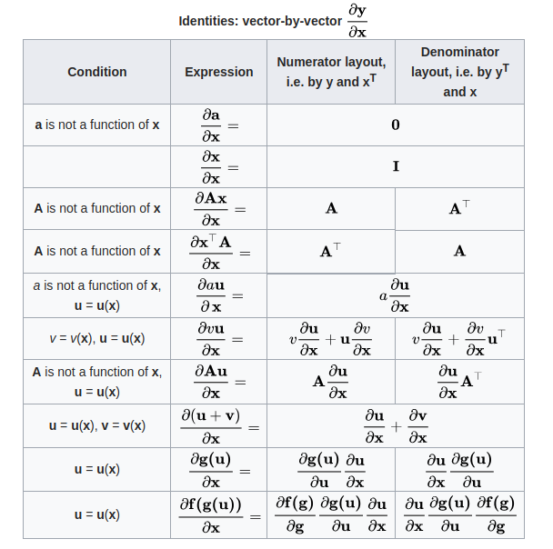
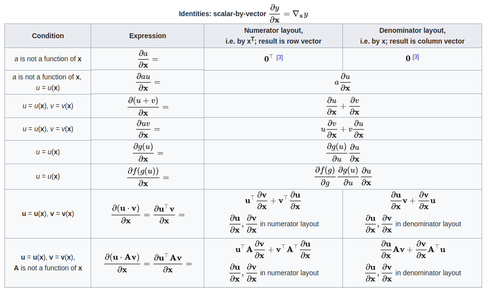
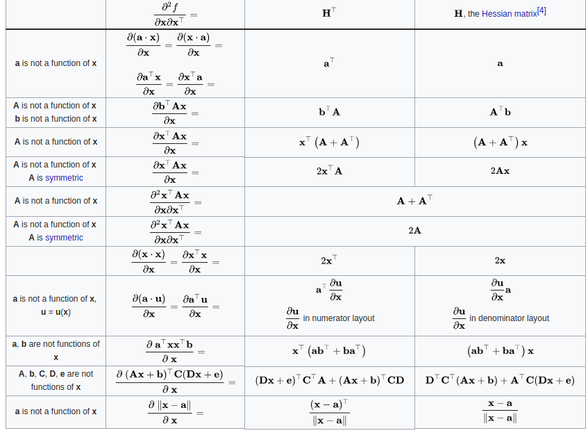

[TOC]

## Matrix Calculus Note

### 简单介绍

矩阵求导中有两种符号记法，区分方法为标量对向量求导的结果是行向量的形式还是列向量的形式．不同领域一般记法都相同，但有些作者会混用，导致书写结果较为混乱．

`梯度向量`:
$$
\nabla f = \frac{\partial f}{\partial \mathbf{x}} =\left[ \begin{array}{lll}{\frac{\partial f}{\partial x_{1}}} & {\frac{\partial f}{\partial x_{2}}} & {\frac{\partial f}{\partial x_{3}}}\end{array}\right]^{\top}
$$
`矩阵求导的分类`

| 类型 |                标量Matrix                |                       向量                        | 矩阵                                     |
| ---- | :--------------------------------------: | :-----------------------------------------------: | ---------------------------------------- |
| 标量 |     $\frac{\partial{y}}{\partial x}$     |     $\frac{\partial \mathbf{y}}{\partial x}$      | $\frac{\partial \mathbf{Y}}{\partial x}$ |
| 向量 | $\frac{\partial y}{\partial \mathbf{x}}$ | $\frac{\partial \mathbf{y}}{\partial \mathbf{x}}$ |                                          |
| 矩阵 | $\frac{\partial y}{\partial \mathbf{X}}$ |                                                   |                                          |

### 符号定义

大写黑体字母表示矩阵: $\mathbf{A},\mathbf{X},\mathbf{Y}$

小写黑体字母表示列向量: $\mathbf{a},\mathbf{b},\mathbf{c}$ 

小写普通字母表示标量: $a,b,c,x,y$  

`布局形式`:

关于向量/矩阵求导，一般有两种形式:分子布局(Numerator Layout)和分母布局(Denominator Layout)，两种布局的区别如下：

+ 分子布局：求导结果中分子保持原有形式，分母为转置形式．
+ 分母布局：求导结果中分母保持原有形式，分子为转置形式.

### 向量求导

> 这部分默认使用的是分子布局

#### 向量对标量的导数

向量$\mathbf{y}=\left[ \begin{array}{llll}{y_{1}} & {y_{2}} & {\cdots} & {y_{m}}\end{array}\right]^{\top}$对标量$x$的导数如下:
$$
\frac{\partial \mathbf{y}}{\partial x}=\left[ \begin{array}{c}{\frac{\partial y_{1}}{\partial x}} \\ {\frac{\partial y_{2}}{\partial x}} \\ {\vdots} \\ {\frac{\partial y_{m}}{\partial x}}\end{array}\right]
$$

#### 标量对向量的导数

标量$y$对向量$\mathbf{x}=\left[ \begin{array}{llll}{x_{1}} & {x_{2}} & {\cdots} & {x_{n}}\end{array}\right]^{\top}$的导数如下：
$$
\frac{\partial y}{\partial \mathbf{x}}=\left[ \begin{array}{cc}{\frac{\partial y}{\partial x_{1}}} & {\frac{\partial y}{\partial x_{2}}} & {\cdots} & {\frac{\partial y}{\partial x_{n}}}\end{array}\right]
$$

#### 向量对向量的导数

向量$\mathbf{y}=\left[ \begin{array}{llll}{y_{1}} & {y_{2}} & {\cdots} & {y_{m}}\end{array}\right]^{\top}$对向量$\mathbf{x}=\left[ \begin{array}{llll}{x_{1}} & {x_{2}} & {\cdots} & {x_{n}}\end{array}\right]^{\top}$的导数为：
$$
\frac{\partial \mathbf{y}}{\partial \mathbf{x}}=\left[ \begin{array}{cccc}{\frac{\partial y_{1}}{\partial x_{1}}} & {\frac{\partial y_{1}}{\partial x_{2}}} & {\cdots} & {\frac{\partial y_{1}}{\partial x_{n}}} \\ {\frac{\partial y_{2}}{\partial x_{1}}} & {\frac{\partial y_{2}}{\partial x_{2}}} & {\cdots} & {\frac{\partial y_{2}}{\partial x_{n}}} \\ {\vdots} & {\vdots} & {\ddots} & {\vdots} \\ {\frac{\partial y_{m}}{\partial x_{1}}} & {\frac{\partial y_{m}}{\partial x_{2}}} & {\cdots} & {\frac{\partial y_{m}}{\partial x_{n}}}\end{array}\right]
$$
该矩阵又被称为`Jacobian`矩阵.

### 布局选择

#### 分子布局:

+ 梯度向量$\frac{\partial y}{\partial \mathbf{x}}$为行向量
+ $\frac{\partial \mathbf{y}}{\partial x}$为列向量

$$
\frac{\partial y}{\partial \mathbf{x}}=\left[ \begin{array}{cccc}{\frac{\partial y}{\partial x_{1}}} & {\frac{\partial y}{\partial x_{2}}} & {\cdots} & {\frac{\partial y}{\partial x_{n}}}\end{array}\right]
$$

$$
\frac{\partial \mathbf{y}}{\partial x}=\left[ \begin{array}{c}{\frac{\partial y_{1}}{\partial x}} \\ {\frac{\partial y_{2}}{\partial x}} \\ {\vdots} \\ {\frac{\partial y_{m}}{\partial x}}\end{array}\right]
$$

$$
\frac{\partial \mathbf{y}}{\partial \mathbf{x}}=\left[ \begin{array}{cccc}{\frac{\partial y_{1}}{\partial x_{1}}} & {\frac{\partial y_{1}}{\partial x_{2}}} & {\cdots} & {\frac{\partial y_{1}}{\partial x_{n}}} \\ {\frac{\partial y_{2}}{\partial x_{1}}} & {\frac{\partial y_{2}}{\partial x_{2}}} & {\cdots} & {\frac{\partial y_{2}}{\partial x_{n}}} \\ {\vdots} & {\vdots} & {\ddots} & {\vdots} \\ {\frac{\partial y_{m}}{\partial x_{1}}} & {\frac{\partial y_{m}}{\partial x_{2}}} & {\cdots} & {\frac{\partial y_{m}}{\partial x_{n}}}\end{array}\right]
$$

#### 分母布局

+ 梯度向量$\frac{\partial y}{\partial \mathbf{x}}$为列向量
+ $\frac{\partial \mathbf{y}}{\partial x}$为行向量

$$
\frac{\partial y}{\partial \mathbf{x}}=\left[ \begin{array}{c}{\frac{\partial y}{\partial x_{1}}} \\ {\frac{\partial y}{\partial x_{2}}} \\ {\vdots} \\ {\frac{\partial y}{\partial x_{n}}}\end{array}\right]
$$

$$
\frac{\partial \mathbf{y}}{\partial x}=\left[ \begin{array}{llll}{\frac{\partial y_{1}}{\partial x}} & {\frac{\partial y_{2}}{\partial x}} & {\cdots} & {\frac{\partial y_{m}}{\partial x}}\end{array}\right]
$$

$$
\frac{\partial \mathbf{y}}{\partial \mathbf{x}}=\left[ \begin{array}{cccc}{\frac{\partial y_{1}}{\partial x_{2}}} & {\frac{\partial y_{2}}{\partial x_{2}}} & {\cdots} & {\frac{\partial y_{m}}{\partial x_{2}}} \\ {\vdots} & {\vdots} & {\ddots} & {\vdots} \\ {\frac{\partial y_{1}}{\partial x_{n}}} & {\frac{\partial y_{2}}{\partial x_{n}}} & {\cdots} & {\frac{\partial y_{m}}{\partial x_{n}}}\end{array}\right]
$$

有些时候两种形式会混用，例如梯度为列向量，但是向量对向量求导为分子布局．

### 求导法则

#### 向量对向量求导

#### 标量对向量求导

