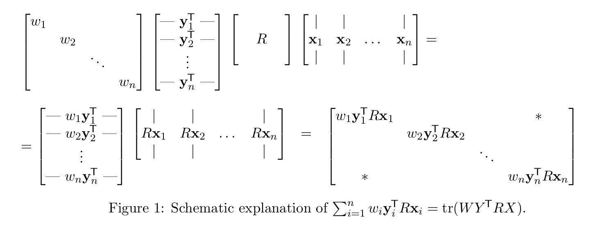

### 使用SVD分解求解刚体变换最小二乘解

#### 问题

给定两个点集，求他们之间的最优刚体变换。设$\mathcal{P}=\left\{\mathbf{p}_{1}, \mathbf{p}_{2}, \ldots, \mathbf{p}_{n}\right\} $ $ \mathcal{Q}=\left\{\mathbf{q}_{1}, \mathbf{q}_{2}, \ldots, \mathbf{q}_{n}\right\}$ ，求解$R,\mathbf{t}$ 使得：
$$
(R, \mathbf{t})=\underset{R \in S O(d), \mathbf{t} \in \mathbb{R}^{d}}{\operatorname{argmin}} \sum_{i=1}^{n} w_{i}\left\|\left(R \mathbf{p}_{i}+\mathbf{t}\right)-\mathbf{q}_{i}\right\|^{2} 
$$
其中$w_i$为每个点对的权重。

#### 推导过程

##### 平移量求解

首先假设$R$已知，求解最优$\mathbf{t}$，即:$F(\mathbf{t})=\sum_{i=1}^{n} w_{i}\left\|\left(R \mathbf{p}_{i}+\mathbf{t}\right)-\mathbf{q}_{i}\right\|^{2}$，可以用过$F$对$\mathbf{t}$求导来获取最优解。
$$
\begin{aligned} 0 &=\frac{\partial F}{\partial \mathbf{t}}=\sum_{i=1}^{n} 2 w_{i}\left(R \mathbf{p}_{i}+\mathbf{t}-\mathbf{q}_{i}\right)=\\ &=2 \mathbf{t}\left(\sum_{i=1}^{n} w_{i}\right)+2 R\left(\sum_{i=1}^{n} w_{i} \mathbf{p}_{i}\right)-2 \sum_{i=1}^{n} w_{i} \mathbf{q}_{i} \end{aligned}
$$
设:
$$
\overline{\mathbf{p}}=\frac{\sum_{i=1}^{n} w_{i} \mathbf{p}_{i}}{\sum_{i=1}^{n} w_{i}}, \quad \overline{\mathbf{q}}=\frac{\sum_{i=1}^{n} w_{i} \mathbf{q}_{i}}{\sum_{i=1}^{n} w_{i}}
$$
即: 
$$
\mathbf{t}=\overline{\mathbf{q}}-R \overline{\mathbf{p}}
$$
把得到的$\mathbf{t}$代入到原式中：
$$
\begin{aligned} \sum_{i=1}^{n} w_{i}\left\|\left(R \mathbf{p}_{i}+\mathbf{t}\right)-\mathbf{q}_{i}\right\|^{2} &=\sum_{i=1}^{n} w_{i}\left\|R \mathbf{p}_{i}+\overline{\mathbf{q}}-R \overline{\mathbf{p}}-\mathbf{q}_{i}\right\|^{2}=\\ &=\sum_{i=1}^{n} w_{i}\left\|R\left(\mathbf{p}_{i}-\overline{\mathbf{p}}\right)-\left(\mathbf{q}_{i}-\overline{\mathbf{q}}\right)\right\|^{2} \end{aligned}
$$
定义：$\mathbf{x}_{i} :=\mathbf{p}_{i}-\overline{\mathbf{p}}, \quad \mathbf{y}_{i} :=\mathbf{q}_{i}-\overline{\mathbf{q}}$ ，可以得到：
$$
R=\underset{R \in S O(d)}{\operatorname{argmin}} \sum_{i=1}^{n} w_{i}\left\|R \mathbf{x}_{i}-\mathbf{y}_{i}\right\|^{2}
$$

##### 旋转量$R$的求解

$$
\begin{aligned}\left\|R \mathbf{x}_{i}-\mathbf{y}_{i}\right\|^{2} &=\left(R \mathbf{x}_{i}-\mathbf{y}_{i}\right)^{\top}\left(R \mathbf{x}_{i}-\mathbf{y}_{i}\right)=\left(\mathbf{x}_{i}^{\top} R^{\top}-\mathbf{y}_{i}^{\top}\right)\left(R \mathbf{x}_{i}-\mathbf{y}_{i}\right)=\\ &=\mathbf{x}_{i}^{\top} R^{\top} R \mathbf{x}_{i}-\mathbf{y}_{i}^{\top} R \mathbf{x}_{i}-\mathbf{x}_{i}^{\top} R^{\top} \mathbf{y}_{i}+\mathbf{y}_{i}^{\top} \mathbf{y}_{i}=\\ &=\mathbf{x}_{i}^{\top} \mathbf{x}_{i}-\mathbf{y}_{i}^{\top} R \mathbf{x}_{i}-\mathbf{x}_{i}^{\top} R^{\top} \mathbf{y}_{i}+\mathbf{y}_{i}^{\top} \mathbf{y}_{i} \end{aligned}
$$

可以进一步简化为：
$$
\underset{R \in S O(d)}{\operatorname{argmin}} \sum_{i=1}^{n} w_{i}\left\|R \mathbf{x}_{i}-\mathbf{y}_{i}\right\|^{2}=\underset{R \in S O(d)}{\operatorname{argmin}} \sum_{i=1}^{n} w_{i}\left(\mathbf{x}_{i}^{\top} \mathbf{x}_{i}-2 \mathbf{y}_{i}^{\top} R \mathbf{x}_{i}+\mathbf{y}_{i}^{\top} \mathbf{y}_{i}\right)= \\
\begin{aligned} &=\underset{R \in S O(d)}{\operatorname{argmin}}\left(\sum_{i=1}^{n} w_{i} \mathbf{x}_{i}^{\top} \mathbf{x}_{i}-2 \sum_{i=1}^{n} w_{i} \mathbf{y}_{i}^{\top} R \mathbf{x}_{i}+\sum_{i=1}^{n} w_{i} \mathbf{y}_{i}^{\top} \mathbf{y}_{i}\right)=\\ &=\underset{R \in S O(d)}{\operatorname{argmin}}\left(-2 \sum_{i=1}^{n} w_{i} \mathbf{y}_{i}^{\top} R \mathbf{x}_{i}\right) \end{aligned}
$$

可以用过矩阵技巧将问题等价为：$\sum_{i=1}^{n} w_{i} \mathbf{y}_{i}^{\top} R \mathbf{x}_{i}=\operatorname{tr}\left(W Y^{\top} R X\right)$

$$
\underset{R \in S O(d)}{\operatorname{argmin}}\left(-2 \sum_{i=1}^{n} w_{i} \mathbf{y}_{i}^{\top} R \mathbf{x}_{i}\right)=\underset{R \in S O(d)}{\operatorname{argmax}} \sum_{i=1}^{n} w_{i} \mathbf{y}_{i}^{\top} R \mathbf{x}_{i}
$$
其中$\sum_{i=1}^{n} w_{i} \mathbf{y}_{i}^{\top} R \mathbf{x}_{i}=\operatorname{tr}\left(W Y^{\top} R X\right)$，其中$W=diag\{ w_1,\cdots ,w_n\}$为$n\times n$ 对角矩阵，元素为权重。$Y$为$d\times n$矩阵，每一列为$\mathbf{y}_i$ ，$X$为$d\times n$矩阵，每一列为$\mathbf{x}_i$ 。
利用矩阵迹的性质：$tr(AB)=tr(BA)$可以得到:
$$
\operatorname{tr}\left(W Y^{\top} R X\right)=\operatorname{tr}\left(\left(W Y^{\top}\right)(R X)\right)=\operatorname{tr}\left(R X W Y^{\top}\right)
$$
设矩阵$S=XWY^{\top}$ ，对$S$进行SVD分解:
$$
S= U\Sigma V^{\top}
$$
可以得到：
$$
\operatorname{tr}\left(R X W Y^{\top}\right)=\operatorname{tr}(R S)=\operatorname{tr}\left(R U \Sigma V^{\top}\right)=\operatorname{tr}\left(\Sigma V^{\top} R U\right)
$$
由于$V,R,U$都是正交矩阵，所以$M=V^{\top}RU$也是正交矩阵。可以得到：
$$
1=\mathbf{m}_{j}^{\top} \mathbf{m}_{j}=\sum_{i=1}^{d} m_{i j}^{2} \Rightarrow m_{i j}^{2} \leq 1 \Rightarrow\left|m_{i j}\right| \leq 1
$$
 当$m_{ii}=1$的时候取得最大值，故：
$$
I=M=V^{\top} R U \Rightarrow V=R U \Rightarrow R=V U^{\top}
$$

##### 存在的问题

可能会存在求出的矩阵包含反射，即：$det(R)=-1$。
$$
R = V \begin{pmatrix}
1 &&&& \\
& 1  \\
& & \ddots \\
&&& det(VU^{\top})  
\end{pmatrix} U^{\top}
$$
强制保证$det(R)=1$

#### 最终计算流程

##### 目标问题

$$
\sum_{i=1}^{n} w_{i}\left\|\left(R \mathbf{p}_{i}+\mathbf{t}\right)-\mathbf{q}_{i}\right\|^{2} 
$$

##### 求解流程:

`step1` 计算:
$$
\overline{\mathbf{p}}=\frac{\sum_{i=1}^{n} w_{i} \mathbf{p}_{i}}{\sum_{i=1}^{n} w_{i}}, \quad \overline{\mathbf{q}}=\frac{\sum_{i=1}^{n} w_{i} \mathbf{q}_{i}}{\sum_{i=1}^{n} w_{i}}
$$
`step2`把所有点坐标进行预处理:
$$
\mathbf{x}_{i} :=\mathbf{p}_{i}-\overline{\mathbf{p}}, \quad \mathbf{y}_{i} :=\mathbf{q}_{i}-\overline{\mathbf{q}}, \quad i=1,2, \ldots, n
$$
`step3`计算如下$d\times d$矩阵，其中$X,Y$每一列由相应的$\mathbf{x_i},\mathbf{y_i}$组成，$W$为权重.
$$
S=X W Y^{\top}
$$
`step4`计算$S$的SVD分解$S=U \Sigma V^{\mathrm{T}}$，得到：
$$
R = V \begin{pmatrix}
1 &&&& \\
& 1  \\
& & \ddots \\
&&& det(VU^{\top})  
\end{pmatrix} U^{\top}
$$
`step5`计算最优的平移量为
$$
\mathbf{t}=\overline{\mathbf{q}}-R \overline{\mathbf{p}}
$$
