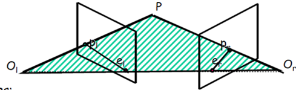
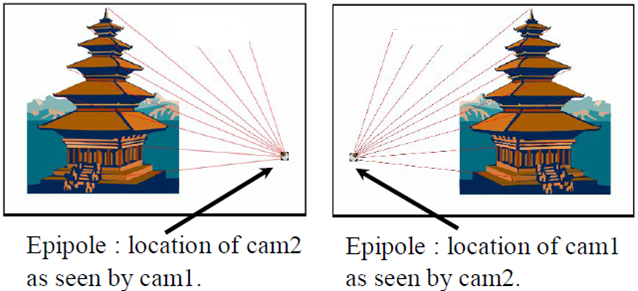
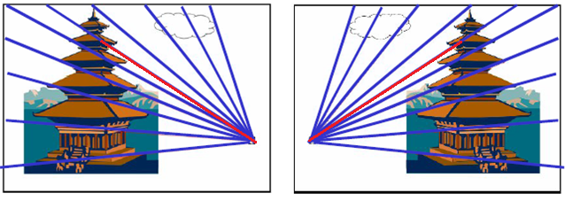
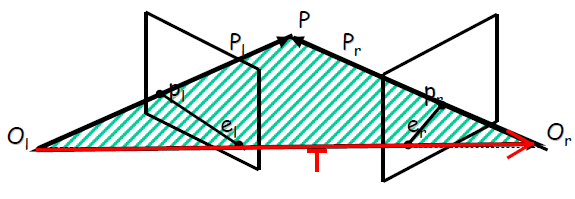

# Epipolar Geometry

## Essential Matrix & Fundamental Matrix

### 基本描述

对极几何描述了同一场景的两幅图像之间的视觉几何关系,设两个相机的中心分别为 $O_r$,$O_l$,两图像的平面分别为$I$和$I^{'}$,设$P$为共同视域中的空间点,它再两幅图像平面上的像素点坐标分别为$p_l$,$p_r$,对极几何主要包括如下几个几何元素:

- **极平面**:两个相机坐标原点$O_l,O_r$组成的平面
- **极线**:极平面与两个像平面的交线,即$\overline{p_le_l}$和$\overline{p_re_r}$
- **极点**:$e_l$为右相机在左像平面的投影,$e_r$为左相机在右像素平面的投影

### 实际例子

如果有两个相机,`cam1`在建筑物的左侧,`cam2`在建筑物的右侧,拍摄得到两张照片.像平面是无限延伸的,照片只是像平面的一部分.

对应的极线为:

### 公式推导

两个相机坐标系的关系如下图所示:

$P_l$是点$P$在$O_l$坐标系下的坐标,$P_r$是点$P$在$O_r$坐标系下的坐标,坐标系$O_r$到坐标系$O_l$的变换对应为$R$和$T$,即
$$
P_l = RP_r+T
$$
所以可以得到:
$$
P_l -T  =RP_r  \Rightarrow  P_r=R^{T}(P_l-T)
$$
在$O_l$坐标系下,极平面为:
$$
T\times P_l 
$$
由于$\overline{O_lP}$ ,$T$,$O_rP$三线共面,所以根据混合积为0,可以得到:
$$
(P_l-t)^T\cdot(T\times P_l) = P_r^TR^T\cdot(T\times P_l) = 0
$$
又因为叉乘可以等效为叉乘矩阵:
$$
a\times b = [a]_{\times} b =
\begin{bmatrix}
 0 &-a_ 3 &a_2 \\
 a_3 &0 &-a_1 \\
 -a_2  &a_1 &0 \\
\end{bmatrix}
\begin{bmatrix}
b_1 \\
b_2 \\
b_3 \\
\end{bmatrix}
$$

将$T$转换成对应的叉乘矩阵为:
$$
S=\begin{bmatrix}
 0 &-t_ 3 &t_2 \\
 t_3 &0 &-t_1 \\
 -t_2  &t_1 &0 \\
\end{bmatrix}
$$
于是共面约束的等式可以化成:
$$
P_r^TR^T\cdot SP_l = 0
$$
令$E=R^TS$即可得到:
$$
P_r^TEP_l=\tilde{P_r}^TE\tilde{P_l}=0
$$
其中,$\tilde{P_l},\tilde{P_r}$为单位成像平面(即`Z=1`)对应点的坐标

由于针孔相机的成像模型为:
$$
sp = KP  \Rightarrow
s \begin{bmatrix}
u \\
v \\
1
\end{bmatrix} = 
\begin{bmatrix}
f_x  &0  &c_x \\
0 &f_y & c_y \\
0   &0 &1 \\ 
\end{bmatrix}
\begin{bmatrix}
x \\
y\\
z
\end{bmatrix}
$$
所以可以得到:
$$
\tilde{P_l}=K_l^{-1}p_l ,\tilde{P_r} = K_r^{-1}p_r
$$
其中$K_l,K_r$分别是左右两个相机的内参矩阵.

代入上方等式中可以得到:
$$
(K_r^{-1}p_r)^TEK_l^{-1}p_l =0  \\
\Rightarrow p_r^TK_r^{-T}EK_l^{-1}p_l=0
$$
令$F=K_r^{-T} EK_l^{-1}$,可以得到:
$$
p_r^T F p_l=0
$$
所以可以得到如下两个约束方程:
$$
P_r^TEP_l=\tilde{P_r}^TE\tilde{P_l}=0 \\
p_r^T F p_l=0
$$
其中$P_r^TEP_l=\tilde{P_r}^TE\tilde{P_l}=0$ ,  $F=K_r^{-T} EK_l^{-1}$.

### 相关性质

对于基本矩阵`F`,其有如下相关性质:

+ 矩阵的秩为2
+ 依赖于相机的内参以及相机的外参`R,t`

对于本征矩阵`E`,其有如下相关性质:

+ 秩为2
+ 只依赖与相机的外参`R,t`

### 极线约束实际作用

由于基本矩阵确定的是两张图像中点的像素坐标之间的关系,所以我们可以利用`F`矩阵来完成特征匹配中对应点的搜索,减少误匹配率.约束直线的方程推导如下:

$$
p_r^TFp_l=0 \\
p_l^TF^Tp_r=0
$$
所以点$p_l$对应在右图中的直线约束方程为:
$$
l_r = Fp_l = \begin{bmatrix}
a \\
b \\
c
\end{bmatrix} \\
au+bv+c=0
$$
同理点$p_r$在左图中对应的直线约束方程为:
$$
l_l = F^Tp_r = \begin{bmatrix}
a \\
b \\
c
\end{bmatrix} \\
au+bv+c=0
$$
