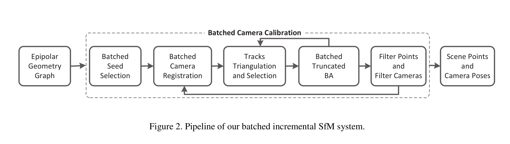

## Batched Incremental Structure-from-Motion

`2019/04/19`

> 中科院2017年的文章，重点在Batched相机Registration和Tracks select
>
> 优点速度快

[TOC]

### Introduction

A typical pipeline for SfM usually consists of four steps: image feature detection and matching, camera poses initialization, tracks triangulation and bundle adjustment.

+ incremental:drift scalability 
+ global: rotation averaging 没问题，但是translation outliers影响较大

增量式重建是在建立好了Tracks的基础上进行的，优点：

+ track通常较长，可以获得更多的候选camera用于registration
+ track构建的时候，可以过滤掉许多feature matches
+ track通常为feature matches的集合，通常在判定inliers的时候比单个match更有说服力

### Batched Seed Selection

`Rotation Averaging`

通过EG之间的相对旋转，估计出Global的Rotation:$ \mathbb{R}=\{\mathbf{R}_{i}, i=1 \ldots N \}$精度足够高。

`EG filter`

利用`geodesic error`对其进行filter $e = acos \left(\left\|\mathbf{R}_{i j}-\mathbf{R}_{j} \mathbf{R}_{i}^{T}\right\|_{F}\right)$ 大于15度即认为是outliers

`Trangulation angle`

给定内参和全局的旋转，可以计算图中每个匹配到的特征点对应的三角化角度。取整张图的平均即可获得两张图之间的角度。用这个角度来代表基线的长度。

`small z-axis value`

两张图之间归一化的平移如果z较大则不选

`more neighbors`

利用$\rho_{ij}$来表示两张图相邻相机密度：

$n_i$为相机$i$在EG中的相邻相机数量，$\rho_{ij}=\min\{n_i,n_j\}$

`总的pipline`

+ Filtered: 
  + small median angle (eg: 3 degrees)
  + 错误的旋转(e.g., geodesic error is larger
    than 15.0 degrees)
  + z-axis 平移较大(eg: $\vert  T_{ij}^z \ge 0.9\vert$
+ Rank: 根据$\rho_{ij}$排序
+ 当3D点inliers数量大于200或者比例高于0.5就作为初始化图像对

### Batched camera registration

有足够2D-3D对应关系的cameras,一次并行计算其Pose等。先注册的相机比后注册的精度要高。

`colmap`的操作：一个一个进行NextBestViewSelect，评分规则是可视的3D点数量以及空间分布,但比较慢。

#### 本文的方法

给定已经重建的3D点，任意一个能够观测到足够多3D点的相机都可以被注册进来。本文使用RANSAC算法，把可以观测到12点以上的camera都作为候选。
对于每一个候选$C_i$，使用$P3P$算法获取初始的相机Pose$\{R_i,T_i\}$，当inliers比例大于0.5则进行后续优化。

固定相机的内参$\mathbf{K}_i$和3D点位置$\mathbf{X}_j$，对相机的Pose:$\left\{\mathbf{R}_{i}, \mathbf{T}_{i}\right\}$进行优化。最小化的误差函数为：
$$
\min _{\mathbf{R}_{i}, \mathbf{T}_{i}} \sum_{i=1}^{N} \sum_{j=1}^{M}\left\|\mathbf{x}_{i j}-\gamma\left(\mathbf{K}_{i}, \mathbf{R}_{i}, \mathbf{T}_{i}, \mathbf{X}_{j}\right)\right\|_{h u b e r}
$$
初始计算的$\left\{\mathbf{R}_{i}, \mathbf{T}_{i}\right\}$与优化出来的如果geodesic error小于5度，则registration 是正确的。由于每个相机的Registration都是独立的，所以可以并行计算。

### Batched tracks selection

在每次camera registration 之后的refine过程，不用将所有可以看到的tracks都代入优化，只对其中挑选出来的一部分进行优化。在处理大尺度的三维重建问题时，tracks对于优化相机位姿来说会有大量冗余，并且会带来较大的内存消耗。因此采取`track selection`非常有必要，选择的规则：

+ cover所有已注册相机，用于优化他们的参数
+ cover将要进行registered的相机 `存疑`
+ 倾向于选择较长Tracks，因为比短的有更大的consistency

#### 本文方法

`三角化`

对track的view进行ransac选取，角度满足条件则利用DLT算法计算3D位置，再利用3D点的位置计算重投影误差，用来判断inliers，并对所有inliers view检查是否在相机前面。保留最后inliers view最多的3D点。

`track selection`

用于解决重建过程中，BA优化时，引入过多的3D点问题。

相机自由度较小，所有的tracks会cover相机数百次，过于冗余。本文方法会把相机被cover次数限制在K次。`没代码讲的不太清楚`