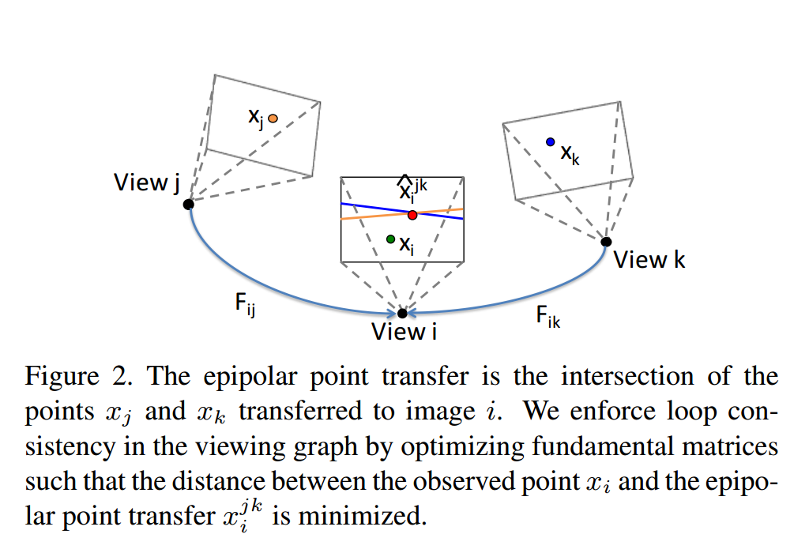

## Optimizing the Viewing Graph for Structure-from-Motion

`CVPR` `TheiaSfM作者` `ViewGraphOptimization` `FocalEstimation`

[TOC]

### Abstract

对`GlobalSfM`中重建部分输入的`Relative ViewGraph`进行优化，使得其满足`consistent`条件：

即`Graph`中所有的`Triplets`都满足：
$$
e_{ik}^T F_{ij}e_{jk} = e_{ij}^T F_{ik}e_{kj} =e_{ji}^T F_{jk}e_{ki}=0
$$

### 算法

#### View Graph Optimization

##### `epipolar point transfer`

$$
\hat{x}_i^{jk} = F_{ij}x_j\times F_{ik}x_{k}
$$

$x_i,x_j$为对应图中的`Feature`点。

$$
C(x)_i^{jk} = \Vert x_i -\hat{x}_i^{jk} \Vert_2 \\
$$
`总的误差函数`
$$
\mathbf{F}^*  = \arg\min \sum_{t\in \mathcal{T}}\sum_{x\in t} C(x)_i^{jk} +C(x)_j^{ik} + C(x)_k^{ij}
$$
$x$为在`triplet`$t=\{i,j,k\}$的`Feature track`,$\mathbf{F}$ 为整个Graph中的基本矩阵的集合。

#### Flocal Length from a Fundamental Matrix

利用$E$矩阵的性质：
$$
C= \Vert EE^T \Vert^2 - \frac{1}{2} \Vert E \Vert ^4 
$$
对于正确的$E$矩阵，$C$应该为0，利用$E=K'^T F K$ 带入焦距信息，并利用$C$的非负性，封闭解可以通过：
$$
\frac{\partial C}{\partial f'} =0 \\
\frac{\partial C}{\partial f} = 0
$$
获得，同时利用`Triplet`来构造误差函数，避免直接平均：
$$
C = C(F_{12}) + C(F_{13}) + C(F_{23}) \\
$$

总的优化形式为：
$$
\mathbf{f}^* = \arg \min \sum_{F\in \mathcal{G}} C(F)
$$
