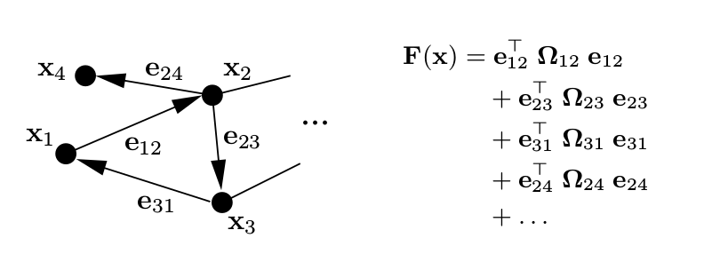

[TOC]

### g2o: A General Framework for Graph Optimization
#### Abstract
SLAM/BA问题一般建模为最小二乘问题，g2o 将最小二乘问题建模成一个Graph优化的模型。
优点：
+ Highly general 
+ Highly Extensible

#### Nonlinear Graph Optimization using Least-Squares
对于机器人/视觉领域，很多问题都可以建模成如下形式：
$$
\mathbf{F}(\mathbf{x})=\sum_{\langle i, j\rangle \in c} \underbrace{\mathbf{e}\left(\mathbf{x}_{i}, \mathbf{x}_{j}, \mathbf{z}_{i j}\right)^{\top} \Omega_{i j} \mathbf{e}\left(\mathbf{x}_{i}, \mathbf{x}_{j}, \mathbf{z}_{i j}\right)}_{\mathbf{F}_{i j}}
\tag{1}
$$

$$
\mathbf{x}^{*}=\underset{\mathbf{x}}{\operatorname{argmin}} \mathbf{F}(\mathbf{x}) \tag{2}
$$

其中$\mathbf{x}=\left(\mathbf{x}_{1}^{\top}, \ldots, \mathbf{x}_{n}^{\top}\right)^{\top}$为参数向量，每个$\mathbf{x}_i$都表示一个参数块，$\mathbf{z}_{ij}$和$\mathbf{\Omega }_{ij}$表示连接参数$\mathbf{x}_i,\mathbf{x}_j$的约束的均值和信息矩阵(协方差矩阵的逆)。$\mathbf{e}\left(\mathbf{x}_{i}, \mathbf{x}_{j}, \mathbf{z}_{i j}\right)$ 表示参数$\mathbf{x}_i$和$\mathbf{x}_j$满足约束$\mathbf{z}_{ij}$的程度，当完美符合时为$\mathbf{0}$。
为了简化符号，定义：
$$
\mathbf{e}\left(\mathbf{x}_{i}, \mathbf{x}_{j}, \mathbf{z}_{i j}\right) \stackrel{\mathrm{def.}}{=} \mathbf{e}_{i j}\left(\mathbf{x}_{i}, \mathbf{x}_{j}\right) \stackrel{\mathrm{def.}}{=} \mathbf{e}_{i j}(\mathbf{x}) \tag{3}
$$

整个图的结构中，节点$i$表示参数块$\mathbf{x}_i$，节点$i$和$j$之间的边表示两个参数块之间的约束。如下图所示：

左边为对应的图结构，右边为整个优化问题对应的目标函数。

#### 最小二乘优化

给定参数的一个初始估计$\breve{\mathbf{x}}$，使用高斯牛顿法或者LM算法可以求得参数的最优解，求解的思路为使用一阶泰勒展开去近似误差函数：
$$
\mathbf{e}_{i j}\left(\breve{\mathbf{x}}_{i}+\mathbf{\Delta x}_{i}, \breve{\mathbf{x}}_{j}+\mathbf{\Delta x}_{j}\right)=\mathbf{e}_{i j}(\breve{\mathbf{x}}+\Delta \mathbf{x}) \simeq \quad \mathbf{e}_{i j}+\mathbf{J}_{i j} \Delta \mathbf{x} \tag{4}
$$
其中$\mathbf{J}_{ij}$为误差$\mathbf{e}_{ij}$在$\breve{\mathbf{x}}$处计算的$Jacobian$，将其代入到公式$(1)$ 中的$\mathbf{F}_{ij}$中，可以得到：
$$
\begin{aligned}
\mathbf{F}_{i j}(\breve{\mathbf{x}}+\Delta \mathbf{x}) &= \mathbf{e}_{i j}(\breve{\mathbf{x}}+\Delta \mathbf{x})^{\top} \boldsymbol{\Omega}_{i j} \mathbf{e}_{i j}(\breve{\mathbf{x}}+\Delta \mathbf{x}) \\
&\simeq \quad\left(\mathbf{e}_{i j}+\mathbf{J}_{i j} \Delta \mathbf{x}\right)^{\top} \mathbf{\Omega}_{i j}\left(\mathbf{e}_{i j}+\mathbf{J}_{i j} \Delta \mathbf{x}\right)\\
&= \underbrace{\mathbf{e}_{i j}^{\top} \mathbf{\Omega}_{i j} \mathbf{e}_{i j}}_{\mathbf{b}_{i j}}+\underbrace{2 \mathbf{e}_{i j}^{\top} \mathbf{\Omega}_{i j} \mathbf{J}_{i j}}_{\mathbf{b}_{i j}} \Delta \mathbf{x}+\Delta \mathbf{x}^{\top} \underbrace{\mathbf{J}_{i j}^{\top} \mathbf{\Omega}_{i j} \mathbf{J}_{i j}}_{\mathbf{H}_{i j}} \Delta \mathbf{x} \\
&=\mathrm{c}_{i j}+2 \mathbf{b}_{i j} \Delta \mathrm{x}+\Delta \mathrm{x}^{\top} \mathbf{H}_{i j} \Delta \mathrm{x}
\end{aligned}
\tag{5}
$$
 基于这种局部近似，可以把$\mathbf{F}(\mathbf{x})$重写成：
$$
\begin{aligned}
\mathbf{F}(\breve{\mathbf{x}}+\mathbf{\Delta x}) &=\sum_{\langle i, j\rangle \in \mathcal{C}} \mathbf{F}_{i j}(\breve{\mathbf{x}}+\Delta \mathbf{x}) \\
&\simeq \sum_{\langle i, j\rangle \in \mathcal{C}} \mathrm{c}_{i j}+2 \mathbf{b}_{i j} \Delta \mathrm{x}+\Delta \mathrm{x}^{\top} \mathbf{H}_{i j} \Delta \mathrm{x} \\
&=\mathrm{c}+2 \mathbf{b}^{\top} \boldsymbol{\Delta} \mathbf{x}+\mathbf{\Delta} \mathbf{x}^{\top} \mathbf{H} \mathbf{\Delta} \mathbf{x}
\end{aligned}
\tag{6}
$$
$\mathrm{c}=\sum \mathrm{c}_{i j}, \mathbf{b}=\sum \mathbf{b}_{i j}$ ，$\mathbf{H}=\sum \mathbf{H}_{i j}$ 通过求解：
$$
\mathbf{H} \Delta \mathbf{x}^{*}=-\mathbf{b} \tag{7}
$$
求得$\Delta \mathbf{x} $ 使得$\mathbf{F}(\mathbf{x})$最小。
其中$\mathbf{H}$为系统的信息矩阵，解为：$\mathbf{x}^{*}=\breve{\mathbf{x}}+\Delta \mathbf{x}^{*}$
上述为高斯牛顿法的求解思路，而LM算法增加了一个阻尼系数用于帮助算法收敛。
$$
(\mathbf{H}+\lambda \mathbf{I}) \boldsymbol{\Delta} \mathbf{x}^{*}=-\mathbf{b} \tag{8}
$$
$\lambda $为阻尼系数：当$\mathbf{\Delta x}$越小，$\lambda$越大，这对于步长的控制非常有用。LM算法监测每次迭代的误差，当新的误差比上一次的误差小，则$\lambda$减小，否则$\lambda$增大。

#### 参数化方式

由于在SLAM/BA问题中，状态量的参数化经常不是在欧氏空间。所以对于增量$\mathbf{\Delta x}_i $ 的定义通常会不同于原有的$\mathbf{x}$所在的参数空间。
在当前变量$\breve{\mathbf{x}}_i$的附近计算一个扰动量$\mathbf{\Delta x}_i$ ，其中$\mathbf{\Delta x}_i$使用最小参数化表示，而$\breve{\mathbf{x}}_i$使用超参数化的表示。优化后新的$\mathbf{x}_i^{*}$ 可以使用如下方式更新，定义:$\boxplus: \operatorname{Dom}\left(\mathbf{x}_{i}\right) \times \operatorname{Dom}\left(\mathbf{\Delta} \mathbf{x}_{i}\right) \rightarrow \operatorname{Dom}\left(\mathbf{x}_{i}\right)$如下：
$$
\mathbf{x}_{i}^{*}=\breve{\mathbf{x}}_{i} \boxplus \Delta \mathbf{x}_{i}^{*}
$$
在3D SLAM问题中，一般增量$\mathbf{\Delta x}_i $ 使用平移向量和单位四元数的轴(the axis of a normalized quaternion)表示，位姿$\mathbf{x}_i$使用平移和完整的四元数表示。
$$
\breve{\mathbf{x}}_{i} \boxplus \boldsymbol{\Delta x}_{i}^{*} \stackrel{\mathrm{def.}}{=}  \breve{\mathbf{x}}_{i} \oplus \Delta \mathbf{x}_{i}^{*}
$$
通过定义新的操作符，新的误差函数可以定义为：
$$
\begin{aligned}
\mathbf{e}_{i j}\left(\boldsymbol{\Delta \mathbf { x }}_{i}, \mathbf{\Delta} \mathbf{x}_{j}\right) \stackrel{\mathrm{def}}{=}&\mathbf{e}_{i j}\left(\breve{\mathbf{x}}_{i} \boxplus \boldsymbol{\Delta} \mathbf{x}_{i}, \breve{\mathbf{x}}_{j} \boxplus \mathbf{\Delta} \mathbf{x}_{j}\right) \\
=& \mathbf{e}_{i j}(\breve{\mathbf{x}} \boxplus \mathbf{\Delta} \mathbf{x}) \simeq \mathbf{e}_{i j}+\mathbf{J}_{i j} \Delta \mathbf{x}
\end{aligned}
$$
其中$\mathbf{J}_{ij}$变成：
$$
\mathbf{J}_{i j}=\left.\frac{\partial \mathbf{e}_{i j}(\breve{\mathbf{x}} \boxplus \Delta \mathbf{x})}{\partial \Delta \mathbf{x}}\right|_{\Delta \mathbf{x}=0}
$$

#### 线性化后系统的结构

上文中$\mathbf{H}$和向量$\mathbf{b}$为一系列矩阵和向量的组合，设$\mathbf{b}_{i j}=\mathbf{J}_{i j}^{\top} \mathbf{\Omega}_{i j} \mathbf{s}_{i j}$ 和$\mathbf{H}_{i j}=\mathbf{J}_{i j}^{\top} \boldsymbol{\Omega}_{i j} \mathbf{J}_{i j}$我们可以把$\mathbf{H}$和$\mathbf{b}$重写成如下形式：
$$
\mathbf{b}=\sum_{\langle i, j\rangle \in \mathcal{C}} \mathbf{b}_{i j} \quad \mathbf{H}=\sum_{\langle i, j\rangle \in \mathcal{C}} \mathbf{H}_{i j}
$$
误差的雅克比为如下形式：
$$
\mathbf{J}_{i j}=\left(\mathbf{0} \cdots \mathbf{0} \underbrace{\mathbf{A}_{i j}}_{i} \mathbf{0} \cdots \mathbf{0} \underbrace{\mathbf{B}_{i j}}_{j} \mathbf{0} \cdots 0\right)
$$
$\mathbf{A}_{ij}$和$\mathbf{B}_{ij}$为误差函数相对于$\mathbf{\Delta x}_i$ 和$\mathbf{\Delta x}_j$ 的导数，而$\mathbf{H}_{ij}$的结构如下：
$$
\mathbf{H}_{ij} = \begin{pmatrix}
\ddots  & \\
&\mathbf{A}_{i j}^{\top} \boldsymbol{\Omega}_{i j} \mathbf{A}_{i j}  \cdots & \mathbf{A}_{i j}^{\top} \mathbf{\Omega}_{i j} \mathbf{B}_{i j}\\

& \vdots  & \vdots \\
& \mathbf{B}_{i j}^{\top} \mathbf{\Omega}_{i j} \mathbf{A}_{i j} \cdots &\mathbf{B}_{i j}^{\top} \boldsymbol{\Omega}_{i j} \mathbf{B}_{i j}  \\
& & &\ddots
\end{pmatrix},
\mathbf{b}_{ij}=
\begin{pmatrix}
\vdots \\
\mathbf{A}_{i j}^{\top} \boldsymbol{\Omega}_{i j} \mathbf{e}_{i j} \\
\vdots \\
\mathbf{B}_{i j}^{\top} \mathbf{\Omega}_{i j} \mathbf{e}_{i j} \\
\vdots
\end{pmatrix}
$$
利用$\mathbf{H}$的稀疏性，可以完成问题的快速求解。整个系统的框架如下图所示：

#### 对于有特殊结构问题的处理

对于某个特殊问题，例如BA问题，其$\mathbf{H}$矩阵有着更加特殊的结构，利用这些特殊性，可以进一步提升性能。在BA问题中通常有两种变量相机位姿$\mathbf{p}$和路标点$\mathbf{l}$ 。
对变量顺序进行重新排列，可以得到：
$$
\begin{pmatrix}
\mathbf{H}_{\mathbf{pp}} & \mathbf{H}_{\mathbf{pl}} \\
\mathbf{H}^{\top}_{\mathbf{pl} } & \mathbf{H}_{\mathbf{ll}}
\end{pmatrix}
\begin{pmatrix}
\mathbf{\Delta \mathbf{x}^{*}_{\mathbf{p}}} \\
\mathbf{\Delta \mathbf{x}^{*}_{\mathbf{l}}}  
\end{pmatrix} = \begin{pmatrix}
\mathbf{-\mathbf{b}_{\mathbf{p}}} \\
\mathbf{- \mathbf{b}_{\mathbf{l}}}  
\end{pmatrix} 
$$

利用对$\mathbf{H}$矩阵进行舒尔补可以得到：
$$
\left(\mathbf{H}_{\mathbf{p p}}-\mathbf{H}_{\mathbf{p l}} \mathbf{H}_{\mathrm{ll}}^{-1} \mathbf{H}_{\mathbf{p l}}^{\top}\right) \Delta \mathbf{x}_{\mathbf{p}}^{*} =-\mathbf{b}_{\mathbf{p}}+\mathbf{H}_{\mathbf{p} 1} \mathbf{H}_{11}^{-1} \mathbf{b}_{1}
$$
由于$\mathbf{H}^{-1}_{\mathbf{ll}}$计算较为容易，因为$\mathbf{H}_{\mathbf{ll}}$为块对角阵，求解上式可以得到：$\mathbf{\Delta x_{p}}^{*}$进而求解:
$$
\mathbf{H}_{11} \Delta \mathbf{x}_{1}^{*}=-\mathbf{b}_{1}-\mathbf{H}_{\mathbf{p l}}^{\top} \Delta \mathbf{x}_{\mathbf{p}}^{*}
$$
得到$\mathbf{\Delta x^{*}_{\mathbf{l}}}$，用于优化路标点坐标。通常情况下，路标点多于相机，所以计算效率会有提升。