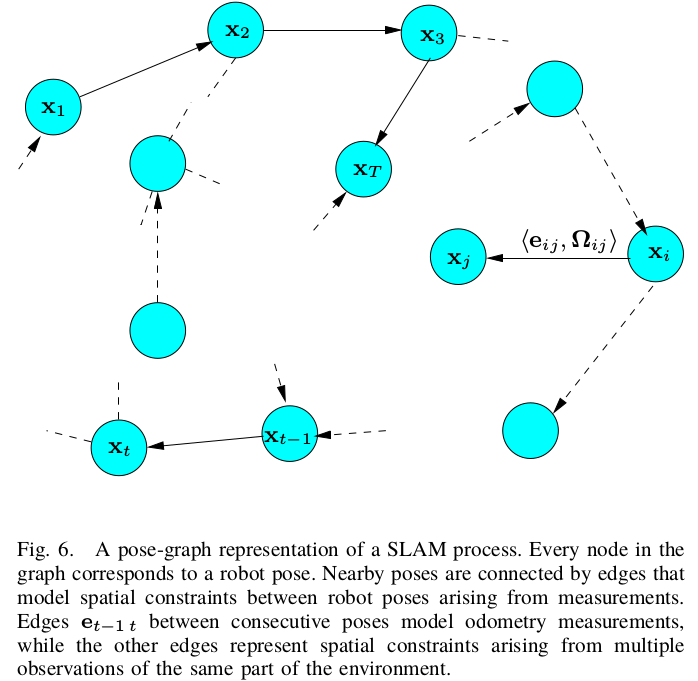
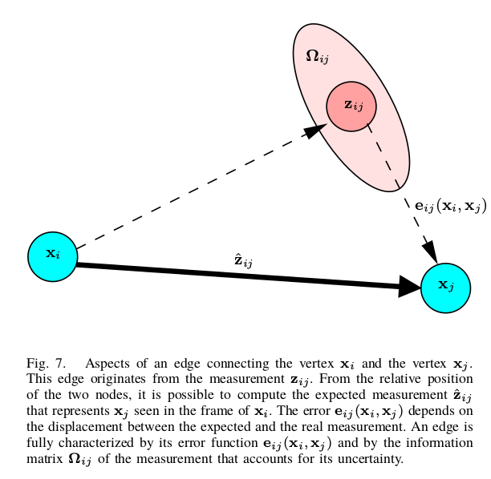

[TOC]

## Tutorial on Graph-Based SLAM

### 问题建立

Trajectory: $\mathbf{x}_{1 : T}=\left\{\mathbf{x}_{1}, \ldots, \mathbf{x}_{T}\right\}$

Odometry: $\mathbf{u}_{1 : T}=\left\{\mathbf{u}_{1}, \dots, \mathbf{u}_{T}\right\}$

Perception:$\mathbf{z}_{1 : T}=\left\{\mathbf{z}_{1}, \dots, \mathbf{z}_{T}\right\}$

`Goal` : Estimating the posterior probability 
$$
p\left(\mathbf{x}_{1 : T}, \mathbf{m} | \mathbf{z}_{1 : T}, \mathbf{u}_{1 : T}, \mathbf{x}_{0}\right)
$$

### PoseGraph

误差模型的建立是通过前端DataAssociation来建立，后端利用建立的Graph进行全局的优化.

Log-Likehood $l_{ij}$为：
$$
1_{i j} \propto\left[\mathbf{z}_{i j}-\hat{\mathbf{z}}_{i j}\left(\mathbf{x}_{i}, \mathbf{x}_{j}\right)\right]^{T} \Omega_{i j}\left[\mathbf{z}_{i j}-\hat{\mathbf{z}}_{i j}\left(\mathbf{x}_{i}, \mathbf{x}_{j}\right)\right]
$$

$$
\mathbf{e}_{i j}\left(\mathbf{x}_{i}, \mathbf{x}_{j}\right)=\mathbf{z}_{i j}-\hat{\mathbf{z}}_{i j}\left(\mathbf{x}_{i}, \mathbf{x}_{j}\right)
$$

$$
\mathbf{F}(\mathbf{x})=\sum_{\langle i, j\rangle \in \mathcal{C}} \underbrace{\mathbf{e}_{i j}^{T} \mathbf{\Omega}_{i j} \mathbf{e}_{i j}}_{\mathbf{F}_{i j}}
$$

最优解:
$$
\mathbf{x}^{*}=\underset{\mathbf{x}}{\operatorname{argmin}} \mathbf{F}(\mathbf{x})
$$

### 求解过程

#### 一般情况

$\breve{\mathbf{x}}$为待估计状态，对其进行局部线性化:
$$
\begin{aligned} \mathbf{e}_{i j}\left(\breve{\mathbf{x}}_{i}+\Delta \mathbf{x}_{i}, \breve{\mathbf{x}}_{j}+\Delta \mathbf{x}_{j}\right) &=\mathbf{e}_{i j}(\breve{\mathbf{x}}+\Delta \mathbf{x}) \\ & \simeq \mathbf{e}_{i j}+\mathbf{J}_{i j} \Delta \mathbf{x} \end{aligned}
$$
$\mathbf{J}_{ij}$为$\mathbf{e}_{i j}(\mathbf{x})$在$\breve{\mathbf{X}}$处的值.
$$
\begin{aligned}
\mathbf{F}_{i j}(\breve{\mathbf{x}}+\Delta \mathbf{x})\\
& = \mathbf{e}_{i j}(\breve{\mathbf{x}}+\boldsymbol{\Delta} \mathbf{x})^{T} \mathbf{\Omega}_{i j} \mathbf{e}_{i j}(\breve{\mathbf{x}}+\Delta \mathbf{x}) \\
& \simeq \left(\mathbf{e}_{i j}+\mathbf{J}_{i j} \boldsymbol{\Delta x}\right)^{T} \mathbf{\Omega}_{i j}\left(\mathbf{e}_{i j}+\mathbf{J}_{i j} \mathbf{\Delta x}\right) \\
&= \underbrace{\mathbf{e}_{i j}^{T} \mathbf{\Omega}_{i j} \mathbf{e}_{i j}}_{c_{i j}}+2 \underbrace{\mathbf{e}_{i j}^{T} \mathbf{\Omega}_{i j} \mathbf{J}_{i j}}_{\mathbf{b}_{i j}} \Delta \mathbf{x}+\Delta \mathbf{x}^{T} \underbrace{\mathbf{J}_{i j}^{T} \mathbf{\Omega}_{i j} \mathbf{J}_{i j}}_{\mathbf{H}_{i j}} \Delta \mathbf{x} \\
&=  \mathrm{c}_{i j}+2 \mathbf{b}_{i j} \Delta \mathrm{x}+\Delta \mathrm{x}^{T} \mathbf{H}_{i j} \Delta \mathrm{x}
\end{aligned}
$$
利用局部近似，可以把$\mathbf{F(x)}$重写为:
$$
\begin{aligned}
\mathbf{F}(\breve{\mathbf{x}}+\mathbf{\Delta x}) &=\sum_{\langle i, j\rangle \in \mathcal{C}} \mathbf{F}_{i j}(\breve{\mathbf{x}}+\Delta \mathbf{x}) \\
& \simeq \sum_{\langle i, j\rangle \in \mathcal{C}} \mathrm{c}_{i j}+2 \mathbf{b}_{i j} \Delta \mathbf{x}+\mathbf{\Delta x}^{T} \mathbf{H}_{i j} \Delta \mathbf{x} \\
& = \mathrm{c}+2 \mathbf{b}^{T} \Delta \mathbf{x}+\Delta \mathbf{x}^{T} \mathbf{H} \Delta \mathbf{x}
\end{aligned}
$$
其中$\mathrm{c}=\sum \mathrm{c}_{i j}, \mathrm{b}=\sum \mathbf{b}_{i j}$，$\mathbf{H}=\sum \mathbf{H}_{ij}$，可以通过求解$\mathbf{\Delta x}$求最小化：
$$
\mathbf{H} \Delta \mathbf{x}^{*}=-\mathbf{b}
$$

$$
\mathbf{x}^{*}=\breve{\mathbf{x}}+\Delta \mathbf{x}^{*}
$$
