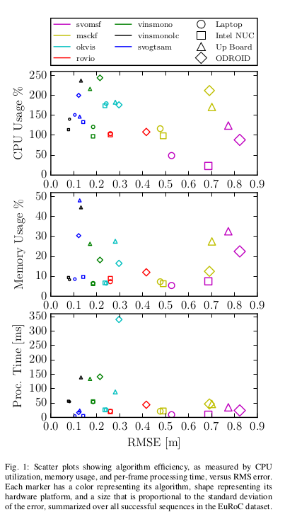
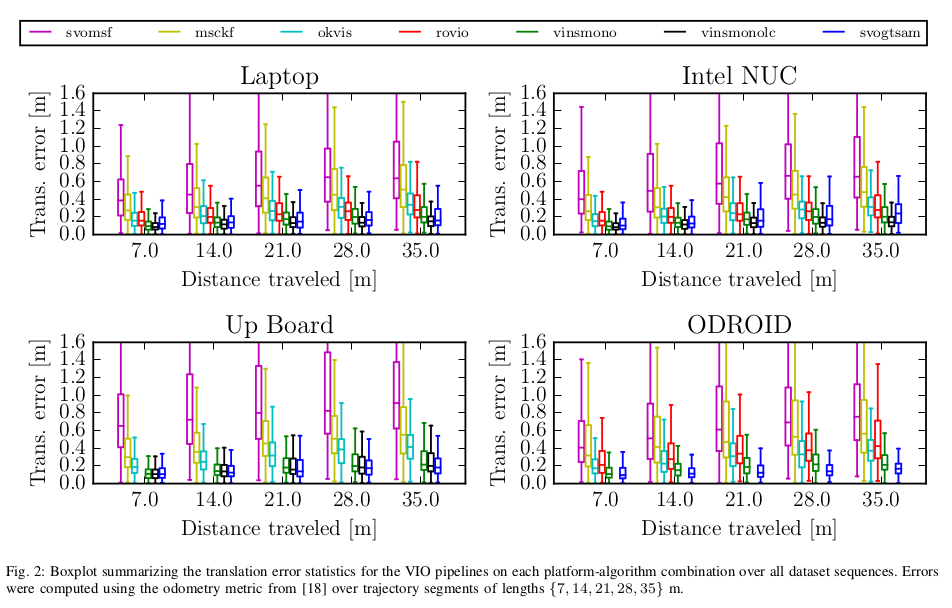
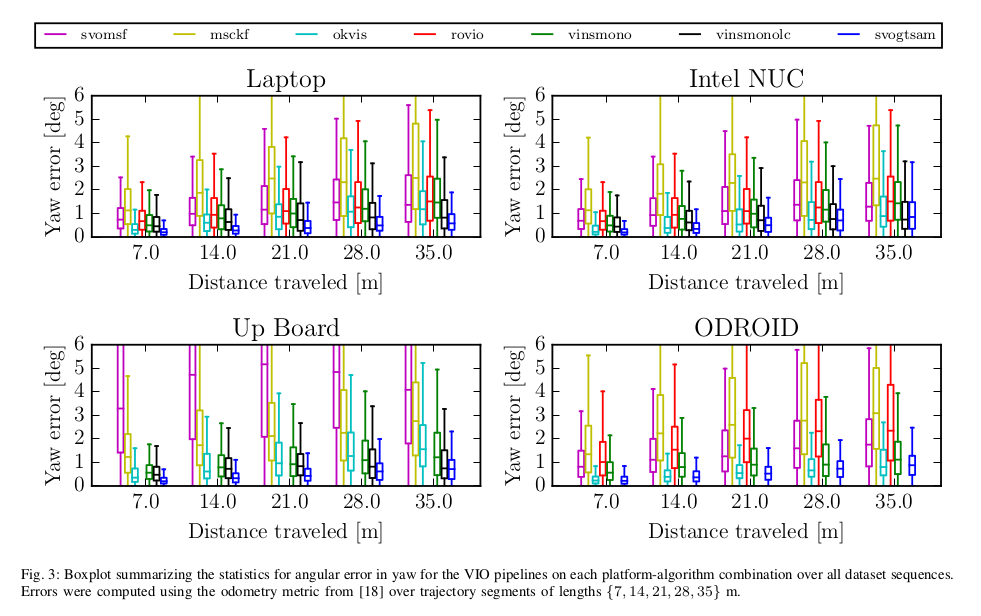
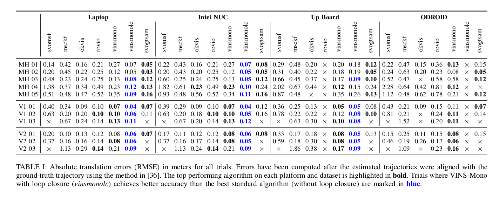
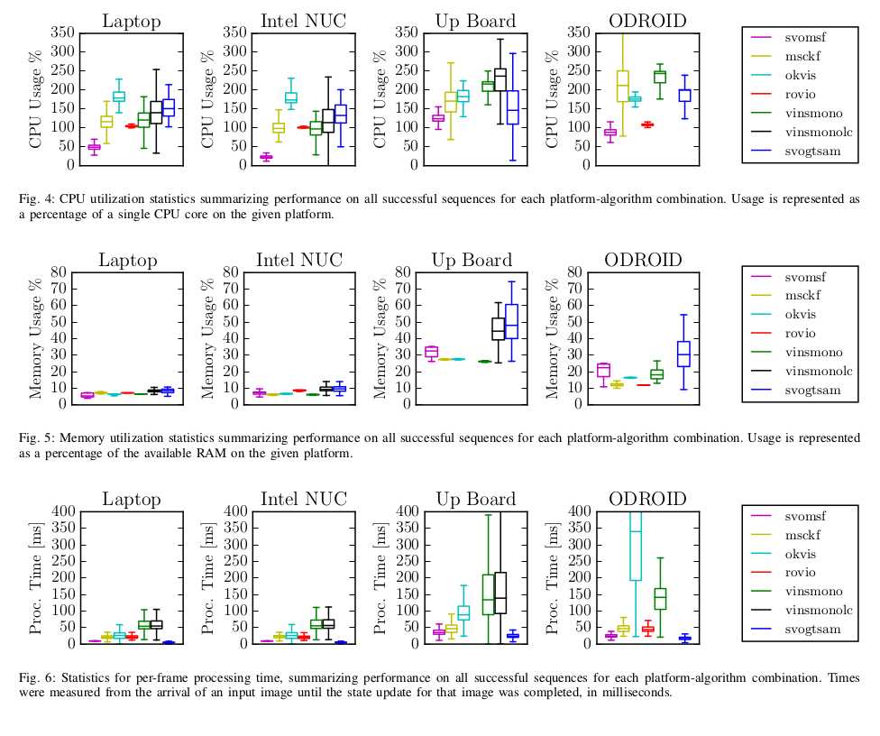

### Visual-Inertial-Odometry算法测评
A Benchmark Comparison of Monocular Visual-Inertial Odometry Algorithms for Flying Robots
#### 比较的算法

+ MSCKF: `EKF` `有多个版本`
  + A multi-state constraint Kalman filter for vision-aided inertial navigation
+ OKVIS: `Keyframe-based` `optimization-based` ` Sliding Window`
  + Keyframe-based visual-inertial SLAM using nonlinear optimization
+ ROVIO: `EKF` Tracking 3D landmarks and image patch features
  + Robust visual
    inertial odometry using a direct EKF-based approach
+ VINS-Mono: `Nonlinear-Optimization` `Sliding Window` `pre-integrate`
  + VINS-Mono: A robust and versatile monocular visual-inertial state estimator
+ SVO-MSF: `松耦合` `EKF`
  +  SVO: Semidirect visual odometry for monocular and multicamera
    systems
+ SVO-GTSAM: `VO前端` `full-smoothing后端` 
  + On-manifold pre-integration for real-time visual-inertial odometry
  + iSAM2: Incremental smoothing and mapping using the Bayes
    tree

#### 算法分析

##### MSCKF

利用相机观测之间的约束，不维护3D特征的状态

`https://github.com/daniilidis-group/msckf_mono`

##### OKVIS

Keyframe-based 使用非线性优化和滑动窗，cost function 为LandMarks的加权重投影误差和惯导误差。

+ Harris 角点检测
+ BRISK描述子
+ 对于old frame 进行Marginalized
+ Ceres Solver
+ 为双目设计，所以双目效果会更好

##### ROVIO

基于EKF来实现的。

+ Fast角点
+ 逆深度参数化
+ multi-level patches
+ 利用IMU信息进行Feature Warp，利用光度误差进行优化
+ Mono-VIO

##### VINS-Mono

基于非线性优化、滑动窗。

+ Good features to track
+ Sensor fusion initialization
+ pre-integrated
+ 4-DoF Pose-Graph 优化 + Loop-closure

##### SVO+MSF(Multi-Sensor Fusion)

+ Vision-only SVO
+ Pose Sensor

##### 性能比较的参数

CPU/Memory 

