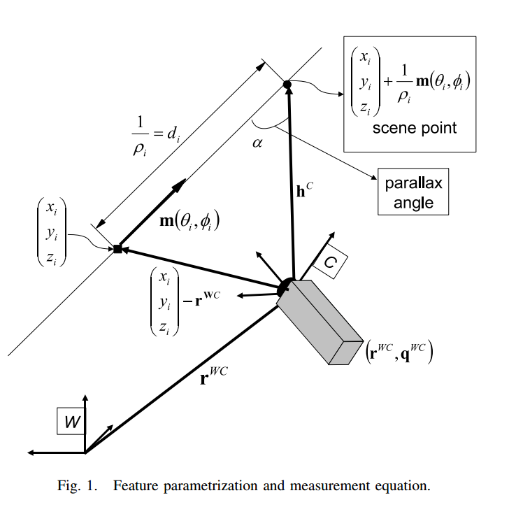

## 单目SLAM中逆深度参数化

[TOC]

### 基本概念

摘要中的很多实际概念还得把基于滤波的slam算法好好研究之后才可以感受到，简单地说优点如下：

+ 直接对逆深度进行参数化，方便后续的线性化
+ 对于视差(`parallax`)较小的相机移动，可以表示3D点在相机经过较大的运动之后变成非无穷远点的概率

`Parallex`：观测点与两次观测的相机光心连线之间的夹角称为视差

`Infinity point`：因为距离太远，所以相机的运动不会产生视差

例子：地球上摄像机观测天上的星星，即便移动了几公里，可能在图片中的位置也不会发生变化，所以无法用来估计相机的平移，但是可以用来确定相机的旋转。

### 状态向量的定义

#### 相机运动模型

手持相机的运动模型假定是__匀速运动__模型，即：角速度与线速度恒定。相机的状态向量$\mathbf{x}_v$由相机的光心位置$\mathbf{r}^{WC}$，以及用四元数表示的姿态$\mathbf{q}^{WC}$ ，线速度$\mathbf{v}^W$和角速度$\omega^{W}$构成：
$$
\mathbf{x}_v = 
\begin{pmatrix}
\mathbf{r}^{WC} \\
\mathbf{q}^{WC} \\
\mathbf{v}^{W} \\
\mathbf{\omega}^W 
\end{pmatrix}
$$
每一步都假设为线加速度与角加速度未知的零均值高斯过程，$\mathbf{a}^W$和$\alpha^W$为线加速度和角加速度。
$$
\mathbf{n} =
\begin{pmatrix}
\mathbf{V}^W \\
\Omega^W
\end{pmatrix}
= \begin{pmatrix}
\mathbf{a}^W\Delta t \\
\alpha^W \Delta t
\end{pmatrix}
$$
相机运动的状态更新方程为：
$$
\mathbf{f}_v = 
\begin{pmatrix}
\mathbf{r}^{WC}_{k+1} \\
\mathbf{q}^{WC}_{k+1} \\
\mathbf{v}^{W}_{k+1} \\
\omega^{W} _{k+1}
\end{pmatrix}
= \begin{pmatrix}
\mathbf{r}^{WC}_k + (\mathbf{v}^{W}_k + \mathbf{V}^{W}_k) \Delta t \\
\mathbf{q}^{WC}_k \times \mathbf{q}( (\omega^{W}_k + \Omega^W ) \Delta t )  \\
\mathbf{v}^{W}_k + \mathbf{V}^{W} \\
\omega^{W}_k + \Omega^{W}
\end{pmatrix}
$$
其中$ \mathbf{q}( (\omega^{W}_k + \Omega^W )\Delta t)$为由旋转向量$(\omega^{W}_k + \Omega^W )\Delta t$所对应的四元数。

####  3D空间点的定义

3D空间点$i$可以由一个6维的状态向量表示：
$$
\mathbf{y}_i = \begin{pmatrix}
x_i & y_i & z_i& \theta_i & \phi_i & \rho_i 
\end{pmatrix}^T 
$$
表示空间的3D点坐标为：
$$
\begin{pmatrix}
x_i \\
y_i \\
z_i 
\end{pmatrix} + \frac{1}{\rho_i}\mathbf{m}(\theta_i,\phi_i)
$$
其中$(x_i,y_i,z_i)^T$ 表示3D点第一次被观测到的时候对应的相机的光心的位置。$\theta_i$和$\phi_i$分别对3D点与第一次观测到其位置的相机的光心所在的向量在世界坐标系中对应的航向角和俯仰角。(滚转角对于3D点位置并没有影响)

3D点沿着$\mathbf{m}(\theta_i,\phi_i)$方向的深度$d_i$通过$\rho_i=1/d_i$进行参数化。由于假定特征点$\mathbf{y}_i$不发生变化，所以整个系统的状态向量可以写成如下形式：
$$
\mathbf{x}=\begin{pmatrix} \mathbf{x}_v^T,\mathbf{y}_1^T,\mathbf{y}_2^T,...,\mathbf{y}_n^T\end{pmatrix}^T
$$
图示：

### 观测方程

每一个被观测到的特征点都给相机的位置与地图点增加了一个约束，3D空间点$\mathbf{y}_i$ 与观测到其的相机的光心定义了一条射线，即为上图中的$\mathbf{h}^C=(h_x, h_y, h_z)^T$：
$$
\mathbf{h}^C  = \mathbf{R}^{CW}
\begin{pmatrix}
\begin{pmatrix}
x_i \\
y_i \\
z_i 
\end{pmatrix} + \frac{1}{\rho_i}\mathbf{m}(\theta_i,\phi_i) -\mathbf{r}^{WC}
\end{pmatrix}
$$
与下方式子等价：
$$
\mathbf{h}^C  = \mathbf{R}^{CW}
\begin{pmatrix}
\begin{pmatrix}
x_i \\
y_i \\
z_i 
\end{pmatrix} + d_i\mathbf{m}(\theta_i,\phi_i) -\mathbf{r}^{W}
\end{pmatrix}
$$
两个式子的区别是，上方的式子可以通过令$\rho_i=0$来表示无穷远点，对于无穷远点，上方的式子可以近似成如下形式：
$$
\mathbf{h}^C  = \mathbf{R}^{CW}
\frac{1}{\rho_i}
\begin{pmatrix}
\rho_i
\begin{pmatrix}
\begin{pmatrix}
x_i \\
y_i \\
z_i 
\end{pmatrix}  -\mathbf{r}^{WC}
\end{pmatrix} + \mathbf{m}(\theta_i,\phi_i)
\end{pmatrix} \\
\Downarrow \\
\mathbf{h}^C  = \mathbf{R}^{CW}
\begin{pmatrix}
\rho_i
\begin{pmatrix}
\begin{pmatrix}
x_i \\
y_i \\
z_i 
\end{pmatrix}  -\mathbf{r}^{WC}
\end{pmatrix} + \mathbf{m}(\theta_i,\phi_i)
\end{pmatrix}
$$
$\mathbf{h}^C$通过针孔相机模型投影到图像平面中：

