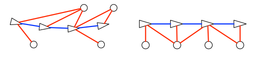
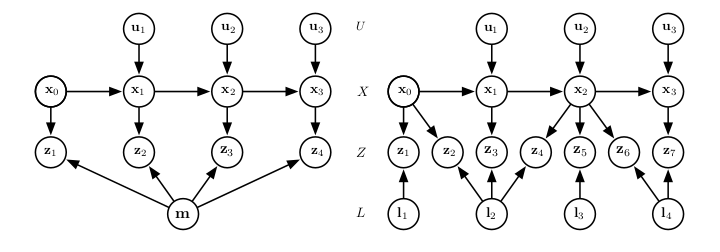
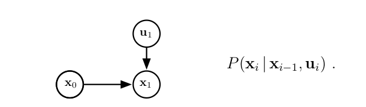
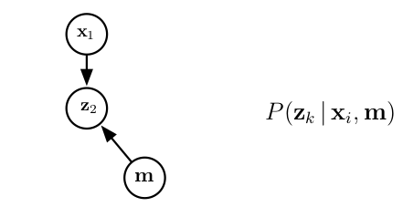
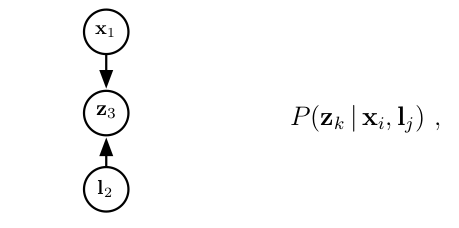
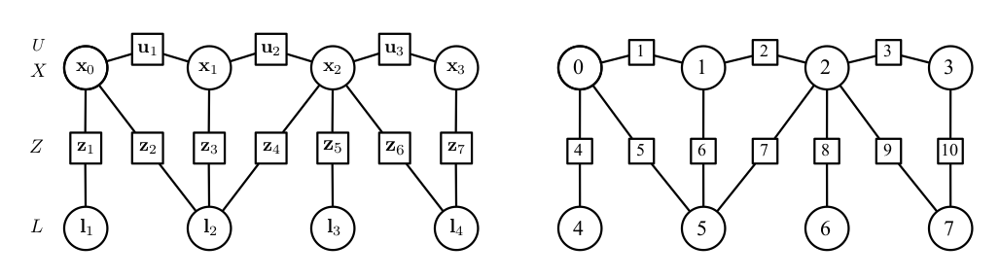
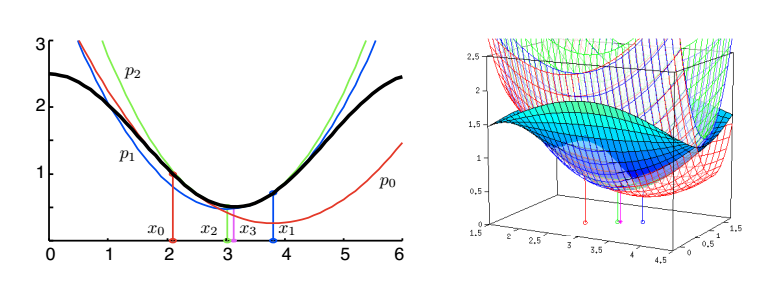

## Graph-based SLAM

### 问题建模

左图为实际的运动位置，右边为构建的图模型示意图，蓝色的边为相对运动测量值，红色的边为观测到路标点。

#### SLAM as Dynamic Bayes Network

动态贝叶斯网络(DBN)为概率图模型，表示随机变量以及之间的依赖关系(条件概率)。为一个有向无环图。$A\leftarrow B$表示A依赖于B，没有回环可以避免A依赖于B,B依赖于C,C依赖于A的情况。

从A到B的箭头表明B依赖于A：$x$为状态值，$u$为控制输入,$z$为观测值,$m$表示地图，$I$为单独的路标点。

变量及含义：

+ 机器人的状态：$X=\left\{\mathbf{x}_{i}\right\}, \quad i \in 0 \cdots M$
+ 路标点的状态：$L=\left\{\mathbf{I}_{j}\right\}, \quad j \in 1 \cdots N$
+ 机器人控制输入：$U=\left\{\mathbf{u}_{i}\right\}, \quad i \in 1 \cdots M$
+ 对路标点的观测：$Z=\left\{\mathbf{z}_{k}\right\}, \quad k \in 1 \cdots K$

由运动模型可以得到：
$$
\mathbf{x}_{i}=f_{i}\left(\mathbf{x}_{i-1}, \mathbf{u}_{i}\right)+\mathbf{w}_{i}
$$
在图中的表示为一个子图，结构如下：

同样对于观测数据，可以建模成如下形式：
$$
\mathbf{z}_{k}=h_{k}\left(\mathbf{x}_{i}, \mathbf{m}\right)+\mathbf{v}_{k}
$$

当抽象的Map用一个一个LandMark来表示的时候：
$$
\mathbf{z}_{k}=h_{k}\left(\mathbf{x}_{i}, \mathbf{l}_{j}\right)+\mathbf{v}_{k}
$$

利用上述形式构建的DBN包含了所有变量之间的依赖关系，意味着不在图中出现的任何变量都是独立的，于是所有变量的联合概率分布可以写作：
$$
P(X, L, U, Z) \propto P\left(\mathbf{x}_{0}\right) \prod_{i=1}^{M} P\left(\mathbf{x}_{i} | \mathbf{x}_{i-1}, \mathbf{u}_{i}\right) \prod_{k=1}^{K} P\left(\mathbf{z}_{k} | \mathbf{x}_{i_{k}}, \mathbf{I}_{j_{k}}\right)
$$
其中$P(\mathbf{x}_0)$表示机器人初始Pose的先验概率。于是整个SLAM问题便可以转化成寻找一组$X^{*}, L^{*}$，满足：
$$
\left\{X^{*}, L^{*}\right\}=\underset{X, L}{\arg \max } P\left(\mathbf{x}_{0}\right) \prod_{i=1}^{M} P\left(\mathbf{x}_{i} | \mathbf{x}_{i-1}, \mathbf{u}_{i}\right) \prod_{k=1}^{K} P\left(\mathbf{z}_{k} | \mathbf{x}_{i_{k}}, \mathbf{I}_{j_{k}}\right)
$$

#### SLAM as Factor Graph

因子图方式建模SLAM问题，上述公式由$M+K$个因子构成，状态量:Poses和LandMarks用圆表示，因子：controls和measurements用方块表示。

因子图为一个二分图，Node有两种类型：`states`和`factors`(用来表示state之间的约束)。

##### 模型如下：

`机器人运动模型`
$$
\mathbf{x}_{i}=f_{i}\left(\mathbf{x}_{i-1}, \mathbf{u}_{i}\right)+\mathbf{w}_{i}, \quad \mathbf{w}_{i} \sim \mathcal{N}\left\{0, \mathbf{\Omega}_{i}^{-1}\right\}
$$
`路标观测模型`
$$
\mathbf{z}_{k}=h_{k}\left(\mathbf{x}_{i_{k}}, \mathbf{I}_{j_{k}}\right)+\mathbf{v}_{k}, \quad \mathbf{v}_{k} \sim \mathcal{N}\left\{0, \mathbf{\Omega}_{k}^{-1}\right\}
$$

噪声$\mathbf{w}_i$ 和$\mathbf{v}_k$ 服从高斯分布，且对应的协方差矩阵为：$\mathbf{\Omega}_i^{-1}$和$\mathbf{\Omega}_k^{-1}$($\mathbf{\Omega}$为信息矩阵)。

于是可以得到因子$\phi$：
$$
\phi_{i}=P\left(\mathbf{x}_{i} | \mathbf{x}_{i-1}, \mathbf{u}_{i}\right) \propto \exp \left(-\frac{1}{2}\left(\mathbf{x}_{i}-f_{i}\left(\mathbf{x}_{i-1}, \mathbf{u}_{i}\right)\right)^{\top} \mathbf{\Omega}_{i}\left(\mathbf{x}_{i}-f_{i}\left(\mathbf{x}_{i-1}, \mathbf{u}_{i}\right)\right)\right)
$$
$$
\phi_{k}=P\left(\mathbf{z}_{k} | \mathbf{x}_{i_{k}}, \mathbf{I}_{j_{k}}\right) \propto \exp \left(-\frac{1}{2}\left(\mathbf{z}_{k}-h_{k}\left(\mathbf{x}_{i_{k}}, \mathbf{I}_{j_{k}}\right)\right)^{\top} \mathbf{\Omega}_{k}\left(\mathbf{z}_{k}-h_{k}\left(\mathbf{x}_{i_{k}}, \mathbf{I}_{j_{k}}\right)\right)\right)
$$

把误差值$\mathbf{e}_k$用唯一的索引$k$表示：

##### 误差：

`机器人运动误差`
$$
\mathbf{e}_{k}\left(\mathbf{x}_{i_{k}-1}, \mathbf{x}_{i_{k}}\right)=f_{i_{k}}\left(\mathbf{x}_{i_{k}-1}, \mathbf{u}_{i_{k}}\right)-\mathbf{x}_{i_{k}}
$$
`路标观测误差`
$$
\mathbf{e}_{k}\left(\mathbf{x}_{i_{k}}, \mathbf{I}_{j_{k}}\right)=h_{k}\left(\mathbf{x}_{i_{k}}, \mathbf{I}_{j_{k}}\right)-\mathbf{z}_{k}
$$
于是可以把上述的$\phi_i$和$\phi_k$写成一个通用形式：
$$
\phi_{k}=\exp \left(-\frac{1}{2} \mathbf{e}_{k}^{\top} \mathbf{\Omega}_{k} \mathbf{e}_{k}\right)
$$
把二者写成一个统一的形式，即为：
$$
\mathbf{e}_{k}\left(\mathbf{x}_{i_{k}}, \mathbf{x}_{j_{k}}, \mathbf{z}_{k}\right)
$$
不必再区分是运动因子还是观测因子，后续的建模过程只需要考虑两种变量：需要估计的状态和观测数据。
需要估计的状态为$\{X,L\}$，其中$X$为状态向量，由N块数据构成：
$$
\mathbf{x}=\left[ \begin{array}{lll}{\mathbf{x}_{1}} & {\cdots} & {\mathbf{x}_{N}}\end{array}\right]^{\top}
$$
$\mathbf{x}_i$为机器人的状态或者是路标的状态。
观测数据$\mathbf{z}=\{U,Z\}$由K块组成。
$$
\mathbf{z}=\left[ \begin{array}{lll}{\mathbf{z}_{1}} & {\cdots} & {\mathbf{z}_{K}}\end{array}\right]^{\top}
$$
包括控制量和观测值。

对于每一个观测数据$\mathbf{z}_k$都可以对其计算误差$\mathbf{e}_k$以及对应的因子$\phi_k$，于是联合概率分布可以写成所有因子的乘积的形式：
$$
P(\mathbf{x}, \mathbf{z}) \propto \prod_{k=1}^{K} \phi_{k} \propto \prod_{k=1}^{K} \exp \left(-0.5 \mathbf{e}_{k}^{\top} \mathbf{\Omega}_{k} \mathbf{e}_{k}\right)
$$
最大化其概率分布函数(PDF)等价于最小化其负对数函数，即cost为：
$$
\mathbf{F}(\mathbf{x}) \triangleq-\log P(\mathbf{x}, \mathbf{z})=\sum_{k=1}^{K} \mathbf{F}_{k}=\sum_{k=1}^{K} \mathbf{e}_{k}\left(\mathbf{x}_{i}, \mathbf{x}_{j}\right)^{\top} \mathbf{\Omega}_{k} \mathbf{e}_{k}\left(\mathbf{x}_{i}, \mathbf{x}_{j}\right)
$$
求解的目标函数为：
$$
\mathbf{x}^{*}=\underset{\mathbf{x}}{\arg \min } \sum_{k=1}^{K} \mathbf{e}_{k}\left(\mathbf{x}_{i}, \mathbf{x}_{j}\right)^{\top} \mathbf{\Omega}_{k} \mathbf{e}_{k}\left(\mathbf{x}_{i}, \mathbf{x}_{j}\right)
$$
同时我们注意到，$\mathbf{F}_k=-\log\phi_k$大于等于误差$\mathbf{e}_{k}=\mathbf{e}_{k}\left(\mathbf{x}_{i_{k}}, \mathbf{x}_{j_{k}}\right)$的马氏距离的平方。
$$
\mathbf{F}_{k} \propto -\log \phi_{k}  \propto  \mathbf{e}_{k}^{\top} \Omega_{k} \mathbf{e}_{k}=\left\|\mathbf{e}_{k}\right\|_{\Omega_{k}^{-1}}^{2}=\left\|\Omega_{k}^{\top / 2} \mathbf{e}_{k}\right\|^{2}
$$

##### Motion Error的一些说明

运动模型的误差定义为：
$$
\mathbf{e}=f\left(\mathbf{x}_{i-1}, \mathbf{u}_{i}\right)-\mathbf{x}_{i}
$$
上文中我们在状态空间定义了误差：
$$
\mathbf{x}_{i}=f_{x}\left(\mathbf{x}_{i-1}, \mathbf{u}_{i}\right)+\mathbf{w}_{i}^{\prime} \quad, \quad \mathbf{w}_{i}^{\prime} \sim \mathcal{N}\left\{0, \mathbf{\Omega}^{\prime-1}\right\}
$$
但是通常噪声$\mathbf{w}$是与测量值$\mathbf{u}$相关联的，即：
$$
\mathbf{x}_{i}=f_{u}\left(\mathbf{x}_{i-1}, \mathbf{u}_{i}-\mathbf{w}_{i}\right) \quad, \quad \mathbf{w}_{i} \sim \mathcal{N}\left\{0, \Omega^{-1}\right\}
$$
其信息矩阵为$\mathbf{\Omega}$一般是满秩的，有些时候甚至是对角阵。在前几章关于协方差矩阵的传播需要求雅克比矩阵。如果雅克比矩阵不可逆，那么与$\mathbf{w}^{\prime}$ 相关的协方差矩阵可能为奇异矩阵，即信息矩阵$\mathbf{\Omega}^{\prime}$无法计算。
为了使误差能够有较好的信息矩阵，一般在将误差定义在观测数据上：
$$
\mathbf{u}_{i}=f^{-1}\left(\mathbf{x}_{i}, \mathbf{x}_{i-1}\right)+\mathbf{w}_{i}
$$

对应的误差写作：
$$
\mathbf{e}=f^{-1}\left(\mathbf{x}_{i}, \mathbf{x}_{i-1}\right)-\mathbf{u}_{i}
$$
误差定义在测量空间，于是这和路标的测量值有着相同的形式：$\mathbf{e}=h\left(\mathbf{x}_{i}, \mathbf{l}_{j}\right)-\mathbf{z}$。由于运动模型的不同，所以$f^{-1}( )$的形式也不相同。

在一些极端情况下，例如IMU预积分的时候，会寻找测量值的修改版本：$\mathbf{z}=z(\mathbf{u})$ 
$$
\mathbf{z}_{i}=g\left(\mathbf{x}_{i}, \mathbf{x}_{i-1}\right)+\mathbf{w}_{i}
$$

$$
\mathbf{e}=g\left(\mathbf{x}_{i}, \mathbf{x}_{i-1}\right)-\mathbf{z}_{i} \sim \mathcal{N}\left\{0, \mathbf{\Omega}^{-1}\right\}
$$

### 迭代非线性优化

对于一个代价函数$\mathbf{F}(\mathbf{x})$,最优状态量为$\mathbf{x}^*$满足:
$$
\mathbf{x}^{*}=\underset{\mathbf{x}}{\arg \min } \mathbf{F}(\mathbf{x})
$$
所有基于迭代的算法都通过一系列的步长去逐步接近最优解,即:$\mathbf{x}_n=\mathbf{x}_{n-1}+\Delta \mathbf{x}_n$,通常流程如下:

+ 在某个状态$\breve{\mathbf{X}}$附近使用解析形式对$\mathbf{F}(\mathbf{x})$进行近似
+ 求解在这种形式下的迭代步长$\Delta \mathbf{x}$
+ 更新状态$\breve{\mathbf{x}} \leftarrow \breve{\mathbf{x}}+\Delta \mathbf{x}$
+ 迭代直到收敛

#### 常见形式与牛顿法

牛顿法近似方式为:
$$
\mathbf{F}(\breve{\mathbf{x}}+\Delta \mathbf{x}) \approx \mathbf{F}(\breve{\mathbf{x}})+\nabla \mathbf{F} \Delta \mathbf{x}+\frac{1}{2} \Delta \mathbf{x}^{\top} \mathbf{H}_{\mathbf{F}} \Delta \mathbf{x}
$$
$\breve{\mathbf{x}}=\mathbf{x}_{n-1}$,使用二阶泰勒展开近似.

其中$\nabla \mathbf{F} $和$ \mathbf{H}_{\mathbf{F}}$分别表示$\mathbf{F}$的梯度向量和海塞矩阵:
$$
\nabla \mathbf{F} \triangleq\left.\frac{\partial \mathbf{F}}{\partial \mathbf{x}}\right|_{\breve{\mathbf{x}}},\mathbf{H}_{\mathbf{F}} \triangleq\left.\frac{\partial^{2} \mathbf{F}}{\partial \mathbf{x}^{2}}\right|_{\check{\mathbf{x}}}
$$

牛顿法近似在选取的近似点不同的时候,最后迭代收敛的最优解也不同.

迭代的最优步长$\Delta \mathbf{x}^*$可以通过对近似方程求导并令导数为0获得:
$$
\nabla \mathbf{F}^{\top}+\mathbf{H}_{\mathbf{F}} \Delta \mathbf{x}^{*}=0
$$

#### 最小二乘与高斯牛顿法

在许多情况下,我们的误差函数为关于误差向量的二次函数:
$$
\mathbf{F}(\mathbf{x})=\frac{1}{2} \mathbf{e}(\mathbf{x})^{\top} \mathbf{\Omega} \mathbf{e}(\mathbf{x})
$$
$\mathbf{\Omega}$为对称矩阵且正定.于是梯度向量$\nabla \mathbf{F}$和$\mathbf{H}_{\mathbf{F}}$的形式如下:
$$
\nabla \mathbf{F}=\left.\frac{\partial \mathbf{F}}{\partial \mathbf{x}}\right|_{\breve{\mathbf{x}}}=\left.\left(\mathbf{e}^{\top} \Omega \frac{\partial \mathbf{e}}{\partial \mathbf{x}}\right)\right|_{\breve{\mathbf{x}}}=\breve{\mathbf{e}}^{\top} \boldsymbol{\Omega} \mathbf{J}
$$

$$
\mathbf{H}_{\mathrm{F}}=\left.\frac{\partial^{2} \mathbf{F}}{\partial \mathbf{x}^{2}}\right|_{\overline{\mathbf{x}}}=\left.\left(\frac{\partial \mathbf{e}}{\partial \mathbf{x}} \boldsymbol{\Omega} \frac{\partial \mathbf{e}}{\partial \mathbf{x}}+\mathbf{e}^{\top} \boldsymbol{\Omega} \frac{\partial^{2} \mathbf{e}}{\partial \mathbf{x}^{2}}\right)\right|_{\breve{\mathbf{x}}}==\mathbf{J}^{\top} \Omega \mathbf{J}+\breve{\mathbf{e}}^{\top} \boldsymbol{\Omega} \mathcal{H}
$$

其中:
$$
\breve{\mathbf{e}} \triangleq \mathbf{e}(\breve{\mathbf{x}}) \quad \text{is error vector} \\ 
\mathbf{J} \triangleq\left.\frac{\partial \mathbf{e}}{\partial \mathbf{x}}\right|_{\breve{\mathbf{x}}} \text{Jacobian matrix } \\
\mathcal{H} \triangleq\left.\frac{\partial^{2} \mathbf{e}}{\partial \mathbf{x}^{2}}\right|_{\check{\mathbf{x}}} \text{Hessian tensor}
$$

> $\mathbf{\Omega}$为信息矩阵,即协方差矩阵的逆,通常为对角阵,或者有些块为对角阵

对误差函数进行近似展开得:
$$
\mathbf{F}(\breve{\mathbf{x}}+\Delta \mathbf{x}) \approx \frac{1}{2} \breve{\mathbf{e}}^{\top} \boldsymbol{\Omega} \breve{\mathbf{e}}+\breve{\mathbf{e}}^{\top} \boldsymbol{\Omega} \mathbf{J} \Delta \mathbf{x}+\frac{1}{2} \Delta \mathbf{x}^{\top}\left(\mathbf{J}^{\top} \boldsymbol{\Omega} \mathbf{J}+\breve{\mathbf{e}}^{\top} \boldsymbol{\Omega} \mathcal{H}\right) \Delta \mathbf{x}
$$
高斯牛顿法的步长计算方式采用的是忽略$\mathbf{H}_{\mathbf{F}}$中的小量:$\breve{\mathbf{e}}^{\top} \boldsymbol{\Omega} \mathcal{H}$,可以得到高斯牛顿法的近似代价函数为:
$$
\mathbf{F}(\breve{\mathbf{x}}+\Delta \mathbf{x}) \approx \frac{1}{2} \breve{\mathbf{e}}^{\top} \mathbf{\Omega} \breve{\mathbf{e}}+\breve{\mathbf{e}}^{\top} \mathbf{\Omega} \mathbf{J} \Delta \mathbf{x}+\frac{1}{2} \Delta \mathbf{x}^{\top} \mathbf{J}^{\top} \mathbf{\Omega} \mathbf{J} \Delta \mathbf{x}
$$
上述表达式一般可以直接通过对误差进行一阶近似来获得$\mathbf{e}(\breve{\mathbf{x}}+\Delta \mathbf{x}) \approx \breve{\mathbf{e}}+\mathbf{J} \Delta \mathbf{x}$,并对$\mathbf{H}$进行近似,可得:
$$
\mathbf{H}_{\mathbf{F}} \approx \mathbf{H} \triangleq \mathbf{J}^{\top} \mathbf{\Omega} \mathbf{J}
$$
高斯牛顿法的步长为:
$$
\Delta \mathbf{x}_{G N}^{*}=\mathbf{H}^{-1} \nabla \mathbf{F}^{\top}
$$
即:
$$
\Delta \mathbf{x}_{G N}^{*}=\left(\mathbf{J}^{\top} \mathbf{\Omega} \mathbf{J}\right)^{-1} \mathbf{J}^{\top} \boldsymbol{\Omega} \breve{\mathbf{e}}
$$
定义矩阵:
$$
\mathbf{J}_{\Omega}^{+} \triangleq\left(\mathbf{J}^{\top} \mathbf{\Omega} \mathbf{J}\right)^{-1} \mathbf{J}^{\top} \boldsymbol{\Omega}
$$
其为$\mathbf{J}$的加权广义逆矩阵.于是方程可以改写为:
$$
\Delta \mathbf{x}_{G N}^{*}=\mathbf{J}_{\Omega}^{+} \breve{\mathbf{e}}
$$
通常$\mathbf{J}_{\Omega}^{+}$不会直接计算,而是通过矩阵相关算法去降低计算复杂度.常用的两种方法为对加权雅克比矩阵$\Omega^{\top / 2} \mathrm{J}$的$QR$分解和

对$\mathbf{H}$矩阵的$Cholesky$分解.矩阵$\mathbf{H}=\mathbf{J}^{\top} \boldsymbol{\Omega} \mathbf{J}$为对海塞矩阵$\mathbf{H}_{\mathbf{F}}$的近似.高斯牛顿法同样也存在着迭代不收敛的情况.

#### Levenberg-Marquardt 算法

通过上一节的分析可以看出,牛顿法在初值较好的时候才会有效,原因是$\mathbf{H}=\mathbf{J}^{\top}\mathbf{\Omega}\mathbf{J}$过小,导致步长较大.

`Levenberg`

改进主要在对步长的修改:
$$
\Delta \mathbf{x}_{L}^{*}=-\alpha(\mathbf{H}+\lambda \mathbf{I})^{-1} \nabla \mathbf{F}^{\top}
$$
当$\lambda$较大时,步长的方向主要由梯度方向$\nabla \mathbf{F}^{\top}=\mathbf{J}^{\top} \Omega \breve{\mathbf{e}}$来决定,算法变为梯度下降法,参数$\alpha$使得我们可以调节步长的长度.

`Marquardt`
$$
\Delta \mathbf{x}_{L M}^{*}=-\alpha(\mathbf{H}+\lambda \operatorname{diag}(\mathbf{H}))^{-1} \nabla \mathbf{F}^{\top}
$$
两种算法中$\alpha$和$\lambda$ 的值都随着cost的值变化.

#### SLAM 问题的稀疏性

求解SLAM问题:
$$
\mathbf{F}(\mathbf{x})=\sum_{k=1}^{K} \mathbf{e}_{k}(\mathbf{x})^{\top} \mathbf{\Omega}_{k} \mathbf{e}_{k}(\mathbf{x})
$$
与下列式完全等价
$$
\mathbf{F}(\mathbf{x})=\frac{1}{2} \mathbf{e}(\mathbf{x})^{\top} \boldsymbol{\Omega} \mathbf{e}(\mathbf{x})
$$
可以看做把所有的Error组成一个向量,且各个信息矩阵块组成一个大的信息矩阵.
$$
\mathbf{e}=\left[ \begin{array}{c}{\mathbf{e}_{1}} \\ {\vdots} \\ {\mathbf{e}_{K}}\end{array}\right] ,\Omega = 
\begin{bmatrix}
\Omega _1& &  \\
&\ddots& \\
&& \Omega_K
\end{bmatrix}
$$
每一个误差:$\left\langle\mathbf{e}_{k}, \boldsymbol{\Omega}_{k}\right\rangle$都来自于独立的测量值,来自motion或者observation因此对应为因子图中的一个因子.

高斯牛顿法通过对$\mathbf{e}_k$进行线性化求解线性最小二乘问题,故:
$$
\mathbf{e}_{k}(\breve{\mathbf{x}}+\Delta \mathbf{x}) \approx \breve{\mathbf{e}}_{k}+\mathbf{J}_{k} \Delta \mathbf{x}
$$

$$
\breve{\mathbf{e}}_{k} \triangleq \mathbf{e}_{k}(\breve{\mathbf{x}}), \quad \mathbf{J}_{k}=\left.\frac{\partial \mathbf{e}_{k}(\mathbf{x})}{\partial \mathbf{x}}\right|_{\check{\mathbf{x}}}
$$

高斯牛顿法求解对应的$Jacobian$和$Hessian$为:
$$
\mathbf{J}=\left[ \begin{array}{c}{\mathbf{J}_{1}} \\ {\vdots} \\ {\mathbf{J}_{K}}\end{array}\right] \quad, \quad \mathbf{H}=\mathbf{J}^{\top} \mathbf{\Omega} \mathbf{J}=\sum_{k} \mathbf{J}_{k}^{\top} \Omega_{k} \mathbf{J}_{k}
$$
在SLAM问题中,这些矩阵大部分为稀疏的.$\mathbf{J}_k$为稀疏的原因是因为整个Graph是稀疏的,只有被该Factor影响的状态会对应非零块.假设矩阵$\mathbf{J}_k$连接的状态为$\mathbf{x}_i$和$\mathbf{x}_j$,对应的$\mathbf{J}_k$如下:
$$
\mathbf{J}_{k}=\left[ \begin{array}{cccccc}{\cdots} & {\mathbf{J}_{k i}} & {\cdots} & {\mathbf{J}_{k j}} & {\cdots}\end{array}\right]
$$
$\mathbf{J}_{ki}$对应节点$i$,$\mathbf{J}_{kj}$对应节点$j$:
$$
\mathbf{J}_{k i}=\left.\frac{\partial \mathbf{e}_{k}(\mathbf{x})}{\partial \mathbf{x}_{i}}\right|_{\breve{\mathbf{x}}}, \quad \mathbf{J}_{k j}=\left.\frac{\partial \mathbf{e}_{k}(\mathbf{x})}{\partial \mathbf{x}_{j}}\right|_{\dot{x}}
$$
下图以及其对应的$\mathbf{J}$形式如下:

$$
\mathbf{J}=\left[ \begin{array}{c}{\mathbf{J}_{1}} \\ {\vdots} \\ {\mathbf{J}_{0}}\end{array}\right]= 
\begin{bmatrix}
\mathbf{J}_{10}  &\mathbf{J}_{11} & & & & &  \\
&\mathbf{J}_{21}  & \mathbf{J}_{22}  & & & &  \\
& & \mathbf{J}_{32}  &\mathbf{J}_{33} &&&\\
\mathbf{J}_{40} & & & & \mathbf{J}_{44}  &&\\
\mathbf{J}_{50} &&&&& \mathbf{J}_{55} &\\
& \mathbf{J}_{61} &&&&\mathbf{J}_{65} \\
&& \mathbf{J}_{72}&&&\mathbf{J}_{75} & &\\
&& \mathbf{J}_{82} &&&& \mathbf{J}_{86} \\
&& \mathbf{J}_{92} &&&&&\mathbf{J}_{97} \\
&&&\mathbf{J}_{10,3} &&&&\mathbf{J}_{10,7}
\end{bmatrix}
$$
