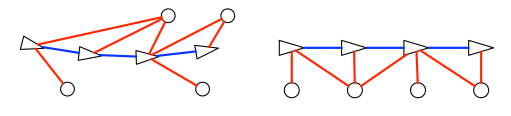
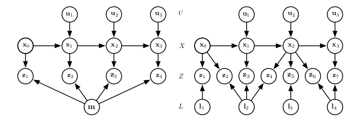

[TOC]
# Course on SLAM 
> Joan Sola

## Robot Motion
### 刚体坐标变换
#### 坐标系相关符号规定
`坐标系B中的点与向量`:$\mathbf{p}_{B}, \mathbf{v}_{B}, \mathbf{p}^{B}, \mathbf{v}^{B}$
`全局坐标系中的点与向量`：$\mathbf{p}, \mathbf{v}$
`坐标系B相对于F的位姿`：$B_{F}=\left(\mathbf{t}_{F B}, \mathbf{\Phi}_{F B}\right)$
`局部坐标系相对于全局坐标系的位姿`：$(\mathbf{t}, \Phi)$

> ps:个人理解B相对于F的位姿态，即对应B系点变换到F系的变换矩阵，即平移对应F系原点到B系原点向量在F系下的坐标，旋转为由F系旋转到B系对应的旋转矩阵。eg:由F经z-y-x顺序旋转到B，对应旋转矩阵为$R_{FB}=R_zR_yR_x$

`2D`：
$$
B=\left[ \begin{array}{l}{\mathbf{t}} \\ {\theta}\end{array}\right] \in \mathbb{R}^{3}
$$
`3D`：
$$
B=\left[ \begin{array}{c}{\mathbf{t}} \\ {\mathbf{q}}\end{array}\right] \in \mathbb{R}^{7}, \quad\|\mathbf{q}\|=1
$$
其中$\mathbf{q}=\left[q_{w}, q_{x}, q_{y}, q_{z}\right]^{\top}$

#### 坐标系变换

不同坐标系之间的点与向量之间的变换，假设载体坐标系为：$B=(\mathbf{t}, \Phi)$

则对应的点坐标变换为：
$$
\begin{aligned} \mathbf{p} &=\mathbf{R}\{\mathbf{\Phi}\} \mathbf{p}_{B}+\mathbf{t} \\ \mathbf{v} &=\mathbf{R}\{\mathbf{\Phi}\} \mathbf{v}_{B} \end{aligned}
$$
对应的向量变换为：
$$
\begin{aligned} \mathbf{p}_{B} &=\mathbf{R}\{\mathbf{\Phi}\}^{\top}(\mathbf{p}-\mathbf{t}) \\ \mathbf{v}_{B} &=\mathbf{R}\{\mathbf{\Phi}\}^{\top} \mathbf{v} \end{aligned}
$$

其中$\mathbf{R}\{\mathbf{\Phi}\}^{\top}$为$\mathbf{\Phi}$对应的旋转矩阵。

`2D`:
$$
\mathbf{R}\{\theta\}=\left[ \begin{array}{cc}{\cos \theta} & {-\sin \theta} \\ {\sin \theta} & {\cos \theta}\end{array}\right]
$$
`3D`:
$$
\mathbf{R}\{\mathbf{q}\}=\left[ \begin{array}{ccc}{q_{w}^{2}+q_{x}^{2}-q_{y}^{2}-q_{z}^{2}} & {2\left(q_{x} q_{y}-q_{w} q_{z}\right)} & {2\left(q_{x} q_{z}+q_{w} q_{y}\right)} \\ {2\left(q_{x} q_{y}+q_{w} q_{z}\right)} & {q_{w}^{2}-q_{x}^{2}+q_{y}^{2}-q_{z}^{2}} & {2\left(q_{y} q_{z}-q_{w} q_{x}\right)} \\ {2\left(q_{x} q_{z}-q_{w} q_{y}\right)} & {2\left(q_{y} q_{z}+q_{w} q_{x}\right)} & {q_{w}^{2}-q_{x}^{2}-q_{y}^{2}+q_{z}^{2}}\end{array}\right]
$$

#### 坐标系之间的结合

给定两个坐标系：R系和S系，则S相对于R的位姿态可以通过如下方式表示：
$$
R=\left[ \begin{array}{c}{\mathbf{t}_{R}} \\ {\mathbf{\Phi}_{R}}\end{array}\right] \quad, \quad S=\left[ \begin{array}{c}{\mathbf{t}_{S}} \\ {\mathbf{\Phi}_{S}}\end{array}\right] \quad, \quad S_{R}=\left[ \begin{array}{c}{\mathbf{t}_{R S}} \\ {\mathbf{\Phi}_{R S}}\end{array}\right]
$$
`2D`:
$$
\begin{aligned} 
S&= \left[ \begin{array}{c}{\mathbf{t}_{S}} \\ 
{\theta_{S}}\end{array}\right] =\left[ \begin{array}{c}{\mathbf{t}_{R}+\mathbf{R}\left\{\theta_{R}\right\} \mathbf{t}_{R S}} \\ {\theta_{R}+\theta_{R S}}\end{array}\right] \\
S_{R}&=\left[ \begin{array}{c}{\mathbf{t}_{R S}}\\
{\theta_{R S}}\end{array}\right]=\left[ \begin{array}{c}{\mathbf{R}\left\{\theta_{R}\right\}^{\top}\left(\mathbf{t}_{S}-\mathbf{t}_{R}\right)} \\
{\theta_{S}-\theta_{R}}\end{array}\right]
\end{aligned}
$$
`3D`:
$$
\begin{aligned} S&= \left[ \begin{array}{c}{\mathbf{t}_{S}} \\ {\mathbf{q}_{S}}\end{array}\right] =\left[ \begin{array}{c}{\mathbf{t}_{R}+\mathbf{R}\left\{\mathbf{q}_{R}\right\} \mathbf{t}_{R S}} \\ {\mathbf{q}_{R} \otimes \mathbf{q}_{R S}}\end{array}\right] \\ S_{R}&=\left[ \begin{array}{c}{\mathbf{t}_{R S}} \\ {\mathbf{q}_{R S}}\end{array}\right]=\left[ \begin{array}{c}{\mathbf{R}\left\{\mathbf{q}_{R}\right\}^{\top}\left(\mathbf{t}_{S}-\mathbf{t}_{R}\right)} \\ {\mathbf{q}_{R}^{*} \otimes \mathbf{q}_{S}}\end{array}\right] \end{aligned}
$$

其中$q^{*}$为单位四元数$q$的共轭。

### 机器人运动建模

机器人的状态为一个关于：上一时刻状态、控制输入、噪声的函数：
$$
\mathbf{x}_{n}=f_{n}\left(\mathbf{x}_{n-1}, \mathbf{u}_{n}, \mathbf{i}\right), \quad \mathbf{i} \sim \mathcal{N}\{0, \mathbf{Q}\}
$$
也可以记做：
$$
\mathbf{x} \leftarrow f(\mathbf{x}, \mathbf{u}, \mathbf{i}), \quad \mathbf{i} \sim \mathcal{N}\{0, \mathbf{Q}\}
$$

#### 不确定性的传播

假定机器人状态分布为高斯分布：$\mathbf{x} \sim \mathcal{N}\{\overline{\mathbf{x}}, \mathbf{P}\}$

则对应的更新方程为：
$$
\begin{aligned} \overline{\mathbf{x}} \leftarrow & f(\overline{\mathbf{x}}, \mathbf{u}, 0) \\ \mathbf{P}  \leftarrow& \mathbf{F}_{x} \mathbf{P} \mathbf{F}_{x}^{\top}+\mathbf{F}_{i} \mathbf{Q} \mathbf{F}_{i}^{\top} \end{aligned}
$$

其中$\overline{\mathbf{x}}$为$\mathbf{x}$的均值，$\mathbf{P}$为其协方差矩阵，$\mathbf{i}$为扰动。
$$
\mathbf{F}_{x}=\left.\frac{\partial f}{\partial \mathbf{x}}\right|_{\overline{\mathbf{x}}, \mathbf{u}, \mathbf{i}=0}, \quad \mathbf{F}_{i}=\left.\frac{\partial f}{\partial \mathbf{i}}\right|_{\overline{\mathbf{x}}, \mathbf{u}, \mathbf{i}=0}
$$

### 常见的运动模型

#### 匀速运动模型

> 适用于控制输入无法获得的时候，例如手持相机运动

外部的各种因素最终造成的扰动会直接表现在速度上$\mathbf{v}_{i} ,\boldsymbol{\omega}_{i}$
$$
\mathbf{x}=\left[ \begin{array}{c}{\mathbf{p}} \\ {\mathbf{v}} \\ {\mathbf{q}} \\ {\boldsymbol{\omega}}\end{array}\right], \quad \mathbf{i}=\left[ \begin{array}{c}{\mathbf{v}_{i}} \\ {\boldsymbol{\omega}_{i}}\end{array}\right]
$$

$$
\begin{array}{l}{\mathbf{p} \leftarrow \mathbf{p}+\mathbf{v} \delta t} \\ {\mathbf{v} \leftarrow \mathbf{v}+\mathbf{v}_{i}} \\ {\mathbf{q} \leftarrow \mathbf{q} \otimes \mathbf{q}\{\omega \delta t\}} \\ {\boldsymbol{\omega} \leftarrow \boldsymbol{\omega}+\boldsymbol{\omega}_{i}}\end{array}
$$

#### 匀加速度模型

> 适用于运动比较平滑的时候，因为加速度无法突变

$$
\mathbf{x}=\left[ \begin{array}{c}{\mathbf{p}} \\ {\mathbf{v}} \\ {\mathbf{a}} \\ {\mathbf{q}} \\ {\boldsymbol{\omega}} \\ {\boldsymbol{\alpha}}\end{array}\right],\mathbf{i}=\left[ \begin{array}{c}{\mathbf{a}_{i}} \\ {\boldsymbol{\alpha}_{i}}\end{array}\right]
$$

更新方式：
$$
\begin{array}{l}{\mathbf{p} \leftarrow \mathbf{p}+\mathbf{v} \delta t+\frac{1}{2} \mathbf{a} \delta t^{2}} \\ {\mathbf{v} \leftarrow \mathbf{v}+\mathbf{a} \delta t} \\ {\mathbf{a} \leftarrow \mathbf{a}+\mathbf{a}_{i}} \\ {\mathbf{q} \leftarrow \mathbf{q} \otimes \mathbf{q}\left\{\boldsymbol{\omega} \delta t+\frac{1}{2} \boldsymbol{\alpha} \delta t^{2}\right\}} \\ {\boldsymbol{\omega} \leftarrow \boldsymbol{\omega}+\boldsymbol{\alpha} \delta t} \\ {\boldsymbol{\alpha} \leftarrow \boldsymbol{\alpha}+\boldsymbol{\alpha}_{i}}\end{array}
$$

#### 里程计模型

> 适用于轮式和腿型机器人，控制信号$\mathbf{u}$直接作用于机器人当前状态，带来位姿的局部增量，通过对微小增量的积分可以得到完整的轨迹。

`2D`

控制信号为：$\mathbf{u}=[\delta \mathbf{p}, \delta \theta] \in \mathbb{R}^{3}$
$$
\mathbf{x}=\left[ \begin{array}{c}{\mathbf{p}} \\ {\theta}\end{array}\right], \quad \mathbf{u}=\left[ \begin{array}{c}{\delta \mathbf{p}} \\ {\delta \theta}\end{array}\right], \quad \mathbf{i}=\left[ \begin{array}{c}{\delta \mathbf{p}_{i}} \\ {\delta \theta_{i}}\end{array}\right]
$$

模型更新为：$\mathbf{x} \leftarrow f(\mathbf{x}, \mathbf{u}, \mathbf{i})$
$$
\begin{array}{l}{\mathbf{p} \leftarrow \mathbf{p}+\mathbf{R}\{\theta\}\left(\delta \mathbf{p}+\delta \mathbf{p}_{i}\right)} \\ {\theta \leftarrow \theta+\delta \theta+\delta \theta_{i}}\end{array}
$$
对应的$Jacobian$矩阵为：
$$
\mathbf{F}_{x}=\left[ \begin{array}{ccc}{1} & {0} & {(-d x \sin \theta-d y \cos \theta)} \\ {0} & {1} & {(d x \cos \theta-d y \sin \theta)} \\ {0} & {0} & {1}\end{array}\right], \quad \mathbf{F}_{i}=\left[ \begin{array}{ccc}{\cos \theta} & {-\sin \theta} & {0} \\ {\sin \theta} & {\cos \theta} & {0} \\ {0} & {0} & {1}\end{array}\right]
$$

> 推导过程，展开即可:$\delta \mathbf{p} =(\delta x,\delta y)^{\top}$

`3D`

控制信号为：$\mathbf{u}=[\delta \mathbf{p}, \delta \boldsymbol{\theta}] \in \mathbb{R}^{6}$
$$
\mathbf{x}=\left[ \begin{array}{c}{\mathbf{p}} \\ {\mathbf{q}}\end{array}\right], \quad \mathbf{u}=\left[ \begin{array}{c}{\delta \mathbf{p}} \\ {\delta \boldsymbol{\theta}}\end{array}\right], \quad \mathbf{i}=\left[ \begin{array}{c}{\delta \mathbf{p}_{i}} \\ {\delta \boldsymbol{\theta}_{i}}\end{array}\right]
$$

$$
\begin{array}{l}{\mathbf{p} \leftarrow \mathbf{p}+\mathbf{R}\{\mathbf{q}\}\left(\delta \mathbf{p}+\delta \mathbf{p}_{i}\right)} \\ {\mathbf{q} \leftarrow \mathbf{q} \otimes \mathbf{q}\left\{\delta \boldsymbol{\theta}+\delta \boldsymbol{\theta}_{i}\right\}}\end{array}
$$

对应的坐标系更新：
$$
\mathbf{x} \leftarrow \mathbf{x} \oplus\left[\delta \mathbf{p}+\delta \mathbf{p}_{i}, \mathbf{q}\left\{\delta \boldsymbol{\theta}+\delta \boldsymbol{\theta}_{i}\right\}\right]
$$

#### 差速轮模型(2D)编码器

关于差速轮机器人运动模型的推导见:[2WD推导](./reference/2wd_ref.md)

> 两个轮子的移动机器人，且机器人中心为两个轮子轴中心

模型的主要参数有两个：

+ 轮子之间的距离$d$
+ 轮子半径$r$

测量值主要通过两个轮子上的编码器获得的角度增量来计算。在时间间隔$  \delta t$内，左右轮角度增量为：$\delta \psi_{L}, \delta \psi_{R}$。当时间间隔$\delta t$较小的时候，对应的角度增量$\delta \theta$也为一个小量，左右轮共同作用：

+ 共模分量：导致$x$方向上的平移
+ 差模分量：导致$z$轴方向的旋转

`数学模型`如下：
$$
\begin{aligned} \delta x &=\frac{r\left(\delta \psi_{R}+\delta \psi_{L}\right)}{2} \\ \delta y &=0 \\ \delta \theta &=\frac{r\left(\delta \psi_{R}-\delta \psi_{L}\right)}{d} \end{aligned}
$$
对应的2D控制步长为：
$$
\mathbf{u}=\left[ \begin{array}{c}{\delta \mathbf{p}} \\ {\delta \theta}\end{array}\right]=\left[ \begin{array}{l}{\delta x} \\ {\delta y} \\ {\delta \theta}\end{array}\right]
$$
对其进行积分即可获取其轨迹，协方差$\mathbf{Q}$ 可以通过测量的角度获得。
$$
\mathbf{Q}=\mathbf{J} \mathbf{Q}_{\psi} \mathbf{J}^{\top}
$$
其中$\mathbf{J}$为上述数学模型的$Jacobian$矩阵，$\mathbf{Q_{\psi}}$为轮子编码器测量角度的协方差矩阵。
$$
\mathbf{J}=\left[ \begin{array}{cc}{r / 2} & {r / 2} \\ {0} & {0} \\ {r / d} & {-r / d}\end{array}\right]
,\mathbf{Q}_{\psi}=\left[ \begin{array}{cc}{\sigma_{\psi}^{2}} & {0} \\ {0} & {\sigma_{\psi}^{2}}\end{array}\right]
$$

即：$\left[ \delta x,\delta y,\delta \theta \right]^{\top}$对$\left[\psi_{L},\psi_{R} \right]^{\top}$的$Jacobian$矩阵。

`注意`：当$\delta \theta$不是小量的时候，需要另外考虑$y$方向上的位移，这里忽略，有需要再查询。

#### Twist Control model (2D)

速度控制模型，对于2D机器人较为常见，通过控制其自身坐标系下的线速度和角速度来完成对机器人的控制：
$$
\left[ \begin{array}{c}{\mathbf{v}} \\ {\omega}\end{array}\right]=\left[ \begin{array}{c}{v_{x}} \\ {v_{y}} \\ {\omega}\end{array}\right]
$$
由于轮子一般只能前后向移动，所以$v_y$一般情况下为0。整个输入为两个标量$[v, \omega]$，其中$v=v_x$。

假定控制时间间隔为$\delta t$，则：
$$
\begin{aligned} \delta x &=v_{x} \delta t=v \delta t \\ \delta y &=v_{y} \delta t=0 \\ \delta \theta &=\omega \delta t \end{aligned}
$$
接下来只需要将其整合成一个2D odometry 步长即可。
$$
\mathbf{u}=\left[ \begin{array}{c}{\delta \mathbf{p}} \\ {\delta \theta}\end{array}\right]=\left[ \begin{array}{c}{\delta x} \\ {\delta y} \\ {\delta \theta}\end{array}\right]
$$
协方差的估计：

设Twist为$\mathbf{Q}_v$：
$$
\mathbf{Q}=\mathbf{J} \mathbf{Q}_{v} \mathbf{J}^{\top} \delta t
$$

$$
\mathbf{J}=\left[ \begin{array}{ccc}{1} & {0} & {0} \\ {0} & {1} & {0} \\ {0} & {0} & {1}\end{array}\right], \quad \mathbf{Q}_{v}=\left[ \begin{array}{ccc}{\sigma_{v x}^{2}} & {0} & {0} \\ {0} & {\sigma_{v y}^{2}} & {0} \\ {0} & {0} & {\sigma_{\omega}^{2}}\end{array}\right]
$$

$\mathbf{J}$为$\mathbf{u}$对Twist的$Jacobian$矩阵。

#### IMU-Driven模型(3D only)

IMU的测量值为线加速度$\mathbf{a}_S$和角速度$\mathbf{\omega}_S$用于直接预测机器人的位姿
$$
\mathbf{x}=\left[ \begin{array}{c}{\mathbf{p}} \\ {\mathbf{v}} \\ {\mathbf{q}} \\ {\mathbf{a}_{b}} \\ {\omega_{b}}\end{array}\right], \quad \mathbf{u}=\left[ \begin{array}{c}{\mathbf{a}_{S}} \\ {\boldsymbol{\omega}_{S}}\end{array}\right], \quad \mathbf{i}=\left[ \begin{array}{c}{\mathbf{v}_{i}} \\ {\boldsymbol{\theta}_{i}} \\ {\mathbf{a}_{i}} \\ {\boldsymbol{\omega}_{i}}\end{array}\right]
$$

$$
\begin{aligned} \mathbf{p} & \leftarrow \mathbf{p}+\mathbf{v} \Delta t+\frac{1}{2}\left(\mathbf{R}\{\mathbf{q}\}\left(\mathbf{a}_{S}-\mathbf{a}_{b}\right)+\mathbf{g}\right) \Delta t^{2} \\ \mathbf{v} & \leftarrow \mathbf{v}+\left(\mathbf{R}\{\mathbf{q}\}\left(\mathbf{a}_{S}-\mathbf{a}_{b}\right)+\mathbf{g}\right) \Delta t+\mathbf{v}_{i} \\ \mathbf{q} & \leftarrow \mathbf{q} \otimes \mathbf{q}\left\{\left(\boldsymbol{\omega}_{S}-\boldsymbol{\omega}_{b}\right) \Delta t+\boldsymbol{\theta}_{i}\right\} \\ \mathbf{a}_{b} & \leftarrow \mathbf{a}_{b}+\mathbf{a}_{i} \\ \omega_{b} & \leftarrow \boldsymbol{\omega}_{b}+\boldsymbol{\omega}_{i} \end{aligned}
$$

符号含义：

+ $\mathbf{p}$：位置
+ $\mathbf{v}$：速度
+ $\mathbf{q}$：姿态四元数
+ $\mathbf{a}_b$：加速度计Bias
+ $\mathbf{w}_b$：陀螺仪的Bias
+ $\mathbf{v}_i$：加速度测量噪声对于时间的积分
+ $\mathbf{\theta}_i$：陀螺仪测量噪声对于时间的积分
+ $\mathbf{a}_i$：加速度计的Bias随机游走
+ $\mathbf{\omega}_i$：陀螺仪的Bias随机游走

## Environment perception

### 常见的传感器

+ 2D/3D激光雷达
+ 单目/双目相机
+ RGBD相机

`Range`:到障碍物的距离
`Bearing`:障碍物的方向

### 环境感知建模

#### 观测模型

通常的观测模型可以写作：
$$
\mathbf{z}=h(\mathbf{x})+\mathbf{v}, \quad \mathbf{v} \sim \mathcal{N}\{0, \mathbf{R}\}
$$
其中$\mathbf{x}$为状态向量，$\mathbf{z}$为测量值，$h(\cdot)$为非线性函数，$\mathbf{v}$为测量噪声，协方差矩阵为$\mathbf{R}$。通$h(\cdot)$只依赖于$\mathbf{x}$的一部分：机器人状态$\mathbf{x}_{R}$以及路标$\mathbf{x}_{L}$。

观测模型写作：
$$
\mathbf{z}=h\left(\mathbf{x}_{R}, \mathbf{x}_{L}\right)+\mathbf{v}, \quad \mathbf{v} \sim \mathcal{N}\{0, \mathbf{R}\}
$$
由于传感器直接获得的Pose信息通常为传感器坐标系下的，所以还需要获得$\mathbf{x}_{RS}$即使传感器坐标系相对于机器人坐标系的Pose。
$$
\mathbf{x}_{S}=\mathbf{x}_{R} \oplus \mathbf{x}_{R S}
$$

### 常用的传感器以及建模

#### 2D激光雷达

通过记录激光束反射回来的时间来计算距离,返回的测量数据为$N$维范围值$d_i$与对应的方位角$\alpha _i$相关联.
$$
[d_1,d_2,\cdots d_N]
$$
对应的2D点坐标$\boldsymbol{\pi}_{i}^{S}=\left[x_{i}^{S}, y_{i}^{S}\right]^{\top}$与相关联的方位角$\alpha_i$与距离$d_i$的关系如下:
$$
\left[ \begin{array}{c}{\alpha_{i}} \\ {d_{i}}\end{array}\right]=\operatorname{polar}_{2}\left(\boldsymbol{\pi}^{S}\right) \triangleq\left[\frac{\arctan \left(y^{S}, x^{S}\right)}{\sqrt{\left(y^{S}\right)^{2}+\left(x^{S}\right)^{2}}}\right]
$$
转换成全局坐标系下的表示为$(\mathbf{p},\theta)$,可以得到完整的观测模型:
$$
\left[ \begin{array}{c}{\alpha_{i}} \\ {d_{i}}\end{array}\right]=\operatorname{polar}_{2}(\mathbf{R}\{\theta\}(\boldsymbol{\pi}-\mathbf{p}))
$$
示意图如下:

从激光雷达获得的每个输出值都可以转换成2D全局坐标系下的坐标:
$$
\boldsymbol{\pi}_{i}=\mathbf{p}+d_{i} \mathbf{R}\{\theta\} \left[ \begin{array}{c}{\cos \alpha_{i}} \\ {\sin \alpha_{i}}\end{array}\right]
$$
`注意`:由于激光雷达在进行扫描的时候,载具并不一定是静止的,所以不能够忽略速度带来的影响.通常激光雷达的扫描间隔为100ms左右.

所以上述模型可以修改为带有时间参数的形式:
$$
\boldsymbol{\pi}_{i}=\mathbf{p}\left(t_{i}\right)+d_{i} \mathbf{R}\left\{\theta\left(t_{i}\right)\right\} \left[ \begin{array}{c}{\cos \alpha_{i}} \\ {\sin \alpha_{i}}\end{array}\right]
$$
式中$(\mathbf{p},\theta)$ 更改为带有时间参数$t_i$的形式.

时间$t_i$可以从scan的时间戳TS[s]以及扫描的角速度$\omega [rad/s]$与输出强度$\delta [echos/rad]$获得.
$$
t_i = TS + \frac{i-i_0}{\delta \omega}
$$

#### 3D激光雷达

3D激光雷达一般可用通过两种方式获得:2D激光雷达沿着俯仰方向旋转扫描或者用多线的激光雷达

##### 旋转2D激光雷达

$$
\boldsymbol{\pi}_{i}=\mathbf{p}\left(t_{i}\right)+d_{i} \mathbf{R}\left\{\mathbf{q}\left(t_{i}\right)\right\} \left[ \begin{array}{c}{\cos \alpha_{i}} \\ {\sin \alpha_{i}} \\ {0}\end{array}\right]
$$

##### 多线3D激光雷达

多线激光,水平角度不同,一起绕着垂直轴旋转,对于$M$线激光每条线的水平角度为:$\epsilon_{j}, j \in 1 \cdots M$,传感器的输出结果为:
$$
\begin{bmatrix}
d_{11} & d_{12} \cdots d_{1N} \\
d_{21} & d_{22} \cdots d_{2N} \\
\vdots  	\\
d_{M1 } &d_{M2} \cdots d_{MN}
\end{bmatrix}
$$
每一行对应一个$\epsilon_i$,每一列对应一个方位角$\alpha_i$
$$
\left[ \begin{array}{c}{\alpha_{i}} \\ {\epsilon_{j}} \\ {d_{j i}}\end{array}\right]=\text { polar }_{3}\left(\boldsymbol{\pi}_{j i}^{C}\right) \triangleq \left[ \begin{array}{c}{\arctan \left(y^{C}, x^{C}\right)} \\ {\arctan \left(z^{C}, \sqrt{\left(x^{C}\right)^{2}+\left(y^{C}\right)^{2}}\right.} \\ {\sqrt{\left(x^{C}\right)^{2}+\left(y^{C}\right)^{2}+\left(z^{C}\right)^{2}}}\end{array}\right]
$$
得到的3D观测模型如下:
$$
\left[ \begin{array}{c}{\alpha_{i}} \\ {\epsilon_{j}} \\ {d_{j i}}\end{array}\right]=\operatorname{polar}_{3}\left(\mathbf{R}\left\{\mathbf{q}\left(t_{i}\right)\right\}\left(\boldsymbol{\pi}_{j i}-\mathbf{p}\left(t_{i}\right)\right)\right)
$$
3D空间坐标可以通过下列公式获得:
$$
\boldsymbol{\pi}_{j i}=\mathbf{p}\left(t_{i}\right)+d_{j i} \mathbf{R}\left\{\mathbf{q}\left(t_{i}\right)\right\} \left[ \begin{array}{c}{\cos \alpha_{i} \cos \epsilon_{j}} \\ {\sin \alpha_{i} \cos \epsilon_{j}} \\ {\sin \epsilon_{j}}\end{array}\right]
$$

#### 单目相机模型

透视相机模型用于关联3D空间点$\mathbf{\pi}^C=[x^C,y^C,z^C]$与2D图像平面坐标点$\mathbf{u}=[u,v]^{\top}$,通过投影与像素化两种操作.

左边显示的3D点到2D点的投影,右边为像素化,即从m(米/毫米)到像素的单位变换

##### 针孔相机模型

3D空间点$\boldsymbol{\pi}^{C}=\left[x^{C}, y^{C}, z^{C}\right]^{\top}$ 到单位平面坐标$P=[X, Y]^{\top}$的变换如下
$$
\left[ \begin{array}{c}{X} \\ {Y} \\ {1}\end{array}\right] \sim \underline{P}=\left[ \begin{array}{ccc}{f} & {0} & {0} \\ {0} & {f} & {0} \\ {0} & {0} & {1}\end{array}\right] \left[ \begin{array}{l}{x^{C}} \\ {y^{C}} \\ {z^{C}}\end{array}\right] \triangleq \mathbf{K}_{f} \boldsymbol{\pi}^{C}
$$

##### 像素化

将点$P$坐标转换成像素单位,其中转换系数为:$\left[s_{u}, s_{v}\right]^{\top}[p i x / m]$以及principal point坐标:$\left[u_{0}, v_{0}\right]^{\top}[p i x]$

转换公式为:
$$
u=u_{0}+s_{u} X \quad, \quad v=v_{0}+s_{v} Y
$$
写成矩阵形式为:
$$
\left[ \begin{array}{c}{u} \\ {v} \\ {1}\end{array}\right] \sim \underline{\mathbf{u}}=\left[ \begin{array}{ccc}{s_{u}} & {0} & {u_{0}} \\ {0} & {s_{v}} & {v_{0}} \\ {0} & {0} & {1}\end{array}\right] \left[ \begin{array}{l}{X} \\ {Y} \\ {1}\end{array}\right] \triangleq \mathbf{K}_{s} \underline{P}
$$

##### 完整模型

完整的透视相机模型如下:
$$
\underline{\mathbf{u}}=\mathbf{K}_{s} \mathbf{K}_{f} \boldsymbol{\pi}^{C}=\mathbf{K} \boldsymbol{\pi}^{C}
$$

$$
\mathbf{K} \triangleq \mathbf{K}_{s} \mathbf{K}_{f}=\left[ \begin{array}{ccc}{\alpha_{u}} & {0} & {u_{0}} \\ {0} & {\alpha_{v}} & {v_{0}} \\ {0} & {0} & {1}\end{array}\right]
$$

$\mathbf{K}$即是我们常说的内参矩阵.

如果已知相机的Pose$(\mathbf{p},\mathbf{q})$(通常称为外参)(此处为相机到世界的变换)

整个模型为:
$$
\underline{\mathbf{u}}=\mathbf{K} \mathbf{R}\{\mathbf{q}\}^{\top}(\boldsymbol{\pi}-\mathbf{p})
$$
其中$\underline{\mathbf{u}}=[u_1,u_2,u_3]^{\top}$
$$
\mathbf{u}=\left[ \begin{array}{l}{u} \\ {v}\end{array}\right]=\left[ \begin{array}{l}{u_{1} / u_{3}} \\ {u_{2} / u_{3}}\end{array}\right]
$$
由2D图像点获取3D点坐标的方程如下:
$$
\boldsymbol{\pi}(r)=\mathbf{p}+r \mathbf{R}\{\mathbf{q}\} \mathbf{v}^{C}, \quad r \in[0, \infty)
$$
其中:
$$
\mathbf{v}^{C}=\left[ \begin{array}{c}{v_{x}} \\ {v_{y}} \\ {1}\end{array}\right] \sim \mathbf{K}^{-1} \underline{\mathbf{u}}
$$

#### 双目相机模型

通过第二个ViewPoint去获取深度数据，从而获得3D点准确的3D位置，最简单的模型为标准模型，即：两个独立的针孔模型相机构成，两相机光轴平行且图像平面共面。为了方便讨论，假定两个光轴$O_L$和$O_R$同在$x^C$轴上。光心之间的距离$b$即为通常所说的基线。通常使用左边相机的$(x^C,y^C,z^C)$三轴作为双目相机的局部坐标系。示意图如下：

给定一个空间3D点:$\boldsymbol{\pi}^{C}=\left[x^{C}, y^{C}, z^{C}\right]^{\top}$对应的左右相机像素坐标分别为：
$$
\left[ \begin{array}{c}{u_{L}} \\ {v_{L}} \\ {1}\end{array}\right] \sim \underline{\mathbf{u}}_{L}=\mathbf{K} \left[ \begin{array}{c}{x^{C}} \\ {y^{C}} \\ {z^{C}}\end{array}\right] \quad, \quad \left[ \begin{array}{c}{u_{R}} \\ {v_{R}} \\ {1}\end{array}\right] \sim \underline{\mathbf{u}}_{R}=\mathbf{K} \left[ \begin{array}{c}{x^{C}-b} \\ {y^{C}} \\ {z^{C}}\end{array}\right]
$$
从中可以看出两边像素的垂直方向坐标相同$v_L=v_R$意味着有冗余数据。且二者满足：
$$
u_{L}-u_{R}=\alpha_{u} \frac{x^{C}-\left(x^{C}-b\right)}{z^{C}}=\alpha_{u} \frac{b}{z^{C}}
$$

> 注：$\alpha_u$为$f_x$

通过这个方程我们可以获取到深度值$z^C$，定义像素测量值：$(u,v)$与视差$d$
$$
u \triangleq u_{L} \quad, \quad v \triangleq v_{L} \quad, \quad d \triangleq u_{L}-u_{R}
$$
于是可以进一步得到双目相机的观测模型：
$$
\mathbf{s}=\left[ \begin{array}{l}{u} \\ {v} \\ {d}\end{array}\right]=\left[ \begin{array}{c}{u_{0}+\alpha_{u} x^{C} / z^{C}} \\ {v_{0}+\alpha_{v} y^{C} / z^{C}} \\ {\alpha_{u} b / z^{C}}\end{array}\right]
$$
如果视差不为0，可以通过逆向操作获取3D空间点坐标：$\mathbf{s}=[u, v, d]^{\top}$
$$
\boldsymbol{\pi}^{C}=\left[ \begin{array}{c}{x^{C}} \\ {y^{C}} \\ {z^{C}}\end{array}\right]=\frac{\alpha_{u} b}{d} \left[ \begin{array}{c}{\left(u-u_{0}\right) / \alpha_{u}} \\ {\left(v-v_{0}\right) / \alpha_{v}} \\ {1}\end{array}\right], \quad d>0
$$
转换到global坐标系下的结果为：
$$
\boldsymbol{\pi}=\mathbf{p}+\frac{\alpha_{u} b}{d} \mathbf{R}\{\mathbf{q}\} \left[ \begin{array}{c}{\left(u-u_{0}\right) / \alpha_{u}} \\ {\left(v-v_{0}\right) / \alpha_{v}} \\ {1}\end{array}\right]
$$
视差为0的情况一般发生在左右相机的对应点在非常远的地方，理想情况为无穷远。在这种情况下，双目相机退化为一个单目相机。当基线长度与离物体的距离差的非常大的时候会发生这种情况。一般基线的30倍较为正常。

**利用极线双目匹配**

利用对极几何的极线约束，进行对应点的搜索，理想情况下可以假定$v_R=v_L$。
利用图像块匹配的方法进行搜索。通常有$3\times 3$或者$11\times 11$的Patch，完成匹配之后可以获得双目测量值$(u,v,d)$。具体算法如下：

双目的弱点在于：低纹理或者重复图案较多的地方，可能会有多个相似度差不多的对应关系。常见的相似度指标如下：d

#### GPS、罗盘(磁力计)、高度计等

## Graph-based SLAM

### 问题建模

左图为实际的运动位置，右边为构建的图模型示意图，蓝色的边为相对运动测量值，红色的边为观测到路标点。

#### SLAM as Dynamic Bayes Network

动态贝叶斯网络(DBN)为概率图模型，表示随机变量以及之间的依赖关系(条件概率)。为一个有向无环图。$A\leftarrow B$表示A依赖于B，没有回环可以避免A依赖于B,B依赖于C,C依赖于A的情况。

从A到B的箭头表明B依赖于A：$x$为状态值，$u$为控制输入,$z$为观测值,$m$表示地图，$I$为单独的路标点。

变量及含义：

+ 机器人的状态：$X=\left\{\mathbf{x}_{i}\right\}, \quad i \in 0 \cdots M$
+ 路标点的状态：$L=\left\{\mathbf{I}_{j}\right\}, \quad j \in 1 \cdots N$
+ 机器人控制输入：$U=\left\{\mathbf{u}_{i}\right\}, \quad i \in 1 \cdots M$
+ 对路标点的观测：$Z=\left\{\mathbf{z}_{k}\right\}, \quad k \in 1 \cdots K$

#### SLAM as Factor Graph

