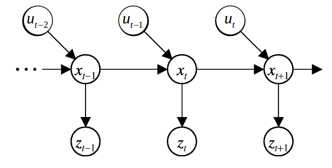

[TOC]

### UCSD ECE276A: Sensing & Estimation in Robotics

#### 课程参考资料: 

+ [State Estimation for Robotics: Barfoot](http://asrl.utias.utoronto.ca/~tdb/bib/barfoot_ser17.pdf)
+ [Probabilistic Robotics: Thrun, Burgard & Fox](http://www.probabilistic-robotics.org/)
+ [Bayesian Filtering and Smoothing: Sarkka](https://users.aalto.fi/~ssarkka/pub/cup_book_online_20131111.pdf)
+ [An Invitation to 3-D Vision: Ma, Kosecka, Soatto & Sastry](http://www.springer.com/us/book/9780387008936)
+ [Nonlinear Gaussian Filtering: Theory, Algorithms, and Applications: Huber](https://www.ksp.kit.edu/download/1000045491)

#### 机器人学简介

+ Sense
+ Estimate
+ Plan
+ Act

#### 机器人领域问题建模

+ Time: $t$
+ Robot state: $x_t$ (eg: 位置、速度、姿态等)
+ Control input: $u_t$
+ Observation: $z_t$
+ Motion Model: $p(x_{t+1}| x_t,u_t)$
+ Observation Model: $p(z_t | x_t,m_t)$

#### 课程目录

##### Math Basic

[Introduction,Linear Algebra, Probability Theory](./ch1.md)

#### 大作业

+ Color Segmentation
+ Partical Filter SLAM
+ Lidar and RGBD SLAM
+ Visual Inertial SLAM