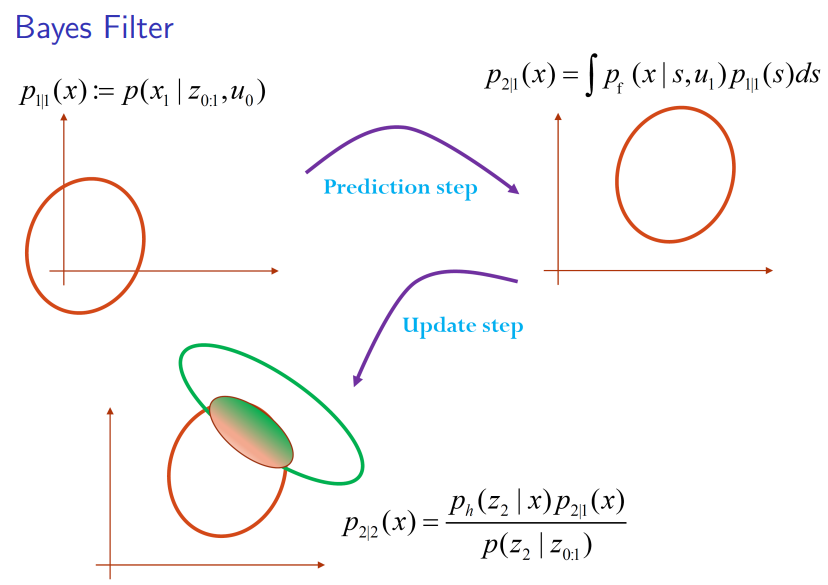

[TOC]

##  贝叶斯滤波与粒子滤波

### Structure of Robotics Problems

+ Time: $t$
+ Robot State: $x_t$
+ Control Input: $u_t$
+ Observation: $z_t$
+ Environment State: $m_t$

控制输入$u_{0:t}$和观测值$z_{0:t}$假设已知，机器人状态$x_{0:t}$和环境状态$m_{0:t}$假定未知．

`Markov Assumptions` :

+ 状态$x_{t+1}$只和前一个状态$x_t$以及控制输入$u_t$有关
+ 观测$z_t$只依赖机器人当前状态$x_t$以及$m_t$

`运动模型`
$$
x_{t+1}=f\left(x_{t}, u_{t}, w_{t}\right) \sim p_{f}\left(\cdot | x_{t}, u_{t}\right)
$$
$ w_{t}$为运动噪声．

`观测模型`
$$
z_{t}=h\left(x_{t}, m_{t}, v_{t}\right) \sim p_{h}\left(\cdot | x_{t}, m_{t}\right)
$$
$v_t$为观测噪声.

### 贝叶斯理论基础知识

基于Markov假设和贝叶斯法则，把控制输入和观测结果结合起来，估计机器人的状态．

+ 全概率公式：$p(x)=\int p(x, y) d y$
+ 条件概率：$p(x,y)=p(y|x)p(x)$
+ 贝叶斯公式：$p(x|y,z)=p(x | y, z)=\frac{p(y | x, z) p(x | z)}{\int p(y, s | z) d s}=\frac{p(y | x, z) p(z | x) p(x)}{p(y | z) p(z)}$

贝叶斯滤波的特殊情况：

+ $Kalman$滤波
+ 粒子滤波
+ Forward Algorithm for Hidden Markov Models(HMMs)

### 滤波问题

#### 联合概率分布

$$
p\left(x_{0} : T, z_{0 :} T, u_{0 : T-1}\right)=\underbrace{p_{0 | 0}\left(x_{0}\right)}_{\text { prior }} \prod_{t=0}^{T} \underbrace{p_{h}\left(z_{t} | x_{t}\right)}_{\text { observation model }}\prod_{t=1}^{T} \underbrace{p_{f}\left(x_{t} | x_{t-1}, u_{t-1}\right)}_{\text { motion model }}
$$

$p_h(\cdot)$ 为观测模型，$p_f(\cdot)$为运动模型。

`Filtering`: Keeps track of 
$$
\begin{aligned} p_{t|t}\left(x_{t}\right) & :=p\left(x_{t} | z_{0 : t}, u_{0 : t-1}\right) \\ p_{t+1 | t}\left(x_{t+1}\right) & :=p\left(x_{t+1} | z_{0 : t}, u_{0 : t}\right) \end{aligned}
$$
`Smoothing`: Keeps track of 
$$
\begin{aligned} p_{t|t}\left(x_{0 : t}\right) : & :=p\left(x_{0 : t} | z_{0 : t}, u_{0 : t-1}\right) \\ p_{t+1 | t}\left(x_{0 : t+1}\right) & :=p\left(x_{0 : t+1} | z_{0 : t}, u_{0 : t}\right) \end{aligned}
$$

`Filtering vs Smoothing`:

+ filtering: $p(x_t|y_1,\ldots,y_t,\Theta)$
+ smoothing: $p(x_t|y_1,\ldots,y_T,\Theta)$ for $0 \le t < T$

#### 贝叶斯滤波

##### Prediction step:

给定$x_t$时刻的先验概率密度$p_{t|t}$和控制输入$u_t$，利用运动模型计算预测$x_{t+1}$时刻的概率密度:
$$
p_{t+1|t}(x)=\int p_{f}\left(x | s, u_{t}\right) p_{t | t}(s) d s
$$

##### Update step:

给定预测的$x_{t+1}$时刻的概率密度函数$p_{t+1|t}$ 与$t+1$时刻的观测$z_{t+1}$，利用观测模型$p_h(\cdot)$ 和观测信息得到$x_{t+1}$时刻的后验概率$p_{t+1|t+1}$:
$$
p_{t+1|t+1}(x)=\frac{p_{h}\left(z_{t+1} | x\right) p_{t+1|t}(x)}{\int p_{h}\left(z_{t+1} | s\right) p_{t+1 | t}(s) d s}
$$
##### 贝叶斯滤波过程:

$$
\begin{aligned}
p_{t+1 | t+1}\left(x_{t+1}\right) &=p\left(x_{t+1} | z_{0 : t+1}, u_{0 : t}\right) \\
& \xlongequal{Bayes } \frac{1}{\eta_{t+1}} p\left(z_{t+1} | x_{t+1}, z_{0 : t}, u_{0 : t}\right) p\left(x_{t+1} | z_{0 : t}, u_{0 : t}\right) \\
& \xlongequal{Markov} \frac{1}{\eta_{t+1}} p_{h}\left(z_{t+1} | x_{t+1}\right) p\left(x_{t+1} | z_{0 : t}, u_{0 : t}\right) \\
& \xlongequal{Total.prob} \frac{1}{\eta_{t+1}} p_{h}\left(z_{t+1} | x_{t+1}\right) \int p\left(x_{t+1}, x_{t} | z_{0 : t}, u_{0 : t}\right) d x_{t} \\
& \xlongequal{Cond. prob} \frac{1}{\eta_{t+1}} p_{h}\left(z_{t+1} | x_{t+1}\right) \int p\left(x_{t+1} | z_{0 : t}, u_{0 : t}, x_{t}\right) p\left(x_{t} | z_{0 : t}, u_{0 : t}\right) d x_t \\
& \xlongequal {Markov} \frac{1}{\eta_{t+1}} p_{h}\left(z_{t+1} | x_{t+1}\right) \int p_{f}\left(x_{t+1} | x_{t}, u_{t}\right) p\left(x_{t} | z_{0 : t}, u_{0 : t-1}\right) d x_{t} \\

&=\boxed{\frac{1}{\eta_{t+1}} p_{h}\left(z_{t+1} | x_{t+1}\right) \int p_{f}\left(x_{t+1} | x_{t}, u_{t}\right) p_{t | t}\left(x_{t}\right) d x_{t}}

\end{aligned}
$$

归一化常数: $\eta_{t+1} :=p\left(z_{t+1} | z_{0 : t}, u_{0 : t}\right)$。

##### 简单例子

##### 叶斯滤波总结

`运动模型`: $x_{t+1}=f\left(x_{t}, u_{t}, w_{t}\right) \sim p_{f}\left(\cdot | x_{t}, u_{t}\right)$

`观测模型`: $z_{t}=h\left(x_{t}, v_{t}\right) \sim p_{h}\left(\cdot | x_{t}\right)$

`联合密度函数`:$p\left(x_{0} : T, z_{0 :} T, u_{0 : T-1}\right)=\underbrace{p_{0 | 0}\left(x_{0}\right)}_{\text { prior }} \prod_{t=0}^{T} \underbrace{p_{h}\left(z_{t} | x_{t}\right)}_{\text { observation model }} \prod_{t=0}^{T} \underbrace{p_{f}\left(x_{t} | x_{t-1}, u_{t-1}\right)}_{\text { motion model }}$

`滤波`:按照如下步骤，不断迭代

+ step1:  $p_{t | t}\left(x_{t}\right) :=p\left(x_{t} | z_{0 : t}, u_{0 : t-1}\right)$
+ step2:  $p_{t+1 | t}\left(x_{t+1}\right) :=p\left(x_{t+1} | z_{0 : t}, u_{0 : t}\right)$

`整个流程`:
$$
p_{t+1|t+1}\left(x_{t+1}\right)=\underbrace{ \overbrace{\frac{1}{p\left(z_{t+1} | z_{0 : t}, u_{0 : t}\right)}}^{\frac{1}{\eta_{t+1}}} p_{h}\left(z_{t+1} | x_{t+1}\right)  \overbrace{\int p_{f}\left(x_{t+1} | x_{t}, u_{t}\right) p_{t | t}\left(x_{t}\right) d x_{t}}^{\mathbf{Predict:}\quad p_{t+1|t}(x_{t+1}) } 
}_{\mathbf { Update }}
$$

#### 贝叶斯平滑

##### Smoothing

smoothing 是对所有状态进行track
$$
\begin{aligned} p_{t|t}\left(x_{0 : t}\right)  & :=p\left(x_{0 : t} | z_{0 : t}, u_{0 : t-1}\right) \\ p_{t+1 | t}\left(x_{0 : t+1}\right) & :=p\left(x_{0 : t+1} | z_{0 : t}, u_{0 : t}\right) \end{aligned}
$$

##### Forward pass (Bayes Filter)

对于$t=0,\cdots,T$ ,循环计算$p(x_{t+1}|z_{0:T})$和$p\left(x_{t+1} | z_{0 : t}, u_{0 : t}\right)$ 

##### Backward pass (Bayes smoother)

对于$t=T-1,\cdots,0$循环计算:
$$
p\left(x_{t} | z_{0 : T}, u_{0 : T-1}\right) \xlongequal[Probability]{Total} \int p\left(x_{t} | x_{t+1}, z_{0 : T}, u_{0 : T-1}\right) p\left(x_{t+1} | z_{0 : T}, u_{0 : T-1}\right) d x_{t+1} \\
\xlongequal[Assumption]{Markov}  \int p\left(x_{t} | x_{t+1}, z_{0 : t}, u_{0 : t}\right) p\left(x_{t+1} | z_{0 : T}, u_{0 : T-1}\right) d x_{t+1} \\
\xlongequal[Rule]{Bayes} \underbrace{p\left(x_{t} | z_{0 : t}, u_{0 : t-1}\right)}_{\text { forward pass }}\int\left[\frac{\overbrace{p_{f}\left(x_{t+1} | x_{t}, u_{t}\right)}^{\text { motion model }} ) p\left(x_{t+1} | z_{0 : T}, u_{0 : T-1}\right)}{\underbrace{p\left(x_{t+1} | z_{0 : t}, u_{0 : t}\right)}_{\text{forward pass}}}\right] dx_{t+1}
$$

#### 直方图滤波

+ 通过直方图的形式，将概率密度函数$p_{t|t}$和$p_{t+1|t}$表示成离散形式
+ 精度依赖于离散化的程度
+ 当离散化程度过高时，导致计算量成指数增长，无法计算
+ 自适应直方图滤波: 离散形式通过自适应的方式来完成，例如:Octrees

