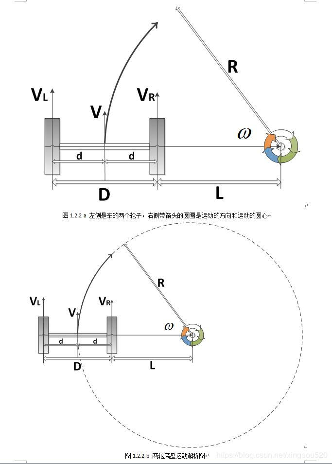

## 差速轮机器人运动模型推导

### 模型特点

两个动力轮位于底盘两侧，两轮独立控制速度，特点如下：

+ 控制简单，里程计计算简单
+ 只能给定X方向线速度和Z轴方向的角速度

### 运动学分析

各个符号的含义如下：

+ $V$：车体线速度
+ $\omega$ ：车体角速度
+ $V_L$：左轮线速度
+ $V_R$：右轮线速度
+ $L$：右轮到圆心距离
+ $D$：两个轮子之间的距离
+ $d$：两个车轮到车中心的距离
+ $R$：车体转弯半径

约束方程：
$$
\begin{aligned}
V &= \omega \times R \\
V_L &= \omega \times (L+D)= \omega \times (L+2d)=\omega \times(R+d)=V+\omega d \\
V_R &= \omega \times L=\omega \times (R-d)  = V-\omega d \\
V &=\omega \times R = \omega \times(L+ d) =\frac{V_L+V_R}{2} \\
\omega &= \frac{V_L-V_R}{2}

\end{aligned}
$$
此处推导方向正负比较随意，但是确定了$\frac{1}{2}$的出处，仅供参考。