[TOC]
### 针孔相机模型
#### 相机外参
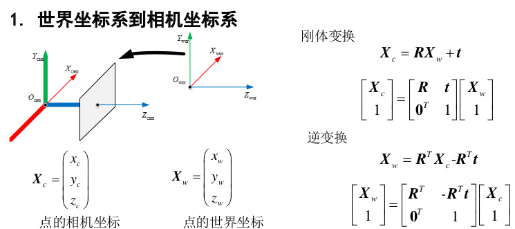

常用的公式：

+ 相机中心在世界坐标系中的位置：$\boldsymbol{O}_{\mathrm{can}}^{w}=\boldsymbol{R}^{T} \boldsymbol{O}_{\mathrm{cam}}^{c}-\boldsymbol{R}^{T} \boldsymbol{t}=-\boldsymbol{R}^{T} \boldsymbol{t}$
+ 相机朝向(Z轴)在世界坐标系中的方向：$\boldsymbol{r}^w = \boldsymbol{R}(2,:)$ 

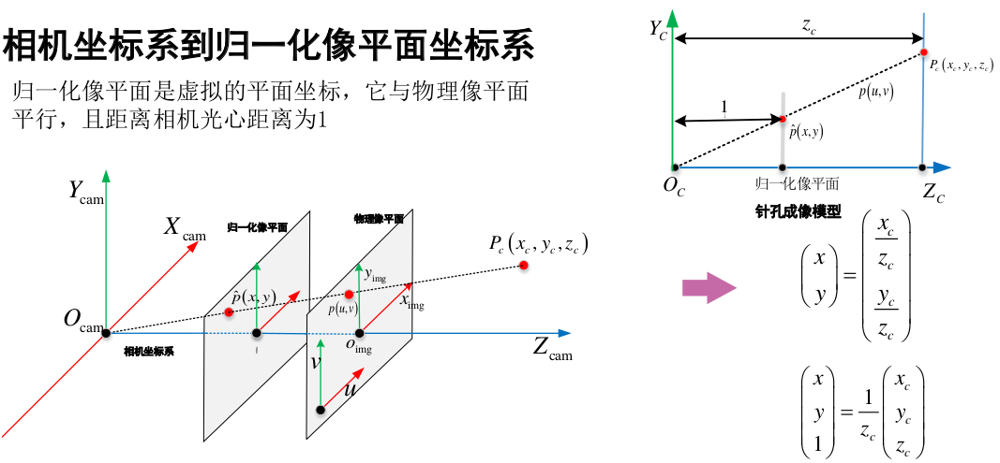

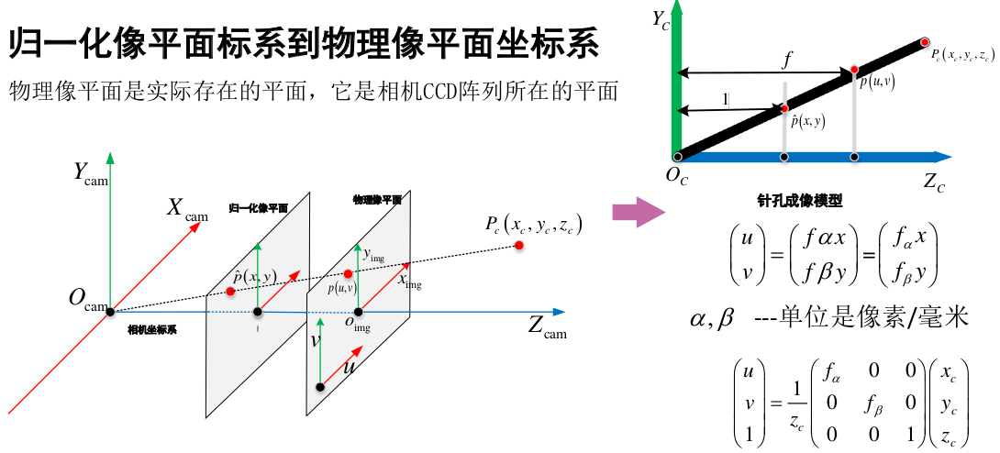

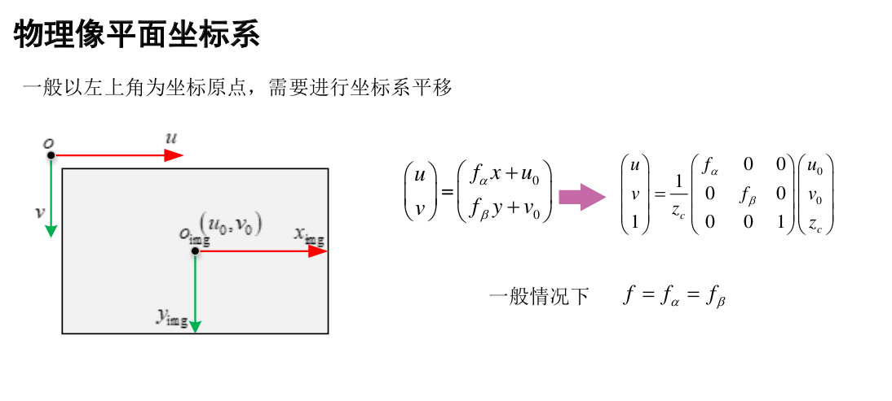

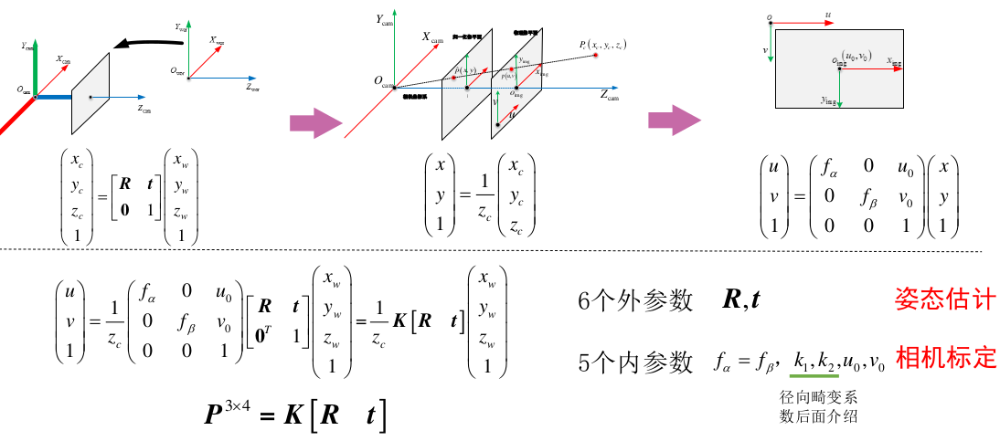

#### 畸变模型

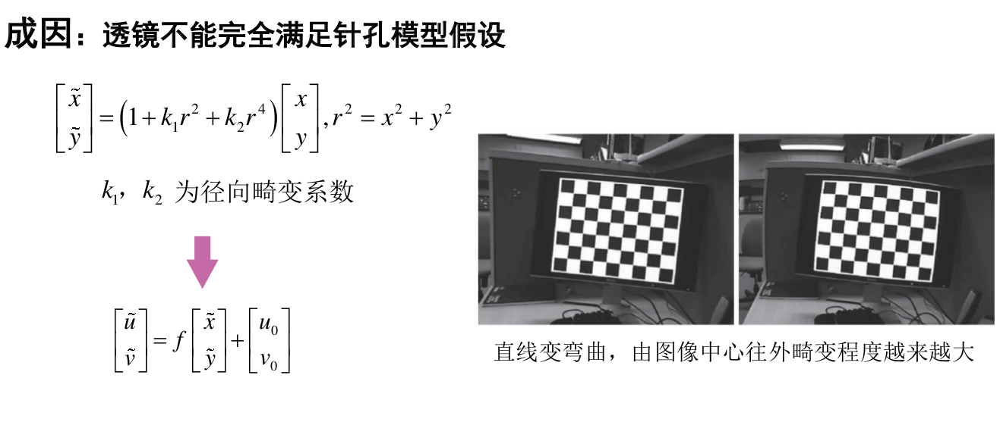

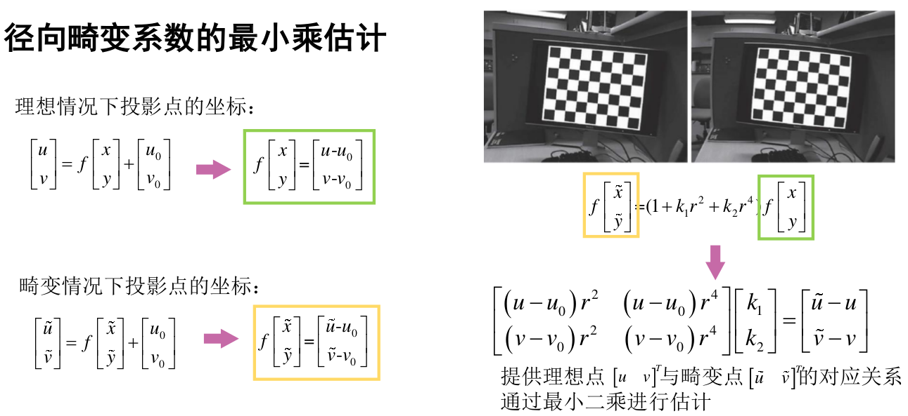

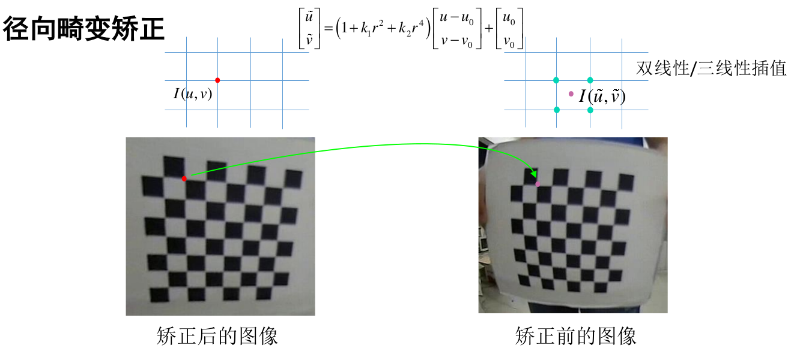

### 对极几何

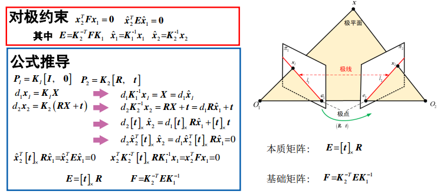

#### 基础矩阵

##### 基本性质

+ $3\times 3$的矩阵，秩为2
+ 具有7个自由度
+ 奇异值为$[\sigma_1,\sigma_2,0]$
+ 极线约束$l_1 = \boldsymbol{x}_2^T \boldsymbol{F}, l_2 =\boldsymbol{F} \boldsymbol{x}_1, \boldsymbol{x_2^TFx_1}=0$  

##### 求解方法

+ 直接线性变换法
  + 8点法
  + 最小二乘法
+ 基于RANSAC的鲁棒方法

##### 直接线性变换法

对于一对匹配点$\boldsymbol{x}_{1}=\left[ \begin{array}{lll}{u_{1},} & {v_{1},} & {1}\end{array}\right]^{\mathrm{T}},  \boldsymbol{x}_{2}=\left[ \begin{array}{ll}{u_{2},} & {v_{2},} & {1}\end{array}\right]^{\mathrm{T}}$  根据对极约束：
$$
\left( \begin{array}{ccc}{u_{1}} & {v_{1}} & {1}\end{array}\right) \left[ \begin{array}{ccc}{F_{11}} & {F_{12}} & {F_{13}} \\ {F_{21}} & {F_{22}} & {F_{23}} \\ {F_{31}} & {F_{32}} & {F_{33}}\end{array}\right] \left( \begin{array}{l}{u_{2}} \\ {v_{2}} \\ {1}\end{array}\right)=0
$$
令$f=\left[ \begin{array}{lllllll}{F_{11},} & {F_{12},} & {F_{13},} & {F_{21},} & {F_{22}} & {,} & {F_{23},} & {F_{31},} & {F_{32},} & {F_{33}}\end{array}\right]^{T}$，则有：
$$
\left[ \begin{array}{lllllll}{u_{1} u_{1},} & {u_{1} v_{2},} & {u_{1},} & {v_{2} u_{1},} & {v_{1} v_{2},} & {v_{1},} & {u_{2},} & {v_{2},} & {1}\end{array}\right] f=0　
$$
每一对匹配点提供一个约束．

当有n对匹配点时：

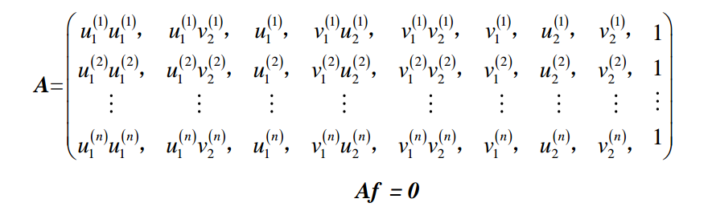

+ 要保证有唯一解至少需要8对匹配点
+ $n=8$时，若$\boldsymbol{A}$ 非奇异，则有唯一解，称为8点法
+ $n\ge8$ 时，可用最小二乘法求解

$\boldsymbol{A^TA}$ 的最小特征值对应的特征向量即为最优解.

##### 奇异值约束

直接线性变换无法保证基础矩阵的奇异值约束，即有两个非0奇异值，根据奇异值约束对矩阵进行重构：
$$
\min \|\boldsymbol{F}-\hat{\boldsymbol{F}}\|, \text { wrt. } \operatorname{svd}(\boldsymbol{F})=\left[ \begin{array}{lll}{\sigma_{1},} & {\sigma_{2}} & {,} & {0}\end{array}\right] \\
\hat{\boldsymbol{F}}=\boldsymbol{U S V}^{T} \quad \text { with } \boldsymbol{S}=\operatorname{diag}\left(\sigma_{1}, \sigma_{2}, \sigma_{3}\right) \\
\boldsymbol{F}=\boldsymbol{U} \operatorname{diag}\left(\sigma_{1}, \quad \sigma_{2}, \quad 0\right) \boldsymbol{V}^{T}
$$
对得到的$\hat{\boldsymbol{F}}$矩阵进行奇异值分解，并令$\sigma_3=0$即可．

#### RANSAC－随机一致性采样

用于解决样本中的Outliers问题，最多可处理50%的Outliers情况
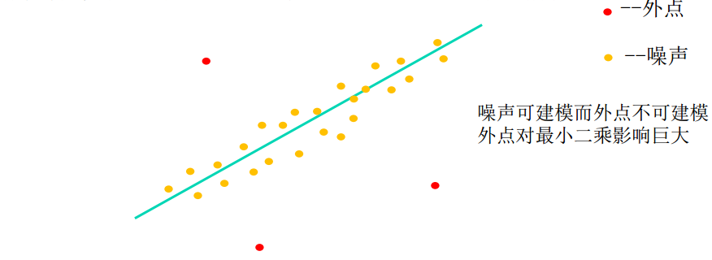

噪声可建模而Outliers不可建模，Outliers对最小二乘影响巨大.

##### 算法流程

$N$ -样本点个数 , $K$-求解模型需要的最少的点的个数

1. 随机采样$K$个点
2. 对该$K$个点拟合模型
3. 计算其他点到拟合模型的距离，小于阈值的作为内点，统计内点个数
4. 重复$M$次，选择内点数最多的模型
5. 利用所有的内点重新估计模型(可选)

##### RANSAC-采样次数的计算

+ $N$- 样本点个数
+ $K$- 求解模型所需要的最少的点的个数
+ $p$ - 内点的概率
+ $p^K$ - $K$个点都是内点的概率
+ $1-p^K$ - $K$个点至少有一个外点(采样失败)的概率
+ $(1-p^K)^M$ - M次采样全部失败的概率
+ $z= 1-(1-p^K)^M$ - $M$次采样至少有1次成功的概率
+ $M= \frac{log(1-z)}{log(1-p^K)}$ 

`例子`：当$p=0.9, K = 8 $时，想要采样成功率达到$z\ge 0.99$，所需要的采样次数$M=8.18$取9次

##### RANSAC - 估计基本矩阵

`算法流程`：

1. 随机采样8对匹配点$(x_1^{(n)},x_2^{(n)})$
2. 8点法求解基础矩阵$\hat{\boldsymbol{F}}$ 
3. 奇异值约束获取基础矩阵$\boldsymbol{F}$
4. 计算误差，统计内点个数
5. 重复上述过程，选择内点最多的结果
6. 对所有的内点执行2,3，重新计算$\boldsymbol{F}$

`内点判定标准 - Sampson Distance`:
$$
d \left(x_{1}, x_{2}\right)=\frac{\left(x_{2}^{T} F x_{1}\right)^{2}}{\left(F x_{1}\right)_{x}^{2}+\left(F x_{1}\right)_{y}^{2}+\left(x_{2}^{T} F\right)_{x}^{2}+\left(x_{2}^{T} F\right)_{y}^{2}} \\
d\left(x_{1}, x_{2}\right)<\tau
$$

#### 本征矩阵
##### 基本性质

+ $3\times 3$的矩阵，秩为2
+ 具有5个自由度
+ 奇异值为$[\sigma,\sigma,0]^T$

##### 求解流程

1. 求解基础矩阵$\boldsymbol{F}$
2. $\widehat{\boldsymbol{E}}=\boldsymbol{K}_{2}^{T} \boldsymbol{F} \boldsymbol{K}_{1} \\\widehat{\boldsymbol{E}}=\boldsymbol{U} \operatorname{diag}\left(\sigma_{1}, \quad \sigma_{2}, \quad 0\right) \boldsymbol{V}^{T}$ 
3. $\boldsymbol{E}=\boldsymbol{U d i a g}\left(\frac{\sigma_{1}+\sigma_{2}}{2}, \quad \frac{\sigma_{1}+\sigma_{2}}{2}, \quad 0\right) \boldsymbol{V}^{T}$

##### 相机位姿的恢复

$$
\boldsymbol{E}=\boldsymbol{U} \Sigma \boldsymbol{V}^{T}, \boldsymbol{\Sigma}=\operatorname{diag}(\sigma, \quad \sigma, \quad 0) \\
\begin{array}{cc}{\boldsymbol{t}_{1}=\boldsymbol{U( :, 2)}} & {\boldsymbol{R}_{1}=\boldsymbol{U} \boldsymbol{R}_{Z}\left(\frac{\pi}{2}\right) \boldsymbol{V}^{T}} \\ {\boldsymbol{t}_{2}=-\boldsymbol{U}( :, \boldsymbol{2})} & {\boldsymbol{R}_{2}=\boldsymbol{U} \boldsymbol{R}_{Z}^{T}\left(\frac{\pi}{2}\right) \boldsymbol{V}^{T}}\end{array}
$$

$$
\boldsymbol{R}_{z}\left(\frac{\pi}{2}\right)=\left( \begin{array}{ccc}{0,} & {-1,} & {0} \\ {1,} & {0,} & {0} \\ {0,} & {0,} & {1}\end{array}\right), \boldsymbol{R}_{z}^{T}\left(\frac{\pi}{2}\right)=\left( \begin{array}{ccc}{0,} & {1,} & {0} \\ {-1,} & {0,} & {0} \\ {0,} & {0,} & {1}\end{array}\right)
$$

共有四种情况：$\left(\boldsymbol{R}_{1}, \boldsymbol{t}_{1}\right),\left(\boldsymbol{R}_{1}, \boldsymbol{t}_{2}\right),\left(\boldsymbol{R}_{2}, \boldsymbol{t}_{1}\right),\left(\boldsymbol{R}_{2}, \boldsymbol{t}_{2}\right)$ 

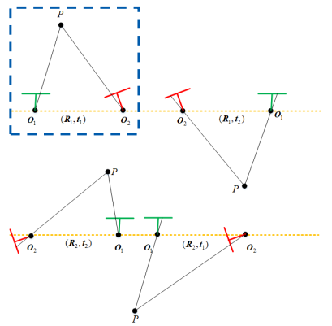

`选择正确的相机位姿`

相机的世界坐标系$\boldsymbol{O}_{1}, \boldsymbol{O}_{2}$  ：
$$
\boldsymbol{O}_{1}=-\boldsymbol{R}^{T} \boldsymbol{t}=\boldsymbol{0}, \quad \boldsymbol{O}_{2}=\boldsymbol{R}^{T} \boldsymbol{t}
$$
相机在世界坐标系中的朝向$\boldsymbol{d}_{1}, \boldsymbol{d}_{2}$:
$$
\boldsymbol{d}_{1}=\left[ \begin{array}{lll}{0,} & {0,} & {1}\end{array}\right]^{T}  \\
\boldsymbol{d}_2= \boldsymbol{R}^T \begin{bmatrix} 
0 \\0 \\1  \end{bmatrix} = \boldsymbol{r}_3^T  
$$
其中：$\boldsymbol{R}=\left[ \begin{array}{l}{\boldsymbol{r}_{1}} \\ {\boldsymbol{r}_{2}} \\ {\boldsymbol{r}_{3}}\end{array}\right] \quad \boldsymbol{R}^{T}=\left[ \begin{array}{lll}{\boldsymbol{r}_{1}^{T}} & {\boldsymbol{r}_{2}^{T}} & {\boldsymbol{r}_{3}^{T}}\end{array}\right]$
利用相机位姿$\boldsymbol{R,t}$和匹配点$p_1,p_2$进行三角测量得到三维点$\boldsymbol{P}$，$\boldsymbol{P}$需满足同时位于两个相机的前方：
方法1: 
$$
\begin{array}{l}{\left(\boldsymbol{P}-\boldsymbol{O}_{1}\right)^{T} \boldsymbol{d}_{1}>0} \\ {\left(\boldsymbol{P}-\boldsymbol{O}_{2}\right)^{T} \boldsymbol{d}_{1}>0}\end{array}
$$
方法2:

 验证$\left[ \begin{array}{l}{x_{c}} \\ {y_{c}} \\ {z_{c}}\end{array}\right]=\boldsymbol{R P}+\boldsymbol{t}, \quad z_{c}>0$对两个相机都成立．

#### 单应矩阵H

