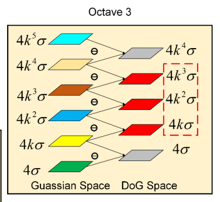

## 特征点提取与匹配

### 特征点介绍

#### Harris角点检测

特征点具有局部差异性，定义：
$$
\begin{aligned}
E(u, v) &=\sum_{(x, y)} w(x, y)[I(x+u, y+v)-I(x, y)]^{2} \\
& \approx  \sum_{(x,y)} w(x,y) [I(x,y)+\frac{\partial I}{\partial x}(x, y) u+\frac{\partial I}{\partial y}(x, y) v - I(x,y)]^2 \\
&= \begin{bmatrix} u \\v \end{bmatrix}^T \mathbf{H} \begin{bmatrix} u \\v \end{bmatrix} 
\end{aligned}
$$
$(u,v)$为整个窗口移动的距离，$(x,y)$为窗口内点坐标$w(x,y)$为权重。

图像梯度:$\nabla I(x, y)=\left(\frac{\partial I}{\partial x}(x, y), \frac{\partial I}{\partial y}(x, y)\right)$ 

Harris矩阵:$\boldsymbol{H}=\left[ \begin{array}{cc}{\sum_{(x, y)} w(x, y)\left(\frac{\partial I}{\partial x}(x, y)\right)^{2}} & {\sum_{(x, y)} w(x, y)\left(\frac{\partial I}{\partial x}(x, y) \frac{\partial I}{\partial y}(x, y)\right)} \\ {\sum_{(x, y)} w(x, y)\left(\frac{\partial I}{\partial x}(x, y) \frac{\partial I}{\partial y}(x, y)\right)} & {\sum_{(x, y)} w(x, y)\left(\frac{\partial I}{\partial y}(x, y)\right)^{2}}\end{array}\right]$

根据$Harris$矩阵的特征值分析：

$S V D(\boldsymbol{H})=\boldsymbol{U} \sum \boldsymbol{V}, \quad\left(\lambda_{1}, \lambda_{2}\right), \lambda_{1}>\lambda_{2}$ 

+ $\lambda _1\approx \lambda_2 \approx0$ : 兴趣点位于光滑区域
+ $\lambda _1 > 0 , \lambda_2 \approx0$：兴趣点位于边缘区域
+ $\lambda _1> 0, \lambda_2 > 0$：兴趣点位于角点区域

`判定准则`
$$
C  =det(H)-ktrace(H)^2 = \lambda _1 \lambda _2 - k(\lambda _1+\lambda _2 )^2,k=0.04
$$

+ k的值越小，越敏感
+ 只有当$\lambda_1$ 和$\lambda_2$同时取得最大值的时候，$C$才能取得较大值
+ 避免了特征值分解，提高计算效率

`非极大值抑制(Non-maximal Suppression)`

选取局部响应最大值，避免重复检测

`算法流程`

计算水平和垂直方向梯度:
$$
\frac{\partial L\left(x, y, \sigma_{D}\right)}{\partial x}=\frac{\partial G\left(x, y, \sigma_{D}\right)}{\partial x} * I(x, y), \frac{\partial L\left(x, y, \sigma_{D}\right)}{\partial y}=\frac{\partial G\left(x, y, \sigma_{D}\right)}{\partial y} * I(x, y)
$$
计算每个像素位置的$Harris$矩阵:
$$
\boldsymbol{H}=G\left(x, y, \sigma_{I}\right) * \left[ \begin{array}{cc}{\left(\frac{\partial L\left(x, y, \sigma_{D}\right)}{\partial x}(x, y)\right)^{2}} & {\frac{\partial L\left(x, y, \sigma_{D}\right)}{\partial x}(x, y) \frac{\partial L\left(x, y, \sigma_{D}\right)}{\partial y}(x, y)} \\ {\frac{\partial L\left(x, y, \sigma_{D}\right)}{\partial x}(x, y) \frac{\partial L\left(x, y, \sigma_{D}\right)}{\partial y}(x, y)} & {\left(\frac{\partial L\left(x, y, \sigma_{D}\right)}{\partial y}(x, y)\right)^{2}}\end{array}\right.
$$
计算每个像素位置的$Harris$角点响应值：
$$
C=\operatorname{det}(H)-k \operatorname{trace}(H)^{2}=\lambda_{1} \lambda_{2}-k\left(\lambda_{1}+\lambda_{2}\right)^{2}
$$
找到$Harris$角点响应值大于给定阈值且局部最大的位置作为特征点。

#### LoG 特征

> Harris角点检测不具有尺度不变性
> 通过尺度归一化LoG算子解决

LoG算子(Laplacian of Gaussian)函数的极值点对应着特征点。

##### LoG算子

`尺度空间`:
$$
L\left(x, y, \sigma_{D}\right)=I(x, y) * G\left(x, y, \sigma_{D}\right), \quad \sigma_{D} \in\left\{\sigma_{0}, \quad k \sigma_{0}, \quad k^{2} \sigma_{0}, \quad \ldots\right\}
$$
`LoG算子`:
$$
\nabla^{2} \mathrm{L}\left(x, y, \sigma_{\mathrm{D}}\right) =
\left(\frac{\partial^{2} \mathrm{L}\left(x, y, \sigma_{\mathrm{D}}\right)}{\partial x^{2}}+\frac{\partial^{2} \mathrm{L}\left(x, y, \sigma_{\mathrm{D}}\right)}{\partial y^{2}}\right)\\=\left(\frac{\partial^{2} \mathrm{G}\left(x, y, \sigma_{\mathrm{D}}\right)}{\partial x^{2}}+\frac{\partial^{2} \mathrm{G}\left(x, y, \sigma_{\mathrm{D}}\right)}{\partial y^{2}}\right) * I(x,y)
$$
`尺度归一化LoG算子`:
$$
\nabla_{\mathrm{norm}}^{2} \mathrm{L}\left(x, y, \sigma_{\mathrm{D}}\right)= \sigma_{\mathrm{D}}^{2}\left(\frac{\partial^{2} \mathrm{G}\left(x, y, \sigma_{\mathrm{D}}\right)}{\partial x^{2}}+\frac{\partial^{2} \mathrm{G}\left(x, y, \sigma_{\mathrm{D}}\right)}{\partial y^{2}}\right)* I(x,y)
$$

+ 不同尺度下LoG响应值不具有可比性
+ 构建尺度空间，同时在位置空间和尺度空间寻找归一化LoG极值(极大/极小)点作为特征点

`流程如下`:

step1: 计算不同尺度上的尺度归一化LoG函数值
$$
\nabla_{\mathrm{nomm}}^{2} \mathrm{L}\left(x, y, \sigma_{\mathrm{D}}\right)=\sigma_{\mathrm{D}}^{2}\left(\frac{\partial^{2} \mathrm{G}\left(x, y, \sigma_{\mathrm{D}}\right)}{\partial x^{2}}+\frac{\partial^{2} \mathrm{G}\left(x, y, \sigma_{\mathrm{D}}\right)}{\partial y^{2}}\right) * I(x, y)
$$
step2: 同时在位置和尺度构成的三维空间寻找尺度归一化LoG的极值点
step3: 进行非极大值抑制，减少重复检测

#### 基于DoG的特征检测子(Sift)

Lowe(2004)提出LoG可以近似等价于相邻尺度的高斯差分(DoG)

`高斯空间`:
$$
L(x, y, \sigma)=G(x, y, \sigma) * I(x, y)
$$
`高斯差分(DoG)`:
$$
\begin{aligned} D(x, y ; \sigma) &=(G(x, y ; k \sigma)-G(x, y ; \sigma)) * I(x, y) \\ &=L(x, y ; k \sigma)-L(x, y ; \sigma) \end{aligned}
$$

##### 尺度空间的构建

`高斯空间`: $2^{o-1}\left(\sigma, k \sigma, \cdots, k^{S+2} \sigma\right), k=2^{\frac{1}{S}}$

`高斯差分`: $2^{o-1}\left(\sigma, k \sigma, \cdots, k^{S+1} \sigma\right), k=2^{\frac{1}{S}}$ 

`有效差分`: $2^{o-1}\left(k \sigma, \cdots, k^{S} \sigma\right), k=2^{\frac{1}{S}}$ 

 参数含义：

+ $O$ : 阶数
+ $S$: 每阶有效差分数
+ $N=S+3$: 每阶层数

示意图如下：

简单例子:

> 通常情况下只会用一套卷积核，通过图像进行缩放来达到不同Octave的效果，因为图像越大，卷积核越大计算量也越大．
>
> 另外根据场景尺度的变化情况，可以适当增加或者减少Octave层数．Octave越大尺度范围越大，计算量也越大．

##### 特征点位置的确定

在位置和尺度空间组成的三维空间中寻找极值点。

亚像素特征点位置的确定：
$$
\begin{array}{l}{\boldsymbol{x}=[x, y, \sigma]^{T}} \\ {\boldsymbol{x}_{0}=\left[x_{0}, y_{0}, \sigma_{0}\right]^{T}}\end{array}
$$
 DoG值:
$$
f(\boldsymbol{x}) = f(\boldsymbol{x_0}) \nabla f\left(\boldsymbol{x}_{0}\right)^{T}\left(\boldsymbol{x}-\boldsymbol{x}_{0}\right) +\frac{1}{2} (\boldsymbol{x-x_0})^T \nabla^2 f(\boldsymbol{x_0})(\boldsymbol{x-x_0})
$$
利用泰勒展开，令$\delta \boldsymbol{x=x-x_0}  $
$$
f(\delta \boldsymbol{x})=\nabla f\left(\boldsymbol{x}_{0}\right)^{T} \delta \boldsymbol{x}+\frac{1}{2} \delta \boldsymbol{x}^{T} \nabla^{2} f\left(\boldsymbol{x}_{0}\right) \delta \boldsymbol{x} \\
\frac{\partial f(\delta \boldsymbol{x})}{\partial \delta \boldsymbol{x}}=\nabla f^{T}\left(\boldsymbol{x}_{0}\right)+\nabla^{2} f\left(\boldsymbol{x}_{0}\right) \delta \boldsymbol{x}=\boldsymbol{0} \\
\delta \boldsymbol{x}=-\nabla^{2} f\left(\boldsymbol{x}_{0}\right)^{-1} \nabla f^{T}\left(\boldsymbol{x}_{0}\right) \Rightarrow  f(\boldsymbol{x})=f\left(\boldsymbol{x}_{0}\right)+\frac{1}{2} \nabla f\left(\boldsymbol{x}_{0}\right)^{T}\left(\boldsymbol{x-x_{0}}\right)
$$
取$\vert f(\boldsymbol{x}) \vert \ge 0.04$的坐标点作为特征点位置。

$\nabla f(\boldsymbol{x_0})$的表达式：
$$
\begin{aligned} \nabla f&=\left[\frac{\partial f}{\partial x},\right. \frac{\partial f}{\partial y}, \frac{\partial f}{\partial z} ] \\
\frac{\partial f}{\partial x}&=\frac{f(x+1, y, \sigma)-f(x-1, y, \sigma)}{2 h_{x}} \\
\frac{\partial f}{\partial y} &=\frac{f(x, y+1, \sigma)-f(x, y-1, \sigma)}{2 h_{y}} \\ 
\frac{\partial f}{\partial \sigma} &=\frac{f(x, y, \sigma+1)-f(x, y, \sigma-1)}{2 h_{\sigma}} \end{aligned}
$$
$\nabla^2f(\boldsymbol{x_0})$的表达式：
$$
\nabla^{2} f=\left[ \begin{array}{ccc}{\frac{\partial^{2} f}{\partial x^{2}}} & {\frac{\partial^{2} f}{\partial x \partial y}} & {\frac{\partial^{2} f}{\partial x \partial \sigma}} \\ {\frac{\partial^{2} f}{\partial x \partial y}} & {\frac{\partial^{2} f}{\partial y^{2}}} & {\frac{\partial^{2} f}{\partial y \partial \sigma}} \\ {\frac{\partial^{2} f}{\partial x \partial \sigma}} & {\frac{\partial^{2} f}{\partial y \partial \sigma}} & {\frac{\partial^{2} f}{\partial \sigma^{2}}}\end{array}\right]  \\
\begin{aligned} \frac{\partial^{2} f}{\partial x^{2}} &=\frac{f(x+1, y, \sigma)+f(x-1, y, \sigma)-2 f(x, y, \sigma)}{d^{2} x} \\ \frac{\partial^{2} f}{\partial y^{2}} &=\frac{f(x, y+1, \sigma)+f(x, y-1, \sigma)-2 f(x, y, \sigma)}{d^{2} y} \\ \frac{\partial^{2} f}{\partial \sigma^{2}} &=\frac{f(x, y, \sigma+1)+f(x, y, \sigma-1)-2 f(x, y, \sigma)}{d^{2} \sigma} \end{aligned} \\ 
\frac{\partial^{2} f}{\partial x \partial y}=\frac{[f(x+1, y+1, \sigma)+f(x-1, y-1, \sigma)]-[f(x+1, y-1, \sigma)+f(x+1, y-1, \sigma)]}{4 d x d y} \\
\frac{\partial^{2} f}{\partial x \partial \sigma}=\frac{[f(x-1, y, \sigma-1)+f(x+1, y, \sigma+1)]-[f(x+1, y, \sigma-1)+f(x-1, y, \sigma+1)]}{4 d x d \sigma} \\
\frac{\partial^{2} f}{\partial y \partial \sigma}=\frac{[f(x, y-1, \sigma-1)+f(x, y+1, \sigma+1)]-[f(x, y+1, \sigma-1)+f(x, y-1, \sigma+1)]}{4 d y d \sigma} 
$$
`边缘点的去除`：
$$
\frac{\operatorname{trace}(\mathbf{H})^{2}}{\operatorname{Det}(\mathbf{H})}<\frac{(r+1)^{2}}{r}, r=10
$$
通过统计梯度直方图的方法确定主方向，使算法具有旋转不变性：

##### 整体流程如下

`计算图像尺度空间`
$$
2^{o-1}\left(\sigma, k \sigma, \cdots, k^{S+2} \sigma\right), k=2^{\frac{1}{S}}\\
2^{o-1} \left(\sigma, k \sigma, \cdots, k^{S+1} \sigma\right), k=2^{\frac{1}{S}}\\
2^{o-1}\left(k \sigma, \cdots, k^{S} \sigma\right), k=2^{\frac{1}{S}}
$$
`DoG极值点检测与定位`
$$
\begin{array}{l}{\delta \boldsymbol{x}=-\nabla^{2} f\left(\boldsymbol{x}_{0}\right)^{-1} \nabla f^{T}\left(\boldsymbol{x}_{0}\right)} \\ {f(\boldsymbol{x})=f\left(\boldsymbol{x}_{0}\right)+\frac{1}{2} \nabla f\left(\boldsymbol{x}_{0}\right)^{T}(\boldsymbol{x}-\boldsymbol{x} 0)}\end{array} 
$$
保留$\vert f(\boldsymbol{x}) \ge 0.04 \vert $的特征点。

`边缘点去除`
$$
\frac{\operatorname{trace}(\mathbf{H})^{2}}{\operatorname{Det}(\mathbf{H})}<\frac{(r+1)^{2}}{r}, r=10
$$
`计算主方向`

`生成描述子`

#### Fast(Feature from Accelerated Segment Test)特征检测

通过检测局部像素灰度变换来确认特征点的位置

[Ref](Fusing points and lines for high performance tracking)

#### Oriented FAST(ORB)

`获取尺度不变性`：构建图像金字塔，在金字塔每一层上检测关键

`获取旋转不变性`： 通过灰度质心法(Intensity Centroid)确定主方向

图像块B上的矩定义为：$C_{m n}=\sum_{x, y \in \mathrm{B}} x^{m} y^{n} I(x, y), m, n=\{0,1\}$

图像块B的质心定义为：$O^{\prime}=\left(\frac{C_{10}}{C_{00}}, \frac{C_{01}}{C_{00}}\right)$

方向角：$\theta=\arctan \left(\frac{C_{01}}{C_{10}}\right)$

### 特征描述子

基本分类如下：

+ 基于直方图的描述子
+ 基于不变性的描述子
+ 二进制描述子

基本参数:$(x,y,\theta,\sigma)$

#### 基于直方图的描述子

`用于微小运动的描述子`：

以特征点为中心矩形区域内所有像素的灰度值作为描述子
$$
E_{S S D}=\sum_{i=1}^{N} \sum_{j=1}^{N}\left\|I_{1}(x, y)-I_{2}(x, y)\right\|^{2}
$$
`Sift描述子`:

旋转：

根据主方向对支持区域($\sigma$)进行旋转，通过双线性插值重构:
$$
I' = \frac{I-u}{s}
$$
图像归一化处理，去除光照变换。

统计局部梯度信息：

将区域划分成$4\times 4$的Block，每个Block内统计梯度方向的直方图(高斯加权梯度作为系数)。

生成描述子：

归一化处理：

+ 门限处理：直方图每个方向的梯度幅值不超过0.2
+ 描述子长度归一化

归一化处理提升了特征点的光照不变性。

#### 二进制描述子(BRIEF)

特征向量由N个0或者1组成，N=128,256,512

生成速度快，匹配效率高，具有旋转不变性。

#### Steer Brief

N对采样点$S=\left( \begin{array}{lll}{x_{1}} & {\dots} & {x_{n}} \\ {y_{1}} & {\dots} & {y_{n}}\end{array}\right)$,根据主方向计算旋转$S_{\theta}=R_{\theta} S$在新的采样点上进行BRIEF描述子生成。

### 特征点匹配

#### 问题描述

#### 距离度量参数

+ 欧氏距离：$D_{e u c}(\boldsymbol{a}, \boldsymbol{b})=\|\boldsymbol{a}-\boldsymbol{b}\|_{2}=\left(\sum_{i=1}^{n}\left(a_{i}-b_{i}\right)^{2}\right)^{\frac{1}{2}}$ $D_{s s d}(\boldsymbol{a}, \boldsymbol{b})=\|\boldsymbol{a}-\boldsymbol{b}\|_{2}^{2}=D_{e u c}(\boldsymbol{a}, \boldsymbol{b})^{2}$
+ 马氏距离：$D_{\text {mahal}}(\boldsymbol{a}, \boldsymbol{b})=\left((\boldsymbol{a}-\boldsymbol{b})^{T} \sum^{-1}(\boldsymbol{a}-\boldsymbol{b})\right)^{\frac{1}{2}}$
+ 归一化互相关：$N C C(\boldsymbol{a}, \boldsymbol{b})=\sum_{i=1}^{n} \frac{1}{s_{a} s_{b}}\left(a_{i}-u_{a}\right)\left(b_{i}-u_{b}\right)$
+ 汉明距离：$D_{h a m}(\boldsymbol{a}, \boldsymbol{b})=\sum_{i=1}^{n} a_{i} \oplus b_{i}$

#### 匹配策略

最近邻搜索：$b^{*}=\arg \min _{b \in \mathrm{B}} D(\boldsymbol{a}, \boldsymbol{b}), D\left(a, b^{*}\right)<\beta$

最近邻距离比(Lowe-Ratio)：$\frac{D\left(a, b^{*}\right)}{D\left(a, b^{* *}\right)}<\alpha$

最近邻距离与次近邻距离比小于一定值。

#### 高效匹配

+ Hash表
+ KD-Tree
+ 特征匹配利用Homography/Fundamental进行去除