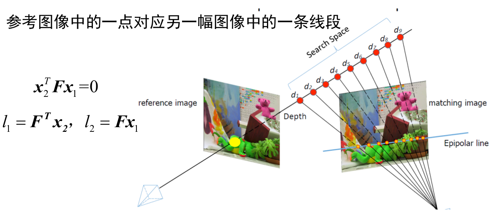
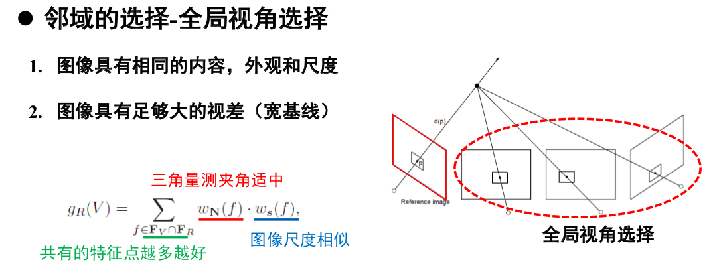

[TOC]

### Multi-View Stereo 

#### 基础知识

##### 极线搜索

##### 光度一致性假设

同一空间点在不同视角的投影应当具有相同的光度，常见度量标准：

+ Sum of Squared Differences(SSD): $\rho_{S S D}(f, g)=\|f-g\|^{2}$
+ Sum of Absolute Differences(SAD): $\rho_{S A D}(f, g)=\|f-g\|_{1}$
+ Normalized Cross Correlation(NCC): $\rho_{N C C}(f, g)=\frac{(f-\overline{f})(g-\overline{g})}{\delta_{f} \delta_{g}}$

##### 可视性约束

+ 图像中出现的点不能被遮挡
+ 重建的点前面不能出现点
+ 不能出现在物体内部

#### DepthMap Fusion

流程：

+ 为每一幅图像选择邻域图像构成立体图像对
+ 计算每一幅图像的深度图
+ 进行深度图融合

略