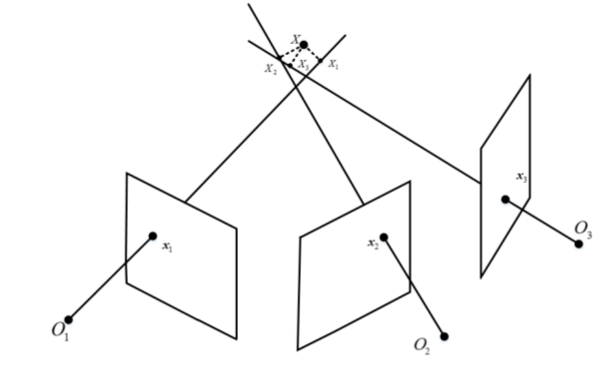
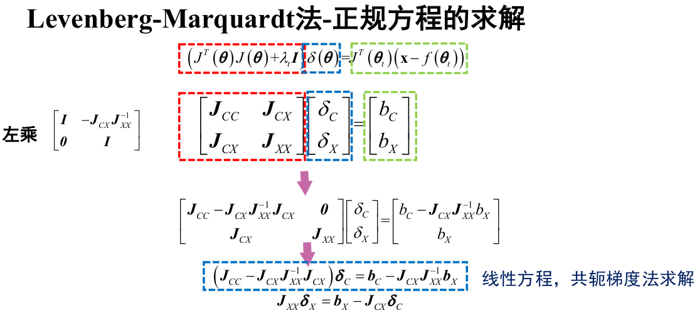

[TOC]

### 双视角SfM

#### 三角测量

已知相机参数和匹配点恢复三维点的坐标

第$i$个相机投影矩阵:
$$
\boldsymbol{P}_{\mathrm{i}}=\boldsymbol{K}_{i}\left[\boldsymbol{R}_{i}, \boldsymbol{t}_{i}\right]=\left[ \begin{array}{c}{\boldsymbol{P}_{i 1}} \\ {\boldsymbol{P}_{i 2}} \\ {\boldsymbol{P}_{i 3}}\end{array}\right]
$$
三维点坐标: $X=[x, y, z, 1]^{T}$，在第$i$个视角中投影的图像坐标为：$\mathbf{x}_{\mathrm{i}}=\left[x_{\mathrm{i}}, y_{\mathrm{i}}, 1\right]^{T}$

利用投影方程可以得到:
$$
\mathbf{x}_{\mathrm{i}}=\boldsymbol{P}_{i} \boldsymbol{X}
$$
两边同时叉乘$\mathbf{x}_{\mathrm{i}}$，可以得到：
$$
\mathbf{x}_{i} \times\left(\boldsymbol{P}_{i} \boldsymbol{X}\right)=\mathbf{0}
$$
即：
$$
\begin{array}{l}{x_{i}\left(\boldsymbol{P}_{i 3} \boldsymbol{X}\right)-\boldsymbol{P}_{i 1} \boldsymbol{X}=\mathbf{0}} \\ {y_{i}\left(\boldsymbol{P}_{i 3} \boldsymbol{X}\right)-\boldsymbol{P}_{i 2} \boldsymbol{X}=\mathbf{0}} \\ {x_{i}\left(\boldsymbol{P}_{i 2} \boldsymbol{X}\right)-y_{i}\left(\boldsymbol{P}_{i 1} \boldsymbol{X}\right)=\mathbf{0}}\end{array}
$$
第三个方程与前两个线性相关，于是可以得到：
$$
\left[ \begin{array}{l}{x_{\mathrm{i}} \boldsymbol{P}_{\mathrm{i} 3}-\boldsymbol{P}_{\mathrm{i} 1}} \\ {y_{\mathrm{i}} \boldsymbol{P}_{\mathrm{i} 3}-\boldsymbol{P}_{\mathrm{i} 2}}\end{array}\right] X=0 
$$
1个观测提供两个约束，$\boldsymbol{X}$具有三个自由度，至少需要2对点。
$$
A X=0  , \\
A = \begin{bmatrix}
x_1\boldsymbol{P}_{13} - \boldsymbol{P}_{11} \\
y_1\boldsymbol{P}_{13} - \boldsymbol{P}_{12}\\
\cdots \\
x_i\boldsymbol{P}_{i3} - \boldsymbol{P}_{i1}\\
y_i\boldsymbol{P}_{i3} - \boldsymbol{P}_{i2}\\
\cdots \\
x_N\boldsymbol{P}_{N3} - \boldsymbol{P}_{N1}\\
y_N\boldsymbol{P}_{N3} - \boldsymbol{P}_{N2}\\
\end{bmatrix},N\ge 2
$$

> Q:存在Outliers(匹配/Pose)的情况下得到准确的3D点坐标

#### 3D-2D: PnP问题

##### 直接线性变换求解

##### 其他常用方法

+ P3P: 四对不共面的点
+ EPnP: $\ge$ 4对不共面点或者3对共面点进行求解

#### 捆绑调整BundleAdjustment

通过最小化重投影误差利用非线性优化，同时优化三维点位置和相机参数

通常由于基于几何信息计算的结果已经给定了较好的初值，所以只需要求局部最优解即可。

