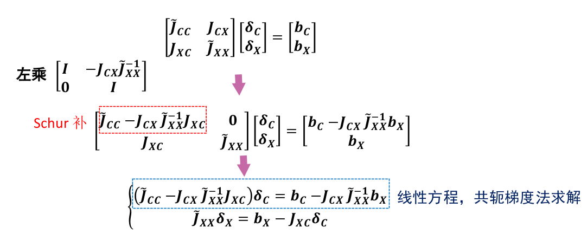

[TOC]

### 双视角SfM

#### 常见BA形式

##### 数学模型

#### Tricks

##### 算法整体流程

##### 初始图像对选取

+ 匹配点足够多(>50)
+ 基线足够长(三角测量角足够大>5度)
+ 满足Homography的匹配尽量少(内点<60%)
+ 成功三角化的匹配对>50%

##### Tracks 滤波

+ 过滤三维空间中太远的点
+ 去除重投影误差较大的点