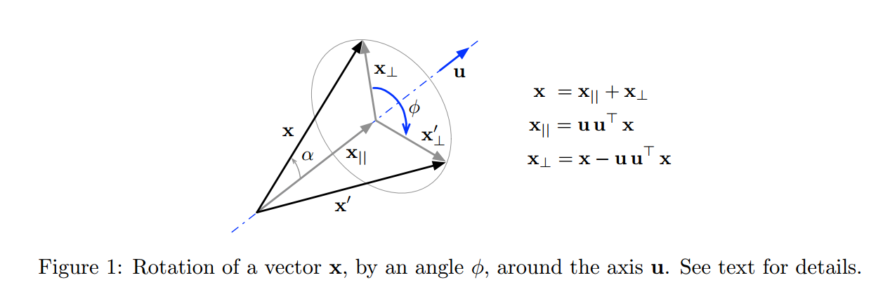
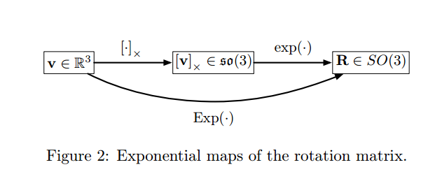

[TOC]

## Rotations and cross-relations

### 2.1 3D向量的旋转

如图所示，向量绕轴$\mathrm{u}$旋转了$\phi$角度，有如下关系成立：
$$
\mathbf{x}^{\prime}=\mathbf{x}_{ \|}+\mathbf{x}_{\perp} \cos \phi+(\mathbf{u} \times \mathbf{x}) \sin \phi
$$

### 2.2 旋转群$SO(3)$

#### 2.3.1 $ \mathfrak{s o}(3)$与$SO(3)$之间的映射关系

$$
\mathbf{R}(t)=\mathbf{R}(0) e^{[\omega]_{ \times} t}=\mathbf{R}(0) e^{[\omega t]_{ \times}}
$$

如果令$\mathbf{v} \triangleq \omega \Delta t$，那么旋转矩阵可以表示为：
$$
\mathbf{R}=e^{[\mathbf{v}]_{x}}
$$
于是有如下映射关系:
$$
\exp : \mathfrak{s o}(3) \rightarrow S O(3) ;[\mathbf{v}]_{ \times} \mapsto \exp \left([\mathbf{v}]_{ \times}\right)=e^{[\mathbf{v}]_{ \times}}
$$
将两次映射整合成为一个映射可以记作：
$$
\operatorname{Exp} : \mathbb{R}^{3} \rightarrow S O(3) ; \mathbf{v} \mapsto \operatorname{Exp}(\mathbf{v})=e^{[\mathbf{v}]_{ \times}}
$$

#### 2.3.2 罗德里格斯公式

利用旋转向量$\mathbf{v}=\phi \mathbf{u}$的指数映射可以得到旋转矩阵，由于$[\mathbf{v}]_{ \times}=\phi[\mathbf{u}]_{ \times}$具有一些特殊性质，因此我们可以利用指数展开的形式推导出旋转向量与旋转矩阵之间的关系：

`性质`：
$$
\begin{aligned}{[\mathbf{u}]}_{ \times}^{2} &=\mathbf{u u}^{\top}-\mathbf{I} \\
[\mathbf{u}]_{\times}^{3} &=-[\mathbf{u}]_{ \times} \end{aligned}
$$
`推出`:
$$
\mathbf{R}=e^{\phi[\mathbf{u}]_{ \times}}=\mathbf{I}+\phi[\mathbf{u}]_{ \times}+\frac{1}{2} \phi^{2}[\mathbf{u}]_{ \times}^{2}+\frac{1}{3 !} \phi^{3}[\mathbf{u}]_{ \times}^{3}+\frac{1}{4 !} \phi^{4}[\mathbf{u}]_{ \times}^{4}+\ldots
$$

$$
\mathbf{R}=\mathbf{I}+\sin \phi[\mathbf{u}]_{ \times}+(1-\cos \phi)[\mathbf{u}]_{ \times}^{2}
$$

变形之后为:
$$
\mathbf{R}=\mathbf{I} \cos \phi+[\mathbf{u}]_{ \times} \sin \phi+\mathbf{u} \mathbf{u}^{\top}(1-\cos \phi)
$$

#### 2.3.4 对数映射

$$
\log : S O(3) \rightarrow \mathfrak{s o}(3) ; \mathbf{R} \mapsto \log (\mathbf{R})=[\mathbf{u} \phi]_{ \times}
$$

公式如下：
$$
\begin{aligned} \phi &=\arccos \left(\frac{\operatorname{trace}(\mathbf{R})-1}{2}\right) \\ \mathbf{u} &=\frac{\left(\mathbf{R}-\mathbf{R}^{\top}\right)^{\vee}}{2 \sin \phi} \end{aligned}
$$

$$
\log : S O(3) \rightarrow \mathbb{R}^{3} ; \mathbf{R} \mapsto \log (\mathbf{R})=\mathbf{u} \phi
$$

### 2.4 四元数与旋转

四元数的旋转操作为：
$$
r(\mathbf{v})=\mathbf{q} \otimes \mathbf{v} \otimes \mathbf{q}^{*}
$$
即:
$$
\mathbf{x}^{\prime}=\mathbf{q} \otimes \mathbf{x} \otimes \mathbf{q}^{*}
$$

#### 2.4.1 四元数的指数映射

给定旋转向量$\mathbf{v}=\phi \mathbf{u} \in \mathbb{R}^{3}$，其对应的四元数为：
$$
\operatorname{Exp} : \mathbf{R}^{3} \rightarrow S^{3} ; \mathbf{v} \mapsto \operatorname{Exp}(\mathbf{v})=e^{\mathbf{v} / 2}
$$

$$
\mathbf{q} \triangleq \operatorname{Exp}(\phi \mathbf{u})=e^{\phi \mathbf{u} / 2}=\cos \frac{\phi}{2}+\mathbf{u} \sin \frac{\phi}{2}=\left[\begin{array}{c}{\cos (\phi / 2)} \\ {\mathbf{u} \sin (\phi / 2)}\end{array}\right]
$$

#### 2.4.2 四元数的对数映射

$$
\log : S^{3} \rightarrow \mathbb{H}_{p} ; \mathbf{q} \mapsto \log (\mathbf{q})=\mathbf{u} \theta \\
\log : S^{3} \rightarrow \mathbb{R}^{3} ; \mathbf{q} \mapsto \log (\mathbf{q})=\mathbf{u} \phi
$$

$$
\begin{aligned} \phi &=2 \arctan \left(\left\|\mathbf{q}_{v}\right\|, q_{w}\right) \\ \mathbf{u} &=\mathbf{q}_{v} /\left\|\mathbf{q}_{v}\right\| \end{aligned}
$$

当角度较小的时候，利用泰勒展开:
$$
\log (\mathbf{q})=\theta \mathbf{u} \approx 2 \frac{\mathbf{q}_{v}}{q_{w}}\left(1-\frac{\left\|\mathbf{q}_{v}\right\|^{2}}{3 q_{w}^{2}}\right)
$$

#### 2.4.3 四元数的旋转变换

将向量$\mathbf{x}$绕轴$\mathbf{u}$旋转角度$\phi$写成四元数形式为:
$$
\mathbf{x}^{\prime}=\mathbf{q} \otimes \mathbf{x} \otimes \mathbf{q}^{*}
$$
其中$q=\operatorname{Exp}(\mathbf{u} \phi)$，向量$\mathbf{x}$写成四元数形式:
$$
\mathbf{x}=x i+y j+z k=\left[\begin{array}{l}{0} \\ {\mathbf{x}}\end{array}\right] \in \mathbb{H}_{p}
$$
证明过程见讲义`Page23-(109)`

### 2.5 旋转矩阵与四元数

给定旋转向量$\mathbf{v}=\mathbf{u} \phi$，旋转变换如下：
$$
\forall \mathbf{v}, \mathbf{x} \in \mathbb{R}^{3}, \mathbf{q}=\operatorname{Exp}(\mathbf{v}), \mathbf{R}=\operatorname{Exp}(\mathbf{v}) \\
\mathbf{q} \otimes \mathbf{x} \otimes \mathbf{q}^{*}=\mathbf{R} \mathbf{x} 
$$
由于变换矩阵的两边都是线性变换，于是:
$$
\mathbf{R}=\left[\begin{array}{ccc}{q_{w}^{2}+q_{x}^{2}-q_{y}^{2}-q_{z}^{2}} & {2\left(q_{x} q_{y}-q_{w} q_{z}\right)} & {2\left(q_{x} q_{z}+q_{w} q_{y}\right)} \\ {2\left(q_{x} q_{y}+q_{w} q_{z}\right)} & {q_{w}^{2}-q_{x}^{2}+q_{y}^{2}-q_{z}^{2}} & {2\left(q_{y} q_{z}-q_{w} q_{x}\right)} \\ {2\left(q_{x} q_{z}-q_{w} q_{y}\right)} & {2\left(q_{y} q_{z}+q_{w} q_{x}\right)} & {q_{w}^{2}-q_{x}^{2}-q_{y}^{2}+q_{z}^{2}}\end{array}\right]
$$

$$
\mathbf{q} \otimes \mathbf{x} \otimes \mathbf{q}^{*}=\left[\mathbf{q}^{*}\right]_{R}[\mathbf{q}]_{L}\left[\begin{array}{l}{0} \\ {\mathbf{x}}\end{array}\right]=\left[\begin{array}{c}{0} \\ {\mathbf{R} \mathbf{x}}\end{array}\right]
$$

于是可以得到向量形式为：
$$
\mathbf{R}=\left(q_{w}^{2}-\mathbf{q}_{v}^{\top} \mathbf{q}_{v}\right) \mathbf{I}+2 \mathbf{q}_{v} \mathbf{q}_{v}^{\top}+2 q_{w}\left[\mathbf{q}_{v}\right]_{ \times}
$$

### 2.6 旋转的组合

$$
\mathbf{q}_{\mathcal{A} C}=\mathbf{q}_{\mathcal{A} \mathcal{B}} \otimes \mathbf{q}_{\mathcal{B C}}, \quad \mathbf{R}_{\mathcal{A} \mathcal{C}}=\mathbf{R}_{\mathcal{A} \mathcal{B}} \mathbf{R}_{\mathcal{B} \mathcal{C}}
$$

`一些注意事项`:

$\mathrm{q}_{j i}$和$\mathbf{R}_{j i}$对于向量而言是由$i$到$j$的一个旋转，即:
$$
\mathbf{x}_{j}=\mathbf{q}_{j i} \otimes \mathbf{x}_{i} \otimes \mathbf{q}_{j i}^{*}\\\mathbf{x}_{j}=\mathbf{R}_{j i} \mathbf{x}_{i}
$$
给定一系列的旋转，可以利用下表将其组合在一起:

给定:$\mathbf{q}_{O A}, \mathbf{q}_{A B}, \mathbf{q}_{B C}, \mathbf{q}_{O X}, \mathbf{q}_{X Z}$

组合:$\mathbf{q}_{O C}=\mathbf{q}_{O A} \otimes \mathbf{q}_{A B} \otimes \mathbf{q}_{B C} \quad \mathbf{R}_{O C}=\mathbf{R}_{O A} \mathbf{R}_{A B} \mathbf{R}_{B C}$

利用共轭的性质还有：
$$
\begin{aligned} \mathbf{q}_{Z A} &=\mathbf{q}_{X Z}^{*} \otimes \mathbf{q}_{O X}^{*} \otimes \mathbf{q}_{O A} \\ &=\mathbf{q}_{Z X} \otimes \mathbf{q}_{X O} \otimes \mathbf{q}_{O A} \end{aligned}
$$

$$
\begin{aligned} \mathbf{R}_{Z A} &=\mathbf{R}_{X Z}^{\top} \mathbf{R}_{O X}^{\top} \mathbf{R}_{O A} \\ &=\mathbf{R}_{Z X} \mathbf{R}_{X O} \mathbf{R}_{O A} \end{aligned}
$$

### 2.7 球面线性插值(SLERP)

#### 方法一:

$$
\mathbf{q}_{1}=\mathbf{q}_{0} \otimes \Delta \mathbf{q} \Rightarrow \Delta \mathbf{q}=\mathbf{q}_{0}^{*} \otimes \mathbf{q}_{1} 
$$

利用对数映射$\mathbf{u} \Delta \phi=\log (\Delta \mathbf{q})$可以得到对应的旋转向量为:$\Delta \phi=\mathbf{u} \Delta \phi$ .

保持旋转轴不变，对旋转角度进行线性因子化:$\delta \phi=t \Delta \phi$

再将其利用指数映射$\delta \mathbf{q}=\operatorname{Exp}(\mathbf{u} \delta \phi)$变换成对应的四元数，可以得到:
$$
\mathbf{q}(t)=\mathbf{q}_{0} \otimes \operatorname{Exp}(t \mathbf{u} \Delta \phi)
$$
即：
$$
\mathbf{q}(t)=\mathbf{q}_{0} \otimes \operatorname{Exp}\left(t \log \left(\mathbf{q}_{0}^{*} \otimes \mathbf{q}_{1}\right)\right) \\
\mathbf{q}(t)=\mathbf{q}_{0} \otimes\left(\mathbf{q}_{0}^{*} \otimes \mathbf{q}_{1}\right)^{t}
$$
最终形式为：
$$
\mathrm{q}(t)=\mathrm{q}_{0} \otimes\left[\begin{array}{c}{\cos (t \Delta \phi / 2)} \\ {\mathbf{u} \sin (t \Delta \phi / 2)}\end{array}\right]
$$
也可以利用旋转矩阵来完成这个过程：
$$
\mathbf{R}(t)=\mathbf{R}_{0} \operatorname{Exp}\left(t \log \left(\mathbf{R}_{0}^{\top} \mathbf{R}_{1}\right)\right)=\mathbf{R}_{0}\left(\mathbf{R}_{0}^{\top} \mathbf{R}_{1}\right)^{t}
$$
利用罗德里格斯公式可以得到：
$$
\mathbf{R}(t)=\mathbf{R}_{0}\left(\mathbf{I}+\sin (t \Delta \phi)[\mathbf{u}]_{ \times}+(1-\cos (t \Delta \phi))[\mathbf{u}]_{ \times}^{2}\right)
$$

#### 方法二:

见讲义`P28`

#### 方法三:

见讲义`p29`

