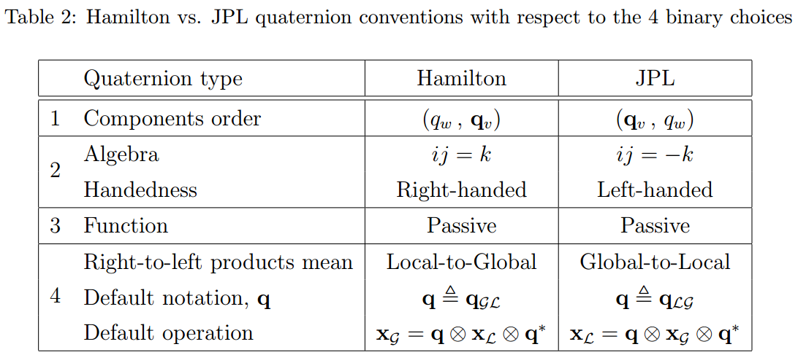

[TOC]

### Quaternion conventions

#### 3.1 四元数的形式 

`元素顺序`: $\mathbf{q}=\left[\begin{array}{l}{q_{w}} \\ {\mathbf{q}_{v}}\end{array}\right] \quad \text { vs. } \quad \mathbf{q}=\left[\begin{array}{c}{\mathbf{q}_{v}} \\ {q_{w}}\end{array}\right]$

`Hamilton or JPL`: $i j=-j i=k \quad v s . \quad j i=-i j=k$

`旋转坐标系 or 旋转向量`: $Passive \quad vs.\quad Active.$

`Passive情况下Local2Global or Global2Local`:$\mathbf{x}_{g l o b a l}=\mathbf{q} \otimes \mathbf{x}_{l o c a l} \otimes \mathbf{q}^{*} \quad \text { vs. } \quad \mathbf{x}_{\text {local}}=\mathbf{q} \otimes \mathbf{x}_{\text {global}} \otimes \mathbf{q}^{*}$

`Hamilton 与 JPL四元数的对比`:

#### 3.2 旋转操作的区别

`active`: 向量在旋转
$$
\mathbf{x}^{\prime}=\mathbf{q}_{a c t i v e} \otimes \mathbf{X} \otimes \mathbf{q}_{a c t i v e}^{*} \\
\mathbf{x}^{\prime}=\mathbf{R}_{a c t i v e} \mathbf{x}
$$
`passive`: 向量不动，坐标系旋转
$$
\mathbf{x}_{\mathcal{B}}=\mathbf{q}_{\text {passive}} \otimes \mathbf{x}_{\mathcal{A}} \otimes \mathbf{q}_{\text {passive}}^{*}, \qquad \mathbf{x}_{\mathcal{B}}=\mathbf{R}_{\text {passive}} \mathbf{x}_{\mathcal{A}}
$$
$\mathcal{A},\mathcal{B}$为两个参考坐标系，$\mathbf{X}_{\mathcal{A}},\mathbf{X}_{\mathcal{B}}$为同一个向量在两个坐标系下的表示
$$
\mathbf{q}_{a c t i v e}=\mathbf{q}_{p a s s i v e}^{*}, \qquad \mathbf{R}_{a c t i v e}=\mathbf{R}_{p a s s i v e}^{\top}  
$$

> 注：`Hamilton`　和 `JPL` 四元数使用的都是passive形式

