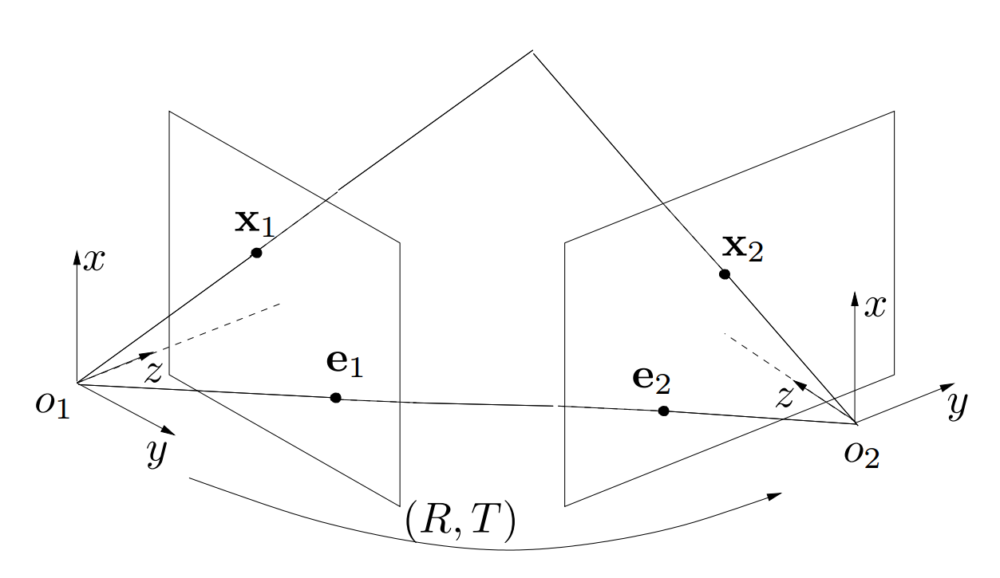

[TOC]

## An Invitation to 3D Vision: Part II  

### 1.不同书中坐标系表述的一些小小差异

#### 1) 机器人状态估计中:

$R,t$ 用于描述一个坐标系的时候，一般$R$的列向量对应着被描述的坐标系在参考坐标系中的方向余弦，对应的点变换是将该坐标系中的点坐标变换到全局坐标系中。例子如下：
$$
R_c \Leftrightarrow R_{wc}  \\
t_{wc}  \Leftrightarrow \vec{wc}  \\
P_w = R_c\cdot P_c+t_{wc}
$$
一般用在描述相机运动的时候，或者需要结合$IMU$来做融合的时候会用到这种形式。

#### 2) 视觉相关领域的书中:

$R,t$用于描述一个坐标系的时候，大多数情况是用来描述相机投影矩阵$P$中的$R,t$，其对应的坐标变换是将世界坐标系中的点变换到相机坐标系之下。例子如下：

假设相机1坐标系与世界坐标系重合，相机2的位姿用$R,t$描述，那么实际空间点的坐标变换关系为：
$$
P_2= R\cdot P_1+t
$$
代表着将相机1(世界坐标系)中的点变换到坐标系2之下。在$OpenCV$ 以及许多$Structure FromMotion$　

的程序中一般都是这种写法，所以看论文和代码的时候需要注意一些。

### 2. 对极几何

#### 2.1 对极约束与本征矩阵

对于一个空间3D点p，其在两个相机中的坐标分别为$X_1,X_2\in \mathbb{R}^3$ ，两个坐标之间可以通过一个刚体变换转换：
$$
X_2 = RX_1+T
$$
设$x_1,x_2 \in \mathbb{R}^3$ 为投影到相机坐标系下的齐次坐标，即：
$$
X_i = \lambda_ix_i ,i=1,2
$$
于是第一个式子可以写成如下形式：
$$
\lambda_2 x_2 = R\lambda_1x_1+T
$$
其中$\lambda_1,\lambda_2$代表着点在相机坐标系下的深度。通过两边同时左乘一个$\widehat{T}$ 便可以消去深度的影响，得到：
$$
\lambda_2\widehat{T}x_2=\widehat{T}R\lambda_1x_1
$$
由于向量$\widehat{T}x_2=T\times x_2$ 与向量$x_2$垂直，所以二者的内积为0，即：$\left<x_2,\widehat{T}x_2\right>=x_2^TT\times x_2=0$  。代入到之前的式子之中可以得到，$x_2^T\widehat{T}R\lambda_1x_1=0$。于是便可以推出对极约束：
$$
x_2^T\widehat{T}Rx_1=0
$$
记其中的$\widehat{T}R \in \mathbb{R}^{3\times3}$ 为矩阵$E$，称为本征矩阵($EssentialMatrix$) 。

__矩阵$E=\widehat{T}R$ 其中的$R,T$代表着将坐标系1中的点变换到坐标系2之中__。

#### 2.2 极点、极线、极平面

对极约束的几何意义可以从下图中看出：

空间点p与相机1中心$o_1$，相机2中心$o_2$组成了一个共同的平面，所以三个向量的混合积为0，利用这个性质我们同样可以完成对极约束的推导。

图中的平面称为`极平面`，平面与两个相机成像平面的交线称为`极线`点$e_1,e_2$我们称为`极点`，$\overline{o_1o_2}$ 称为`基线`。

__相关性质：__

给定一个$essential$矩阵$E=\widehat{T}R$ ，以及相机归一化平面上的两个点$x_1,x_2$ ，我们可以得到如下关系：

`极点`$e_1,e_2\in \mathbb{R}^3$满足：
$$
e_2^TE=0 , Ee_1=0
$$
即：
$$
e_2\sim T ,e_1 \sim R^TT
$$
`极线`$l_1,l_2\in \mathbb{R}^3$ 满足：
$$
l_2\sim Ex_1 , l_1 \sim E^Tx_2 \in \mathbb{R}^3
$$

上式可由两点确定一条直线来推导。

另外还有如下关系：
$$
l_i^Te_i=0, l_i^Tx_i=0
$$
即`极点`和点的投影都满足`极线`方程。

#### 2.3 本征矩阵的性质

根据E的组成我们可以看出，其包含了两个相机之间的旋转和平移变换，这种类型的矩阵构成了一个集合，称为：
$$
\epsilon =\{\widehat{T}R|R\in SO(3),T\in \mathbb{R}^{3\times3} \}
$$
首先介绍线性代数中的一条引理：对于向量$T\in \mathbb{R}^3$ 与矩阵$K\in \mathbb{R}^{3\times3}$，如果满足$det(K) =1 , T^{'}=KT$，那么$\widehat{T}=K^T\widehat{T^{'}}K$。

__本征矩阵的性质:__

非零矩阵$E\in\mathbb{R}^{3\times3}$，是本征矩阵当且仅当$E$的奇异值分解$SVD(E)=U\Sigma V^T$是:
$$
\Sigma = diag\{\sigma,\sigma,0\} , \sigma \in \mathbb{R}_+ ,U,V\in SO(3)
$$
证明过程如下：

根据定义，对于任意一个本征矩阵$E$，都存在一对$R\in SO(3),t \in \mathbb{R}^3$，满足$\widehat{T}R=E$。对于$T$，存在一个旋转矩阵$R_0$满足$R_0T=[0,0,\lVert T\rVert]^T$。定义$a=R_0T \in \mathbb{R}^3$，因为$det(R_0)=1$，从上方的引理中可以得出：$\widehat{T}=R_0^T\widehat{a}R_0$，可以获得：
$$
EE^T =  \widehat{T}RR^T\widehat{T}^T=\widehat{T}\widehat{T}^T=R_0^T\widehat{a}\widehat{a}^TR_0
$$
显然：
$$
\widehat{a}\widehat{a}^T = 
\begin{bmatrix}
0  & -\Vert T \Vert &0 \\
\Vert T \Vert &0 &0 \\
0 &0 &0  \\
\end{bmatrix}
\begin{bmatrix}
0  &\Vert T \Vert &0 \\
-\Vert T \Vert & 0 &0 \\
0 & 0 & 0 \\
\end{bmatrix}
=
\begin{bmatrix}
\Vert T \Vert^2 &0 &0 \\
0 &\Vert T \Vert^2  &0\\
0 &0 & 0\\
\end{bmatrix}
$$
所以$E$的奇异值为$(\lVert T\rVert,\lVert T\rVert,0)$，标准的$SVD$分解中，$U,V$只需要正交，所以还需要证明$U,V\in SO(3)$。
