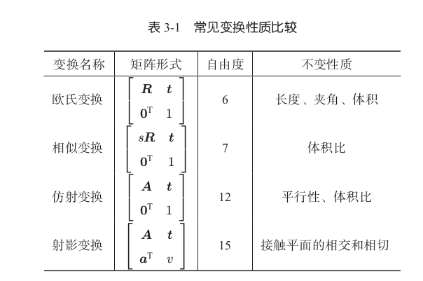

### 计算机视觉中的几种变换

#### 欧氏变换

刚体的旋转和平移，保持物体不变，仅改变姿态和位置
$$
T= \begin{bmatrix}
R &t \\
0^T  &1 
\end{bmatrix}
$$

#### 相似变换

对向量进行旋转之后再分别在$x,y,z$方向进行均匀缩放，三维相似变换的集合称为Sim(3)
$$
T  = \begin{bmatrix}
sR & t  \\
o^T &1 
\end{bmatrix}
$$

#### 仿射变换

形式如下：
$$
T = \begin{bmatrix}
A &t \\
0^T  &1
\end{bmatrix}
$$
左上角为可逆矩阵$A$

#### 射影变换

$$
T = \begin{bmatrix}
A & t \\
a^T & v
\end{bmatrix}
$$

左上角$A​$为可逆矩阵，左下角为缩放$a^T​$

