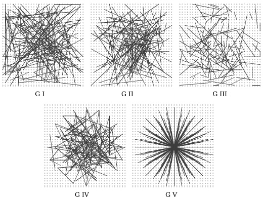

[TOC]

### Binary Robust Independent Elementary Features

#### 一、基本原理

+ Sift: 128维浮点数->512字节
+ Surf: 64维浮点数->256字节

BRIEF: 不需要计算类似Sift的特征描述子，先平滑图像，再在特征点周围选择一个Patch，通过特定方法挑选出$n_d$个点对$(p,q)$，比较二者的值，若$I(p)>I(q)$则对应二值串中的一个1，否则为0。最终结果为一个长度为$n_d$的二值串。

$n_d$一般选择为:128 256 512

通过计算描述子之间的Hamming Distance进行特征点的匹配

#### 二、流程

`step1`: 利用Harris或者FAST检测特征点
`step2`: 确定特征点的邻域窗口Patch，对Patch进行高斯平滑
`step3`: 在Patch内选取$n_d$对像素点生成二进制描述子

#### 三、采样方式

原论文作者提供了5种类在$S\times S$邻域Patch内选取点对$(x_i,y_i)$的方法，如下图所示：

+ $x_i,y_i$为均匀分布$[-\frac{S}{2},\frac{S}{2}]$
+ $x_i,y_i$均为高斯分布$(0,\frac{S^2}{25})$
+ $x_i$服从高斯分布$(0,\frac{S^2}{25})$，$y_i$服从高斯分布$(x_i,\frac{S^2}{25})$，先在原点处对$x_i$进行采样，之后在中心为$x_i$处对$y_i$进行采样.
+ $x_i,y_i$在空间量化极坐标下的离散位置处进行随机采样
+ $x_i=(0,0)^T$，$y_i$在空间量化极坐标下的离散位置处进行随机采样

