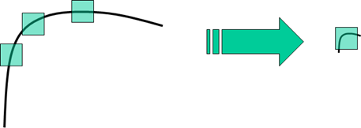

[TOC]

### 角点检测

#### Harris角点

##### 一、基本原理

人眼对角点的识别通常是在一个局部的小区域或小窗口完成的。如果在各个方向上移动这个特征的小窗口，窗口内区域的灰度发生了较大的变化，那么就认为在窗口内遇到了角点。如果这个特定的窗口在图像各个方向上移动时，窗口内图像的灰度没有发生变化，那么窗口内就不存在角点；如果窗口在某一个方向移动时，窗口内图像的灰度发生了较大的变化，而在另一些方向上没有发生变化，那么，窗口内的图像可能就是一条直线的线段。


##### 二、数学描述

对于图像$I(x,y)$，当在点$(x,y)$处平移$(\Delta x,\Delta y)$之后的自相关性可以用自相关函数表示：
$$
c(x,y;\Delta x,\Delta y) = \sum_{(u,v)\in W(x,y)}w(u,v)(I(u,v) – I(u+\Delta x,v+\Delta y))^2
$$
其中$W(x,y)$为以点$(x,y)$为中心的窗口，$w(x,y)$为窗口内每个位置的权重，可以为常数也可以为高斯加权函数。

利用泰勒展开对平移后的$I(x+\Delta x,y+\Delta y)$进行一阶近似：
$$
I(u+\Delta x,v+\Delta y) = I(u,v)+I_x(u,v)\Delta x+I_y(u,v)\Delta y+O(\Delta x^2,\Delta y^2) \\ 
\approx I(u,v)+I_x(u,v)\Delta x+I_y(u,v)\Delta y
$$
自相关函数可以化简为：
$$
c(x,y;\Delta x,\Delta y)\approx \sum_w (I_x(u,v)\Delta x+I_y(u,v)\Delta y)^2=[\Delta x,\Delta y]M(x,y)\begin{bmatrix}\Delta x \\ \Delta y\end{bmatrix}
$$
其中:
$$
M(x,y)=\sum_w \begin{bmatrix}I_x(x,y)^2&I_x(x,y)I_y(x,y) \\ I_x(x,y)I_y(x,y)&I_y(x,y)^2\end{bmatrix} =\\ \begin{bmatrix}\sum_w I_x(x,y)^2&\sum_w I_x(x,y)I_y(x,y) \\\sum_w I_x(x,y)I_y(x,y)&\sum_w I_y(x,y)^2\end{bmatrix}=\begin{bmatrix}A&C\\C&B\end{bmatrix}
$$

即图像$I(x,y)$在点$(x,y)$处平移后的自相关函数可以近似为如下函数：
$$
c(x,y;\Delta x,\Delta y)\approx A\Delta x^2+2C\Delta x\Delta y+B\Delta y^2
$$
其中:
$$
A=\sum_w I_x^2, B=\sum_w I_y^2,C=\sum_w I_x I_y
$$
其本质为一个椭圆函数，椭圆的扁率和尺寸由$M(x,y)$的特征值$\lambda_1 ,\lambda_2$决定的，椭球的方向由$M(x,y)$的特征向量决定：
$$
[\Delta x,\Delta y]M(x,y)\begin{bmatrix}\Delta x \\ \Delta y\end{bmatrix} = 1
$$


椭圆函数特征值与图像中的角点、直线（边缘）和平面之间的关系如下图所示。共可分为三种情况：

- 图像中的直线: 一个特征值大，另一个特征值小，$\lambda_1 \gg \lambda_2 $或$\lambda_2\gg \lambda_1$自相关函数值在某一方向上大，在其他方向上小。
- 图像中的平面: 两个特征值都小，且近似相等；自相关函数数值在各个方向上都小。
- 图像中的角点: 两个特征值都大，且近似相等，自相关函数在所有方向都增大。


虽然可以通过求$M(x,y)$的特征值进行判断，但是$Harris$角点检测可以不必这么麻烦，可以通过计算每一个像素点的响应值$R$进行判断，$R$的计算公式如下：
$$
R=det \boldsymbol{M} - \alpha(trace\boldsymbol{M})^2
$$
其中$\boldsymbol{M}=\begin{bmatrix}A & B \\C & D \end{bmatrix}$，$\alpha$为常数，取值范围为$0.04\sim0.06$。


##### 三、算法流程

`step1`:计算图像$I(x,y)$在$x,y$方向上的梯度$I_x,I_y$
$$
I_x=\frac{\partial I}{\partial x}=I*(-1\ 0\ 1)，I_y =\frac{\partial I}{\partial x}=I*(-1\ 0\ 1)^T
$$
`step2`:计算两个方向上梯度的乘积
$$
I_x^2=I_x\cdot I_y，I_y^2=I_y\cdot I_y，I_{xy}=I_x\cdot I_y
$$

`step3`:对$I_x^2,I_y^2,I_{xy}$进行加权，生成矩阵元素$A,B,C$
$$
A=g(I_x^2)=I_x^2\otimes w，C=g(I_y^2)=I_y^2\otimes w，B=g(I_{x,y})=I_{xy}\otimes w
$$
`step4`:计算每个像素的$Harris$响应值$R$,并对$R$小于某阈值$t$的像素将其$R$置0
$$
R=\{R:det \boldsymbol{M} - \alpha(trace\boldsymbol{M})^2<t\}
$$
`step5`:在$3\times3,5\times5$邻域内进行非极大值抑制，局部最大值即为图像中的角点


##### 四、Harris角点性质

`参数`$\alpha$`对角点检测的影响`

假设已经得到了矩阵$\boldsymbol{M}$的特征值$\lambda_1,\lambda_2$，令$\lambda_2=k\lambda_1,k\in[0,1]$，可以得到：
$$
R = [k-\alpha(k+1)^2]\lambda_1^2
$$
假设$R\ge0$,则有：
$$
0\le \alpha \le\frac{k}{(1+k)^2}\le0.25
$$
当$k$较小时，$R\approx\lambda^2 (k-\alpha),\alpha < k$。

于是可以推出：

+ 增加$\alpha$的值，将减小角点检测响应值$R$，降低角点检测的灵敏度，减少角点数量.
+ 减小$\alpha$的值，将增大角点检测响应值$R$，增加角点检测的灵敏度，增减角点数量.

`Harris角点检测算子对亮度和对比度的变化不敏感`

Harris在计算的时使用微分算子，对亮度和对比度的变化不敏感，所以角点出现的位置不会改变，但是由于阈值$t$的选择，所以角点数量会有区别。

`Harris角点检测算子具有旋转不变性`

Harris角点检测计算像素附近区域的二阶矩矩阵，对应一个椭圆，转动时其特征值不会变化，所以$R$的值也不会变化。

`Harris算子不具有尺度不变性`



如上图显而易见，左边检测为边缘，而右边有可能就会被当做一个角点。


##### 五、OpenCV接口

```c++
C++: void cornerHarris(InputArray src, OutputArray dst, int blockSize, int apertureSize, double k, int borderType = BORDER_DEFAULT);
```

+ src:输入单通道8-bit图像或者浮点图像
+ dst:存储着响应值的图像，为浮点矩阵
+ blockSize: 邻域大小
+ apertureSize: 扩展微分算子大小
+ k: 公式中的$\alpha$
+ boderType: 边界处理方式


#### GoodFeatureToTrack

J.Shi和C.Tomasi在`Good Feature to Track`中提出的对Harris角点检测算法的改进算法`Shi-Tomasi`角点检测算子.对应OpenCV中的GoodFeatureToTrack.
$$
\min(\lambda_1,\lambda_2) \gt \lambda
$$
评分标准更加简单，所以速度会更快,OpenCV的API也提供了更多控制选项。

```c++

void goodFeaturesToTrack( InputArray image, OutputArray corners,int maxCorners, double qualityLevel, double minDistance,InputArray mask=noArray(), int blockSize=3,bool useHarrisDetector=false, double k=0.04 );
```

+ image: 输入8-bits或者32-bits单通道灰度图
+ corners: 输出角点坐标
+ maxCorners: 定义可以检测到的角点数量的最大值
+ qualityLevel:　质量等级较低的会被丢弃
+ minDistance: 两个角点之间的最小距离，单位为像素
+ blockSize: 计算协方差矩阵的时候窗口的大小
+ useHarrisDetector: 是否使用Harris，false使用Shi-Tomasi计算分数
+ k: Harris中的$\alpha$一般取$0.04\sim0.06$