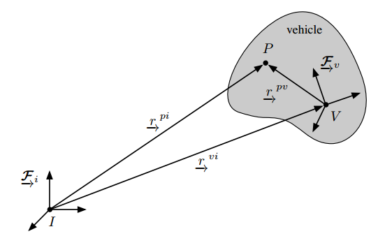

[TOC]

# 三维空间刚体运动笔记整理

## 一、机器人状态估计

### 1.向量与参考坐标系

#### 符号介绍与约定

| 符号 | 含义 |
| :-------------: | :----: |
| $\cal{F}^w$ | 坐标系的基向量构成的`vectrix`，其每一行为三个轴的基向量 |
| $P$ | 三维空间中的点 |
| $p_w$ | 点$P$在坐标系$w$下的参数化的坐标值 |
| $R_{AB}$ | 代表由坐标系A旋转到坐标系B |
| $t_{AB}$ | 代表由坐标系Ａ原点向坐标系B的平移，在Ａ系下的参数化表示 |
| $R_A$ | 坐标系A的姿态，默认为$R_A=R_{WA}$ 其中$W$表示全局坐标系 |
| $\tilde{p}_w$ | $w$系下点$P$坐标值的齐次表示 |
| "A到B"指的是 | 如果A系经过旋转和平移得到B系，那么坐标变换为$p_A=R_{BA}\cdot p_B+t_{AB}$ |

#### 参考坐标系

##### 1) 向量的坐标表示

载体坐标系中的一个点可以用一个向量$\vec{r}^{vi}$表示，对于向量$\vec{r}$

其在参考坐标系中的表示如下：
$$
\begin{equation}
\begin{aligned}
\vec{r} &= r_1\vec{e_1}+ r_2\vec{e_2} + r_3 \vec{e_3} \\
&=\begin{bmatrix}
r_1 & r_2 &r_3
\end{bmatrix}
\begin{bmatrix}
\vec{e_1} \\
\vec{e_2} \\
\vec{e_3}\\
\end{bmatrix} &=r^T\vec{\cal{F}}\\

&=\begin{bmatrix}
\vec{e_1} & \vec{e_2} &\vec{e_3}
\end{bmatrix}
\begin{bmatrix}
r_1 \\
r_2 \\
r_3\\
\end{bmatrix} &=\vec{\cal{F}}^Tr

\end{aligned}
\end{equation}
$$
一般后一种表示更加常用，$\vec{\cal{F}}$的每一列都表示基向量在全局坐标系下的坐标，向量坐标值采用列向量表示。

##### 2) 向量之间的运算

对于两个同一参考坐标系下的向量$\vec{r}$和$\vec{s}$:
$$
\vec{r}=\begin{bmatrix}
r_1 & r_2 &r_3
\end{bmatrix}
\begin{bmatrix}
\vec{e_1} \\
\vec{e_2} \\
\vec{e_3}\\
\end{bmatrix} ,
\vec{s}=\begin{bmatrix}
\vec{e_1} & \vec{e_2} &\vec{e_3}
\end{bmatrix}
\begin{bmatrix}
s_1 \\
s_2 \\
s_3\\
\end{bmatrix}
$$
`点乘`结果为:
$$
\vec{r}\cdot\vec{s} = r^Ts = r_1s_1+r_2s_2+r_3s_3
$$
`叉乘`结果为:
$$
\begin{equation}
\begin{aligned}
\vec{r}\times\vec{s} & = \begin{bmatrix}
\vec{e_1} &\vec{e_2} &\vec{e_3} 
\end{bmatrix}
\begin{bmatrix}
0 & -r_3 &r_2 \\
r_3 &0  & -r_1 \\
-r_2  &r_1 & 0\\
\end{bmatrix}
\begin{bmatrix}
s_1 \\
s_2 \\
s_3 \\
\end{bmatrix} \\
&= \vec{\cal{F}}^Tr^{\times}s
\end{aligned}
\end{equation}
$$

### 2. 三维空间旋转变换

对于两个原点在一起的坐标系$\vec{\cal{F}_1}$和$\vec{\cal{F}_2}$，空间向量$\vec{r}$在两个坐标系下的表示为:
$$
\vec{r} =\vec{\cal{F}_1}^T r_1 = \vec{\cal{F}_2}^Tr_2
$$
按照如下方式进行变换:
$$
\begin{equation}
\begin{aligned}
\vec{\cal{F}_2}^Tr_2&= \vec{\cal{F}_1}^T r_1 \\
\vec{\cal{F}_2}\vec{\cal{F}_2}^Tr_2 &= \vec{\cal{F}_2}\vec{\cal{F}_1}^Tr_1 \\
r_2 &= C_{21}r_1
\end{aligned}
\end{equation}
$$
定义:
$$
\begin{equation}
\begin{aligned}
C_{21} &= \vec{\cal{F}_2}\cdot \vec{\cal{F}_1}^T \\
&=
\begin{bmatrix}
\vec{2_1} \\
\vec{2_2} \\
\vec{2_3} \\ 
\end{bmatrix}
\cdot 
\begin{bmatrix}
\vec{1_1} &\vec{1_2} &\vec{1_3} 
\end{bmatrix} \\
&=\begin{bmatrix}
\vec{2_1} \cdot \vec{1_1} &\vec{2_1} \cdot \vec{1_２}   &\vec{2_1} \cdot \vec{1_３}  \\
\vec{2_2} \cdot \vec{1_1}  &\vec{2_2} \cdot \vec{1_２}  &\vec{2_2} \cdot \vec{1_３}  \\
\vec{2_3} \cdot \vec{1_1}  &\vec{2_3} \cdot \vec{1_２}  &\vec{2_3} \cdot \vec{1_３}  \\
\end{bmatrix}
\end{aligned}
\end{equation}
$$
由于没想到更好的符号，所以直接用了书中的表示，观察上式，我们可以发现:

+ $C_{21}$的每一列对应的是坐标系$\vec{\cal{F}_1}$的三个基向量在坐标系$\vec{\cal{F}_2}$中的方向余弦值。
+ $C_{21}$的每一行对应的是坐标系$\vec{\cal{F}_2}$的三个基向量在坐标系$\vec{\cal{F}_1}$中的方向余弦值。
+ $C_{21}p_1$代表的是$C_{21}$的列向量的线性组合，所以表示将$p_1$变换到$p_2$。
+ $\vec{\cal{F}_2}^T C_{21}$ 代表的是$C_{21}$的行向量的线性组合，所以表示的是将$\vec{\cal{F}_2}$的基向量变换到$\vec{\cal{F}_1}$中。

$C_{21}$代表的实际物理旋转是由坐标系$\vec{\cal{F}_２}$到坐标系$\vec{\cal{F}_1}$的旋转，对应的点坐标变换矩阵为由$\vec{\cal{F}_1}$变换到$\vec{\cal{F}_2}$中的坐标变换矩阵。

两个坐标系的基向量之间的变换为：
$$
\vec{\cal{F}_1}^T = \vec{\cal{F}_2}^T C_{21}
$$
如果对应多次旋转，那么旋转矩阵应该乘在右边。并且此处如果采用欧拉角的表示方法，那么每个轴对应的旋转矩阵应该是如下三个旋转矩，并且组合方式为右乘更新:

$$
R_z(\psi) = 
\begin{bmatrix}
\cos{(\psi)} & -\sin{(\psi) } &0 \\
\sin{(\psi) } & \cos{(\psi)}   &0 \\
0 &0  &1 \\
\end{bmatrix} ,
R_y(\theta) = 
\begin{bmatrix}
\cos{(\psi)} &0 & \sin{(\psi) }  \\
0    &1 &0 \\
-\sin{(\psi) }&0  &\cos{(\psi)}   \\
\end{bmatrix},
R_x(\phi) = 
\begin{bmatrix}
1  & 0 &0 \\
0   &\cos{(\phi)} & -\sin{(\phi) } \\
0 &\sin{(\phi) } & \cos{(\phi)}  \\
\end{bmatrix}三维空间旋转变换
$$

### 3. 三维空间欧式变换

#### 刚体姿态的描述

如图所示，如果我们需要对三维空间中的刚体`Vehicle`的位姿进行描述，那么等价于描述其固连坐标系$V$的位姿，即：
$$
\{ r_i^{vi},C_{iv} \}
$$
其中，$r_i^{vi}$表示坐标系$V$的原点相对于$I$的位置在$I$中的坐标。

对于图中的向量，它们之间的关系如下：
$$
\vec{r^{pi}} = \vec{r^{pv}} +  \vec{r^{vi}} \\
$$
在坐标系$I$下的表示为：
$$
\begin{aligned}
r_{i}^{pi} &= r_{i}^{pv} +r_{i}^{vi} \\
r_{i}^{pi} &= C_{iv}r_{v}^{pv} +r_{i}^{vi} \\
\end{aligned}
$$

#### 变换矩阵

把坐标变换写成齐次形式可以得到：
$$
\begin{bmatrix}
r_i^{pi} \\
1
\end{bmatrix}
=
\begin{bmatrix}
C_{iv}  &r_i^{vi}\\
0^T & 1 
\end{bmatrix}
\begin{bmatrix}
r_v^{pv} \\
1
\end{bmatrix}
$$
对应的$4\times4$变换矩阵我们记作：$T_{iv}$